# Software Design Document

## 1D-QM-Playground

**Version:** 0.2 (Draft)
**Date:** 2026-07-09
**Status:** Populated — [§1](#1-introduction)–[§11](#11-build-configuration-management-and-deployment) and Appendices have real content. [§7.3](#73-api-and-function-signatures) (API and Function Signatures) and [§9.4](#94-test-traceability) (Test Traceability) intentionally start thin by design and mature during implementation ([§10](#10-implementation-roadmap-and-phasing)). See [§12.C](#c-revision-history) Revision History for how this document evolved.

---

## Table of Contents

1. [Introduction](#1-introduction)
   - [1.1 Purpose of This Document](#11-purpose-of-this-document)
   - [1.2 Scope](#12-scope)
   - [1.3 Intended Audience](#13-intended-audience)
   - [1.4 Definitions, Acronyms, and Abbreviations](#14-definitions-acronyms-and-abbreviations)
   - [1.5 References](#15-references)
   - [1.6 Document Conventions](#16-document-conventions)
2. [System Overview](#2-system-overview)
   - [2.1 Background and Motivation](#21-background-and-motivation)
   - [2.2 Goals and Objectives](#22-goals-and-objectives)
   - [2.3 System Context](#23-system-context)
   - [2.4 Assumptions and Constraints](#24-assumptions-and-constraints)
3. [Requirements](#3-requirements)
   - [3.1 Functional Requirements](#31-functional-requirements)
   - [3.2 Non-Functional Requirements](#32-non-functional-requirements)
   - [3.3 Requirements Traceability Matrix](#33-requirements-traceability-matrix)
4. [Architectural Design](#4-architectural-design)
   - [4.1 Architectural Style and Rationale](#41-architectural-style-and-rationale)
   - [4.2 Component Overview](#42-component-overview)
   - [4.3 Data Flow](#43-data-flow)
   - [4.4 Execution View](#44-execution-view)
5. [Detailed Component Design](#5-detailed-component-design)
   - [5.1 Controller](#51-controller)
   - [5.2 TISE Solver](#52-tise-solver)
   - [5.3 TDSE Solver](#53-tdse-solver)
   - [5.4 Analysis Module](#54-analysis-module)
6. [Data Design](#6-data-design)
   - [6.1 Configuration Schema](#61-configuration-schema)
   - [6.2 Internal Data Structures](#62-internal-data-structures)
   - [6.3 Persistent Storage Format](#63-persistent-storage-format)
   - [6.4 Data Validation Rules](#64-data-validation-rules)
7. [Interface Design](#7-interface-design)
   - [7.1 External Interfaces](#71-external-interfaces)
   - [7.2 Inter-Component Interfaces](#72-inter-component-interfaces)
   - [7.3 API and Function Signatures](#73-api-and-function-signatures)
8. [Error Handling and Logging Strategy](#8-error-handling-and-logging-strategy)
9. [Testing Strategy](#9-testing-strategy)
   - [9.1 Unit Testing and TDD Approach](#91-unit-testing-and-tdd-approach)
   - [9.2 Integration Testing](#92-integration-testing)
   - [9.3 Verification and Validation](#93-verification-and-validation)
   - [9.4 Test Traceability](#94-test-traceability)
10. [Implementation Roadmap and Phasing](#10-implementation-roadmap-and-phasing)
    - [10.1 Development Methodology](#101-development-methodology)
    - [10.2 Phased Implementation Sequence](#102-phased-implementation-sequence)
    - [10.3 Test Coverage Policy](#103-test-coverage-policy)
11. [Build, Configuration Management, and Deployment](#11-build-configuration-management-and-deployment)
    - [11.1 Build System and Dependencies](#111-build-system-and-dependencies)
    - [11.2 Directory Layout](#112-directory-layout)
    - [11.3 Version Control Conventions](#113-version-control-conventions)
12. [Appendices](#12-appendices)
    - [A. Glossary](#a-glossary)
    - [B. Open Design Questions](#b-open-design-questions)
    - [C. Revision History](#c-revision-history)

---

## 1. Introduction

### 1.1 Purpose of This Document

This Software Design Document (SDD) is the authoritative, single source of truth for the design of the 1D-QM-Playground system. Its purpose is to translate the physics goals and requirements of this project — a publication-quality B-spline based solver for the time-independent and time-dependent Schrödinger equations — into a concrete, unambiguous engineering plan that can be implemented, tested, and maintained with confidence. Members of this project bring deep expertise in physics and numerical methods, but may have less occasion to work with formal software engineering documents; this section accordingly explains why an SDD matters and how it will be used, so that its value is clear before the detailed technical content is filled in.

A design document exists first to separate the "what" from the "how" from the "when." Requirements — what the system must do — architecture — how the system is organized to do it — and implementation — the actual code — are three distinct concerns. Conflating them, by designing while coding, tends to produce systems where a change to one part has unpredictable effects on distant parts, because no one wrote down the boundaries between components. This document exists to make those boundaries explicit and durable before any of them are committed to code.

This separation is also what makes Test-Driven Development (TDD) possible. TDD is the practice of writing a test that specifies expected behavior before writing the code that implements it, which can only be done when the expected behavior is already known — that is, when the design's interfaces, inputs, outputs, and edge cases have been decided ahead of time. By fully specifying component interfaces and behaviors in this document, tests can be written first, so that "done" comes to mean "meets a written, testable specification" rather than "seems to work."

The same specificity enables interface-driven implementation. Once the contract between two pieces of the system — a function signature, a file format, a data schema — is fixed in this document, both sides of that contract can be implemented and tested independently, even in parallel, as long as each honors the agreed interface. For example, once the `config.yaml` schema is fixed here, the TISE solver, TDSE solver, and Analysis module can each be developed and unit-tested against that schema without waiting on each other or on the Controller.

This document is also the mechanism for requirements-driven design and implementation. Every design decision recorded here should trace back to a stated requirement, whether a physics capability, a performance need, or a usability need. This gives the project a way to check, at any point, whether a piece of code is necessary — does it trace to a requirement — and whether a requirement is satisfied — what code implements it. It equally gives a principled way to decline scope creep: a proposed feature that does not trace to a requirement does not belong in this version of the system.

Deciding these matters up front, and recording them where they can be reviewed, also reduces the accumulation of technical debt. Technical debt is the extra rework caused by choosing a quick, ad-hoc solution now instead of a well-considered one; the debt comes due later as bugs, as confusing code, or as work that must be redone under time pressure. Fixing a bad decision on paper, before code and tests depend on it, is far cheaper than fixing it afterward.

Taken together, these properties make the implementation process substantially more efficient. A contributor picking up any one component of this system — the TISE solver, say — should be able to read this document and know what the component is responsible for, what it receives as input and must produce as output, what other components depend on it, and how its correctness will be verified. This removes the need to reverse-engineer intent from code or to interrupt other contributors with clarifying questions, and it means the same document that guided implementation can later guide code review and onboarding.

This document will therefore be treated as living but authoritative: it should be updated whenever a design decision changes, and code should be expected to match what is written here. Where the two disagree, that disagreement is itself a defect to be resolved — either the document or the code is wrong, and both cases are worth fixing promptly.

### 1.2 Scope

This SDD covers the full 1D-QM-Playground pipeline: a **Controller** that orchestrates a run from a single `config.yaml`; a **TISE Solver** that computes bound and continuum eigenstates of a user-specified 1D potential using a B-spline basis; a **TDSE Solver** that propagates a state under that Hamiltonian, optionally driven by an external time-dependent field; and an **Analysis** module that computes and plots derived physical quantities from TISE and TDSE output. The long-term goal, stated in the project README, is a solver suitable for submission to the *American Journal of Physics*.

Explicitly **out of scope** for the version of the system this SDD describes:

- Multi-particle systems and dimensions beyond 1D ([ADR-0003](adr/0003-defer-multiparticle-3d-extension.md)).
- The FEDVR basis as an alternative to B-splines ([ADR-0001](adr/0001-defer-fedvr-basis.md)).
- WKB-proportional node placement ([ADR-0002](adr/0002-defer-wkb-collocation.md)).
- A parameterized visualization schema — plot ranges, state subsets, etc. ([ADR-0004](adr/0004-defer-visualization-plot-parameters.md)).
- The Analysis module's output artifact — whether/where/how it produces any file or stdout output at all, as distinct from ADR-0004's narrower plot-parameter question above ([ADR-0005](adr/0005-defer-analysis-output-artifact-format.md)).
- Outer-boundary treatments beyond the domain-geometry/asymptote logic of REQ-F-030 — specifically complex absorbing potentials, outgoing-wave (Siegert) boundary conditions, and exterior complex scaling, which remain genuinely undecided ([§12.B](#b-open-design-questions)).

### 1.3 Intended Audience

This document is written for the physicists and numerical-methods contributors implementing and extending 1D-QM-Playground. It assumes strong familiarity with the underlying physics (the Schrödinger equation, scattering theory, B-spline numerics) and with C++/Python implementation, but does not assume prior exposure to formal software-engineering practice — see [§1.1](#11-purpose-of-this-document) for why this document exists and how it should be used. A contributor implementing a specific component should be able to go directly to that component's [§5](#5-detailed-component-design).x subsection and the interfaces it depends on ([§7](#7-interface-design)) without reading the whole document front to back.

### 1.4 Definitions, Acronyms, and Abbreviations

This table covers acronyms used to navigate *this document's own structure*. Domain-specific physics and numerics terms (bound state, phase shift, B-spline, FEDVR, CAP, WKB, etc.) are collected in **Appendix A** instead, since they describe the subject matter rather than the document's structure.

| Term | Meaning |
|---|---|
| SDD | Software Design Document — this document |
| REQ-F-0NN / REQ-NF-0NN | Functional / Non-Functional Requirement identifier ([§3](#3-requirements)), numbered in tens for insertion room |
| ADR-0NNN | Architecture Decision Record — a recorded decision to *defer* a design alternative (`docs/adr/`) |
| TISE | Time-Independent Schrödinger Equation; also shorthand for the TISE Solver component ([§5.2](#52-tise-solver)) |
| TDSE | Time-Dependent Schrödinger Equation; also shorthand for the TDSE Solver component ([§5.3](#53-tdse-solver)) |
| §X.Y | Cross-reference to section X.Y of this document |
| Figure N | A diagram embedded in this document; figure numbers match `docs/diagrams.md` (see [§1.6](#16-document-conventions) for which figures are intentionally not reproduced here) |

### 1.5 References

**Internal documents** (the source material this SDD is built from and supersedes over time — see [§1.6](#16-document-conventions)):

| Document | Content |
|---|---|
| `docs/planning/architecture-06-20.md` | Original architecture sketch, transcribed; per-topic open-questions log with 2026-07-03 stakeholder decisions |
| `docs/planning/architecture-06-26.md` | Formal 4-component architecture: Controller, TISE, TDSE, Analysis; data flow; `config.yaml` schema; Python↔C++ interface decision; storage format; directory layout |
| `docs/planning/architecture-07-02.md` | TISE/TDSE/Analysis input-output math notation reference |
| `docs/planning/bsplines.md` | B-spline theory, de Boor recursion, boundary conditions, matrix banding, current implementation parameters |
| `docs/planning/fedvr-exploration.md` | Deferred exploration of FEDVR as a future alternative basis (see ADR-0001) |
| `docs/planning/resources.md` | External library reference links |
| `docs/superpowers/specs/2026-06-28-config-yaml-schema-design.md` | Full `config.yaml` field-by-field schema specification |
| `docs/diagrams.md` | Diagram reference; all diagrams cited in this SDD are sourced from here ([§1.6](#16-document-conventions)) |
| `docs/adr/0001`–`0004` | Deferred-decision records ([§1.6](#16-document-conventions)) |
| `docs/TDSE-original-design/` | Archived, superseded Chebyshev/van Dijk TDSE design — historical only, not a source for this SDD |
| `BSpline-CPP/README.md`, `1D-QM-Playground/README.md`, `TISE/README.md` | Project background, scope/roadmap, and build/usage instructions |

**External references:**

- H. Bachau, E. Cormier, P. Decleva, J. E. Hansen, F. Martín, "Applications of B-splines in atomic and molecular physics," *Rep. Prog. Phys.* **64**, 1815–1942 (2001) — `H_Bachau_2001_Rep._Prog._Phys._64_1815.pdf`. Primary numerical-method reference.
- C. de Boor, *A Practical Guide to Splines*, Springer (1978).
- L. Argenti, PHY5606 course notes (Fall 2025/2023) — `PHY5606_F25_Bsplines_v2.pdf`, `PHY5606_F25_Projects.pdf`.
- `PHY5606_F25_ContinuumEigenstates.pdf` — the authoritative worked algorithm for continuum/generalized-eigenstate construction via the confined eigenbasis; source for [§5.2.3](#523-internal-design)'s continuum-state formulas.
- `AJP_Example.pdf` — example of the target publication format/quality bar ([§2.2](#22-goals-and-objectives)).
- Candidate/adopted libraries (`docs/planning/resources.md`): [FunctionParser](http://warp.povusers.org/FunctionParser/), [NFParam](https://github.com/nativeformat/NFParam) (expression parsing candidates, [§11.1](#111-build-system-and-dependencies)), [Boost.Math interpolation](https://www.boost.org/doc/libs/1_77_0/libs/math/doc/html/interpolation.html), [nlohmann/json](https://github.com/nlohmann/json), [yaml-cpp](https://github.com/jbeder/yaml-cpp).

### 1.6 Document Conventions

**Requirement IDs.** Functional requirements are `REQ-F-0NN`; non-functional requirements are `REQ-NF-0NN`; both are numbered in tens (010, 020, …) to leave room for insertion without renumbering. Every requirement appears in the traceability matrix ([§3.3](#33-requirements-traceability-matrix)).

**Architecture Decision Records.** A decision to **defer** a design alternative (rather than adopt it) is recorded as a standalone ADR under `docs/adr/000N-<slug>.md`, using a fixed five-field format: Status, Date, Context, Decision, Consequences (including an explicit revisit trigger), and Source. A design question with **no decision yet — not even a decision to defer** — is instead recorded in [§12.B](#b-open-design-questions) (Open Design Questions), not as an ADR. Entries in [§12.B](#b-open-design-questions) are never deleted as they're resolved — they stay verbatim, annotated with a Status line and a pointer to whichever REQ or ADR resolved them.

**Figures.** All diagrams in this SDD are copied from `docs/diagrams.md` and keep that document's figure numbers, so a reader can cross-reference the full diagram set at any time. **Figures 11, 13, and 14 are intentionally not reproduced in this SDD:** Figure 11 (FEDVR vs. B-spline operator structure) documents a deferred alternative and is represented instead by its ADR (ADR-0001); Figure 13 (the original 4-layer sketch) is superseded historical content, summarized instead in [§12.C](#c-revision-history); Figure 14 (design evolution timeline) is likewise historical, and its substance is folded into the [§12.C](#c-revision-history) table rather than reproduced as a diagram. This is a deliberate exclusion, not an omission.

**Cross-references.** Sections are referenced as `§X.Y`; requirements as `REQ-F-0NN`/`REQ-NF-0NN`; decision records as `ADR-0NNN`; diagrams as `Figure N`.

**Relationship to `docs/planning/` and `docs/superpowers/specs/`.** Per the project's working decision, this SDD is meant to *absorb and supersede* those documents as the single source of truth. They are not modified or deleted as part of populating this SDD — they remain available as historical source material and are cited throughout — but new design decisions should be recorded here, not there.

---

## 2. System Overview

### 2.1 Background and Motivation

1D-QM-Playground began as the PHY5606 Hydrogen Atom project base code (`BSpline-CPP/README.md`) and is being extended into a general-purpose, publication-quality 1D quantum mechanics toolkit. The numerical method — representing wavefunctions in a B-spline basis and solving the resulting generalized eigenvalue problem $\mathbf{Hc} = E\mathbf{Sc}$ — follows H. Bachau et al., *Rep. Prog. Phys.* **64**, 1815 (2001); background and derivations specific to this project's implementation are collected in `docs/planning/bsplines.md`.

The original architecture was sketched by hand on 2026-06-20 as a four-layer pipeline — physical setup → a C++ TISE solver → a C++ TDSE solver → a Python analysis layer — and has since evolved into the four-component design described in this document. That evolution is summarized in [§12.C](#c-revision-history) (Revision History).

### 2.2 Goals and Objectives

The stated long-term goal (`1D-QM-Playground/README.md`) is a solver suitable for submission to the *American Journal of Physics* (see `AJP_Example.pdf` for the target format/quality bar). Concretely, the system must be able to:

1. Compute bound and continuum eigenstates of an arbitrary user-specified 1D potential (REQ-F-010, REQ-F-020, REQ-F-030, REQ-F-040, REQ-F-050).
2. Propagate a state under that Hamiltonian, with an optional external driving field.
3. Compute and visualize a defined set of physical observables from both (REQ-F-060).

The system is explicitly scoped to be simple and self-contained rather than maximally general — see [§1.2](#12-scope) and the deferred-extension ADRs (ADR-0001 through ADR-0005).

### 2.3 System Context

The system comprises four components — **Controller**, **TISE Solver**, **TDSE Solver**, **Analysis** — communicating through subprocess invocation and a shared local `data/` directory; [§4.1](#41-architectural-style-and-rationale) explains why this style was chosen over in-process alternatives. **Figure 1** (embedded authoritatively in [§4.2](#42-component-overview)) shows the complete component map. [§2.4](#24-assumptions-and-constraints) below lists the operating assumptions this context depends on.

### 2.4 Assumptions and Constraints

- **Runs are long relative to process-startup overhead.** Each solver invocation takes seconds to minutes; subprocess-call overhead (milliseconds) is negligible. This is the basis for choosing subprocess+YAML orchestration over an in-process binding ([§4.1](#41-architectural-style-and-rationale)).
- **Data exchange is inherently file-based.** Matrices and wavefunction grids are written to disk between pipeline stages by design, not as an implementation shortcut ([§4.3](#43-data-flow), [§6.3](#63-persistent-storage-format)).
- **Single-machine execution only.** No distributed or networked execution model is in scope.
- **Each C++ binary must be independently runnable and debuggable** without the Python Controller in the loop — a development- and testing-time constraint that also shapes [§7](#7-interface-design) (each inter-component interface must be a complete, standalone contract).
- **Physics scope is 1D, single-particle** (ADR-0003). Potentials are expressed as a finite sum of pieces, each a closed-form expression over a sub-interval, using literal numeric constants only — no cross-referencing other config fields ([§6.1](#61-configuration-schema), [§6.4](#64-data-validation-rules)).

---

## 3. Requirements

### 3.1 Functional Requirements

| ID | Requirement | Source |
|---|---|---|
| REQ-F-010 | The system shall expose exactly the $\hat{H}$, $\hat{x}$, and $\hat{p}_x$ operators/observables, restricted to 1D single-particle systems. | `architecture-06-20.md` "Operators"; see ADR-0003 for the deferred multi-particle/3D extension |
| REQ-F-020 | The system shall compute bound-state count as an output (all states below the ionization threshold), never accept it as a user input. | `architecture-06-20.md` "Number of bound states" |
| REQ-F-030 | The system shall determine boundary conditions automatically from domain geometry: Dirichlet on bounded sides; on unbounded sides, hard-wall / Coulomb-sine-matched / flat-matched-with-warning depending on the potential's asymptote (Cases 1–3). | `architecture-06-20.md` "Extra boundary conditions" (verbatim stakeholder Q&A reconfirmed during this SDD population pass); see [§12.B](#b-open-design-questions) for the related, still-open CAP/outgoing-wave/ECS question; flat-asymptote construction algorithm per `PHY5606_F25_ContinuumEigenstates.pdf` ([§5.2.3](#523-internal-design)) |
| REQ-F-040 | The system shall accept `[E_threshold, E_max]` as user input for the continuum spectrum, derive box size $R$ from the domain spec, and warn if `E_max` exceeds the node-spacing-derived accuracy limit $E_\text{acc}$. | `architecture-06-20.md` "Continuum range" |
| REQ-F-050 | The system shall place B-spline knots using uniform spacing augmented by strategic potential-driven nodes as the default collocation scheme. | `architecture-06-20.md` "Collocation scheme"; see ADR-0002 for the deferred WKB-proportional alternative |
| REQ-F-060 | The Analysis module shall compute: bound-state populations vs. time, end-of-run spectral distribution, expectation values of $\hat{x}/\hat{p}/\hat{T}/\hat{V}/\hat{H}$, and (optional) interval probability. | `architecture-06-20.md` "Analysis: what to compute"; notation in `architecture-07-02.md` |

### 3.2 Non-Functional Requirements

| ID | Requirement | Source |
|---|---|---|
| REQ-NF-010 | Unit and integration test coverage shall be maintained at ≥80% throughout development, not only at release. Exact coverage metric (line vs. branch) and tooling are finalized in [§9.1](#91-unit-testing-and-tdd-approach); enforced per-phase in [§10.3](#103-test-coverage-policy). | User requirement, this session |

Additional non-functional requirements (e.g., performance targets, portability) will be added here as they are identified; none beyond REQ-NF-010 have been specified as of this writing.

### 3.3 Requirements Traceability Matrix

| ID | Short Statement | Component(s) | Interface(s) | Verification | Status |
|---|---|---|---|---|---|
| REQ-F-010 | Operator/observable scope: $\hat{H}$, $\hat{x}$, $\hat{p}_x$; 1D single-particle | [§5.2](#52-tise-solver), [§5.3](#53-tdse-solver) | [§7.2.1](#721-controller-to-tise-solver), [§7.2.4](#724-controller-to-tdse-solver) | [§9.3](#93-verification-and-validation) | Active |
| REQ-F-020 | Bound-state count is computed output, not input | [§5.2](#52-tise-solver) | [§7.2.1](#721-controller-to-tise-solver), [§7.2.2](#722-tise-solver-to-analysis) | [§9.1](#91-unit-testing-and-tdd-approach), [§9.3](#93-verification-and-validation) | Active |
| REQ-F-030 | Automatic boundary-condition selection from domain geometry + asymptote | [§5.2](#52-tise-solver) | [§7.2.1](#721-controller-to-tise-solver) | [§9.1](#91-unit-testing-and-tdd-approach), [§9.3](#93-verification-and-validation) | Active |
| REQ-F-040 | User-specified continuum energy range with $E_\text{acc}$ warning | [§5.2](#52-tise-solver) | [§7.2.1](#721-controller-to-tise-solver), [§7.2.2](#722-tise-solver-to-analysis) | [§9.1](#91-unit-testing-and-tdd-approach), [§9.3](#93-verification-and-validation) | Active |
| REQ-F-050 | Uniform + strategic-node default collocation | [§5.2](#52-tise-solver) | [§7.2.1](#721-controller-to-tise-solver) | [§9.1](#91-unit-testing-and-tdd-approach), [§9.3](#93-verification-and-validation) | Active |
| REQ-F-060 | Analysis computable-quantities set | [§5.4](#54-analysis-module) | [§7.2.2](#722-tise-solver-to-analysis), [§7.2.3](#723-controller-to-analysis), [§7.2.5](#725-tdse-solver-to-analysis) | [§9.1](#91-unit-testing-and-tdd-approach), [§9.3](#93-verification-and-validation) | Active |
| REQ-NF-010 | ≥80% test coverage maintained throughout development | all of [§5](#5-detailed-component-design) | — | [§9.1](#91-unit-testing-and-tdd-approach), [§9.4](#94-test-traceability), [§10.3](#103-test-coverage-policy) | Active |
| *(ADR-0001)* | FEDVR alternative basis | [§5.2](#52-tise-solver) | — | — | Deferred — see ADR-0001 |
| *(ADR-0002)* | WKB-proportional collocation | [§5.2](#52-tise-solver) | — | — | Deferred — see ADR-0002 |
| *(ADR-0003)* | Multi-particle / 3D extension | [§5.1](#51-controller), [§3.1](#31-functional-requirements) (REQ-F-010 scope) | — | — | Deferred — see ADR-0003 |
| *(ADR-0004)* | Visualization plot-parameter schema | [§5.4](#54-analysis-module), [§6.1](#61-configuration-schema) | — | — | Deferred — see ADR-0004 |
| *(ADR-0005)* | Analysis output-artifact format (file/plot existence, location, shape) | [§5.4](#54-analysis-module), [§7.2.3](#723-controller-to-analysis) | — | — | Deferred — see ADR-0005 |
| *([§12.B](#b-open-design-questions))* | CAP / outgoing-wave BC / exterior complex scaling | [§5.2](#52-tise-solver) (related to REQ-F-030) | — | — | Open — see [§12.B](#b-open-design-questions) |

---

## 4. Architectural Design

### 4.1 Architectural Style and Rationale

The system uses a **subprocess + shared-file orchestration** style: a Python Controller invokes independent C++ solver binaries as subprocesses, passing a shared `config.yaml` ([§6.1](#61-configuration-schema)), and all cross-component data moves through a local `data/` directory rather than in-process calls ([§4.3](#43-data-flow)). Three alternatives were considered and set aside for now:

- **pybind11** (in-process Python extension) — eliminates file-based transfer and process-startup overhead, but neither matters here: solver runs take seconds to minutes, dwarfing millisecond-scale process startup ([§2.4](#24-assumptions-and-constraints)), and the data is naturally file-resident between pipeline stages anyway. Reconsider if the solver is ever called in a tight loop (e.g., a parameter sweep over hundreds of configurations); the migration path is to restructure the C++ into a library with a `solve(Params) -> Results` API and wrap the existing `main()` as a thin CLI shim over the same library.
- **ctypes/cffi** — lower-level than pybind11 with more manual memory management; not attractive when pybind11 itself isn't yet justified.
- **Shared memory / ZeroMQ / gRPC** — appropriate for distributed or streaming workloads; this system is single-machine and batch-oriented ([§2.4](#24-assumptions-and-constraints)), so this is unnecessary complexity.

Subprocess + YAML was chosen because it keeps each binary independently testable and debuggable outside the pipeline, requires no additional C++ dependency beyond a YAML parser (`yaml-cpp`, [§11.1](#111-build-system-and-dependencies)), and keeps the Controller a thin, physics-free orchestration layer ([§5.1](#51-controller)).

A further alternative — not to the orchestration style, but to the numerical basis underlying the TISE/TDSE solvers themselves — is **FEDVR** in place of B-splines. This is deferred; see ADR-0001 and [§5.2.3](#523-internal-design).

### 4.2 Component Overview

**Figure 1 — System Component Architecture.** *(Source: `docs/planning/architecture-06-26.md` §1; `docs/diagrams.md` #1, reused verbatim.)*

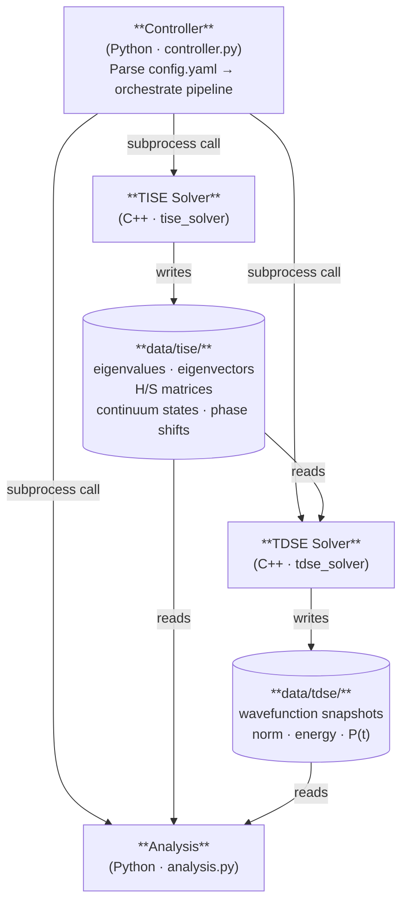

The system is four loosely-coupled components orchestrated by a central Python **Controller** ([§5.1](#51-controller)). The C++ solvers ([§5.2](#52-tise-solver), [§5.3](#53-tdse-solver)) are independent executables; **Analysis** ([§5.4](#54-analysis-module)) is a Python script; all persistent data moves through the `data/` directory ([§6.3](#63-persistent-storage-format)).

### 4.3 Data Flow

**Figure 3 — Data Artifact Map.** *(Source: Data Flow Summary and Local Storage Format tables in `docs/planning/architecture-06-26.md` §3, §6.)*

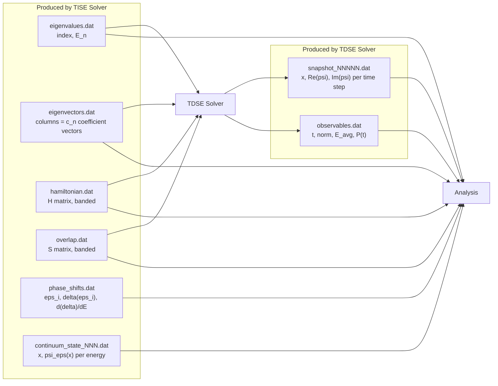

| Producer | Consumer(s) | Data |
|---|---|---|
| TISE | TDSE, Analysis | Eigenvalues, eigenvectors |
| TISE | TDSE, Analysis | $\mathbf{H}$ and $\mathbf{S}$ matrices |
| TISE | Analysis | Continuum states, phase shifts |
| TDSE | Analysis | Wavefunction time series, observables |

Plain text is preferred initially for transparency and ease of inspection with standard tools ([§6.3](#63-persistent-storage-format)); migration to HDF5 is a possible later change that would not alter this producer/consumer map.

### 4.4 Execution View

**Figure 2 — Orchestration Sequence.** *(Source: controller pseudocode in `docs/planning/architecture-06-26.md` §8, and the `run.*` flags in `config.yaml`.)*

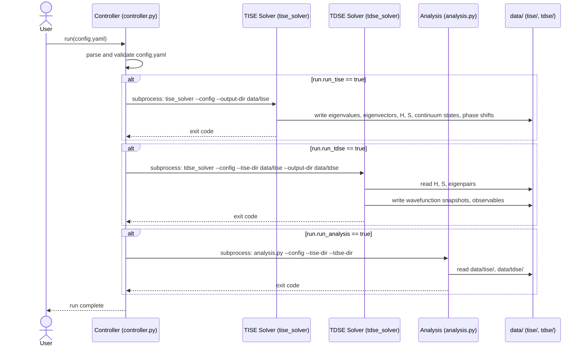

**Figure 12 — Simulation Run State Diagram.** *(Source: `run.*` flags in `config.yaml`, and the controller pseudocode in `docs/planning/architecture-06-26.md` §8.)*

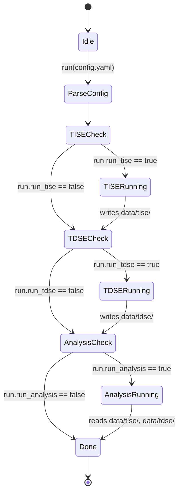

Each stage is gated by a boolean in `config.yaml`'s `run` block ([§6.1](#61-configuration-schema)); the Controller "does not implement any physics — it is purely an orchestration layer" ([§5.1](#51-controller)).

---

## 5. Detailed Component Design

### 5.1 Controller

#### 5.1.1 Responsibilities

The Controller is the single entry point for a simulation run (`controller.py`). It:

- Parses the run configuration from `config.yaml` (and optionally CLI overrides).
- Validates parameters before any solver is invoked ([§6.4](#64-data-validation-rules)).
- Invokes the TISE solver via subprocess and waits for completion.
- Conditionally invokes the TDSE solver if time evolution is requested.
- Invokes the Analysis program with references to the relevant output directories.
- Handles errors and non-zero exit codes from the C++ programs ([§8](#8-error-handling-and-logging-strategy)).

The Controller does **not** implement any physics — it is purely an orchestration layer.

#### 5.1.2 Interfaces

Consumes `config.yaml` in full ([§6.1](#61-configuration-schema)). Invokes the TISE solver per [§7.2.1](#721-controller-to-tise-solver), the TDSE solver per [§7.2.4](#724-controller-to-tdse-solver), and Analysis per [§7.2.3](#723-controller-to-analysis). Scope is bounded by ADR-0003 (1D, single-particle) — the Controller has no branching for multi-particle configurations.

#### 5.1.3 Internal Design

```python
import subprocess
import sys
import yaml
from pathlib import Path

def run(config_path: str):
    with open(config_path) as f:
        cfg = yaml.safe_load(f)

    out = Path(cfg["run"]["output_dir"])
    (out / "tise").mkdir(parents=True, exist_ok=True)

    # --- Step 1: TISE ---
    if cfg["run"]["run_tise"]:
        subprocess.run(
            ["./build/tise_solver", "--config", config_path,
             "--output-dir", str(out / "tise")],
            check=True
        )

    # --- Step 2: TDSE (optional) ---
    if cfg["run"]["run_tdse"]:
        (out / "tdse").mkdir(exist_ok=True)
        subprocess.run(
            ["./build/tdse_solver", "--config", config_path,
             "--tise-dir", str(out / "tise"),
             "--output-dir", str(out / "tdse")],
            check=True
        )

    # --- Step 3: Analysis ---
    if cfg["run"]["run_analysis"]:
        subprocess.run(
            [sys.executable, "analysis.py",
             "--config", config_path,
             "--tise-dir", str(out / "tise"),
             "--tdse-dir", str(out / "tdse")],
            check=True
        )

if __name__ == "__main__":
    import argparse
    parser = argparse.ArgumentParser()
    parser.add_argument("--config", default="config.yaml")
    args = parser.parse_args()
    run(args.config)
```

See Figure 2 (orchestration sequence) and Figure 12 (run state machine) for the corresponding diagrams. `subprocess.run(..., check=True)` raises on a non-zero exit code; [§8](#8-error-handling-and-logging-strategy) defines how the Controller should catch and report which stage failed.

#### 5.1.4 Error Handling

The Controller is responsible for surfacing which stage failed and why when a subprocess exits non-zero, rather than letting a raw traceback be the only signal. See [§8](#8-error-handling-and-logging-strategy) for the full error-handling and logging policy shared across all components.

### 5.2 TISE Solver

#### 5.2.1 Responsibilities

Solves the Time-Independent Schrödinger Equation on a finite interval $[0, R]$ (or the appropriate domain per REQ-F-030) using a B-spline basis:

- Assembles the Hamiltonian matrix $\mathbf{H}$ and overlap matrix $\mathbf{S}$ in the B-spline basis.
- Solves the generalized eigenvalue problem $\mathbf{Hc} = \mathbf{Sc}E$ for bound states (REQ-F-020).
- For continuum states: reuses the confined eigenbasis $\{\phi_n, E_n\}$ to construct $|\bar\psi_E\rangle$ at each energy in closed form (no re-diagonalization per energy), then extracts the normalization constant $A_E$, phase shift $\delta(E)$, and its numerically stable derivative $d\delta/dE$ by matching to the known asymptotic form at $R$ (REQ-F-040; full algorithm in [§5.2.3](#523-internal-design)).
- Writes all results to `data/tise/` ([§6.3](#63-persistent-storage-format)).

#### 5.2.2 Interfaces

Consumes the `bspline`, `potential`, and `tise` (including `tise.continuum`) blocks of `config.yaml` ([§6.1](#61-configuration-schema)). Invoked by the Controller per [§7.2.1](#721-controller-to-tise-solver); its output is read by the TDSE solver and by Analysis per [§7.2.2](#722-tise-solver-to-analysis). Output file formats are defined in [§6.3](#63-persistent-storage-format).

#### 5.2.3 Internal Design

**Figure 6 — TISE Solver Internal Flow.** *(Source: `docs/planning/architecture-06-26.md` §2.2; Layer 2 and the bound-state decision in `docs/planning/architecture-06-20.md`; continuum-construction mechanism (closed-form expansion in the confined eigenbasis) per `PHY5606_F25_ContinuumEigenstates.pdf`.)*

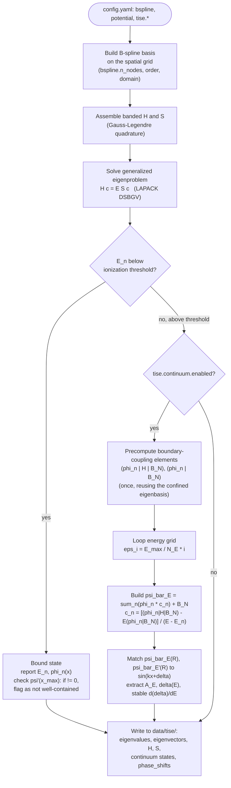

Bound-state count is an **output**, not an input (REQ-F-020): the solver always computes all sub-threshold states. The well-containment check ($\psi'(x_\text{max}) \neq 0$) is the documented diagnostic for flagging states whose energy/wavefunction may be inaccurate. The continuum branch (Precompute → Loop → Build → Match) reuses the confined eigenbasis in closed form, without a second diagonalization per energy — the full derivation follows below.

**Figure 7 — Boundary Condition Decision Tree** (implements REQ-F-030). *(Source: "Extra boundary conditions" stakeholder feedback, 2026-07-03, in `docs/planning/architecture-06-20.md`.)*

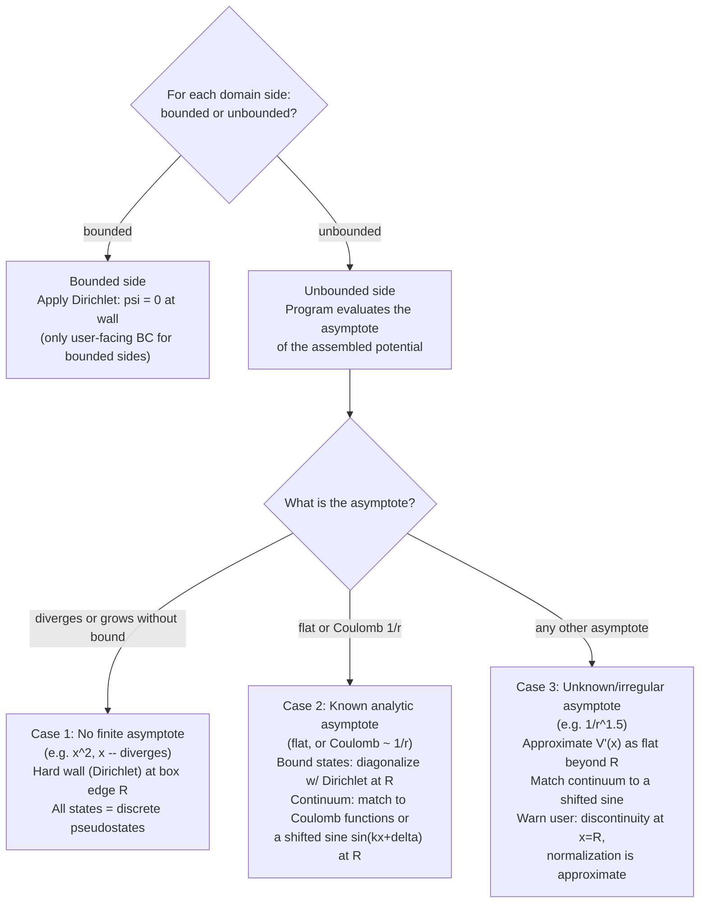

Three domain configurations are supported end-to-end: finite box (both sides bounded), half-line (left bounded, right unbounded — the radial equation), and full line (both sides unbounded). The CAP/outgoing-wave/ECS extensions to this tree remain an open question ([§12.B](#b-open-design-questions)), not part of REQ-F-030.

**Continuum state construction (flat-asymptote case).** Per `PHY5606_F25_ContinuumEigenstates.pdf` — the worked recipe REQ-F-030's Case 2 "shifted sine" branch implements — the continuum solution at an arbitrary energy $E$ reuses the confined eigenbasis $\{\phi_n, E_n\}_{n=1}^{N-2}$ from the same diagonalization used for bound states (Figure 6), extended by explicitly adding back the boundary B-spline $B_N$ (normally dropped to enforce the Dirichlet condition at $R$), since a genuine continuum solution need not vanish there:

$$|\bar\psi_E\rangle = \sum_{n=1}^{N-2}|\phi_n\rangle c_n + |B_N\rangle$$

Requiring $\langle\phi_n|(E-H)|\bar\psi_E\rangle = 0$ for every confined $\phi_n$ gives the coefficients in closed form — an algebraic evaluation at each energy, not a linear solve:

$$c_n = \frac{\langle\phi_n|H|B_N\rangle - E\langle\phi_n|B_N\rangle}{E - E_n}$$

The only energy-independent quantities this requires precomputing (once, from the same $\mathbf{H}$/basis already assembled for bound states) are $\langle\phi_n|H|B_N\rangle$ and $\langle\phi_n|B_N\rangle$ for each $n$ ([§6.2](#62-internal-data-structures)). Normalization and phase shift follow by matching $\bar\psi_E$ and its derivative at $x=R$ to the flat-asymptote form $\psi_E(x) = \sqrt{2/\pi k}\,\sin(kx+\delta)$, $k=\sqrt{2E}$:

$$A_E = \sqrt{\frac{2/\pi}{k\,\bar\psi_E(R)^2 + \bar\psi_E'(R)^2/k}}, \qquad \delta(E) = \arctan\!\left[\frac{k\,\bar\psi_E(R)}{\bar\psi_E'(R)}\right] - kR$$

Because $\delta(E)$ from $\arctan$ has branch-cut discontinuities, its derivative (used to locate resonances, [§9.3](#93-verification-and-validation)) is computed in a form that avoids differentiating $\delta$ directly:

$$\frac{d\delta}{dE} = \frac{1}{2\cos(2\delta)}\frac{d\sin(2\delta)}{dE}$$

Each $\psi_{\varepsilon_i}(x)$ is tabulated on a uniform grid $x_i = \dfrac{R}{N_x-1}(i-1)$ (`tise.continuum.n_pts`, [§6.1](#61-configuration-schema)) and written to `continuum_state_NNN.dat` ([§6.3](#63-persistent-storage-format)), alongside $\varepsilon_i$, $\delta(\varepsilon_i)$, $d\delta/dE$ in `phase_shifts.dat`. REQ-F-040's `[E_threshold, E_max]` range is a later generalization of the PDF's simpler single-`E_max` grid, not a discrepancy.

This is the general recipe for Case 2's *flat*-asymptote sub-branch. The *Coulomb*-tail sub-branch (matching to Coulomb functions instead of $\sin(kx+\delta)$) is required by REQ-F-030 but not yet worked out at this level of detail by any source document — implementers should derive the analogous formulas (following Bachau, `docs/planning/bsplines.md`) before relying on the flat-case formulas above for a Coulomb tail.

**Figure 10 — B-Spline Construction via de Boor Recursion.** *(Source: `docs/planning/bsplines.md`, "Recursion Tree for $B_i^3$"; reused verbatim.)*

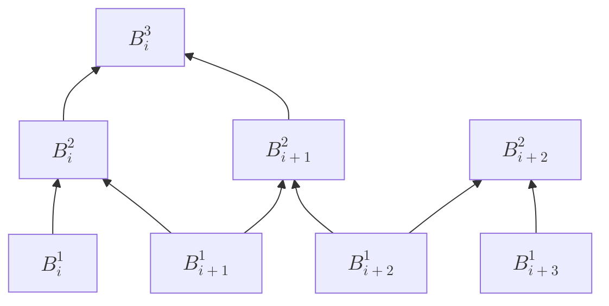

Each node is a weighted blend of the two nodes below it. At any evaluation point $x$, only $k$ B-splines are nonzero simultaneously (the project currently uses $k=12$). Knot density follows REQ-F-050 (uniform + strategic nodes); WKB-proportional density is deferred (ADR-0002). FEDVR — a related basis obtained by pushing all interior knot multiplicities to $k-1$ — is deferred as a future alternative (ADR-0001) rather than implemented alongside B-splines now.

**Current implementation baseline.** The B-spline basis is already implemented in `TISE/BSpline.hpp`/`.cpp` as a `bspline::BSpline` class (`init`, `eval`, `integral`, banded-storage internals) — a C++ port of Argenti's Fortran `ModuleBSpline`. `TISE/tise.hpp`/`.cpp` currently exposes free functions in the `tise::` namespace (`fillBandedMatrices`, `solveGeneralizedEigenproblem` returning an `EigenResult{values, vectors, dim, ldz}`, and a top-level `solveTISE(...)`) built around a **hydrogenic-only** potential (`radialPotential(x, L) = L(L+1)/(2x^2) - 1/x`). Reaching REQ-F-010's general 1D scope requires replacing this hard-coded potential with the config-driven piecewise potential parser of [§6.1](#61-configuration-schema) — this is the core of TISE Solver implementation work in [§10](#10-implementation-roadmap-and-phasing) Phase 4.

#### 5.2.4 Error Handling

Numerical failure modes to surface (see [§8](#8-error-handling-and-logging-strategy) for the shared policy): `BSpline::init()` error codes (`-1` invalid node count, `-2` invalid order, `-4` grid/node-count mismatch, `1` non-monotonic grid); eigensolver non-convergence; invalid domain/potential combinations caught during validation ([§6.4](#64-data-validation-rules)) before the solver runs at all.

### 5.3 TDSE Solver

#### 5.3.1 Responsibilities

Propagates a wavefunction forward in time using eigenstate expansion in the B-spline basis:

$$\psi(x, t) = \sum_n \alpha_n(0)\, e^{-i E_n t / \hbar}\, \phi_n(x), \qquad \alpha_n(0) = \langle \phi_n \mid \psi(0) \rangle$$

evaluated in B-spline coefficient space using the overlap matrix $\mathbf{S}$ from the TISE. When a driving field is enabled, the general case propagates under $H(t) = H_0 + H_\text{int}(t)$ instead of applying a pure phase.

#### 5.3.2 Interfaces

Reads `data/tise/` output (eigenvalues, eigenvectors, $\mathbf{S}$) per [§7.2.4](#724-controller-to-tdse-solver)/[§6.3](#63-persistent-storage-format); consumes the `tdse` config block ([§6.1](#61-configuration-schema)); invoked by the Controller per [§7.2.4](#724-controller-to-tdse-solver); its output is read by Analysis per [§7.2.5](#725-tdse-solver-to-analysis).

#### 5.3.3 Internal Design

**Figure 8 — TDSE Solver Internal Flow (current design).** *(Source: `docs/planning/architecture-06-26.md` §2.3; `docs/superpowers/specs/2026-06-28-config-yaml-schema-design.md` §`tdse`.)*

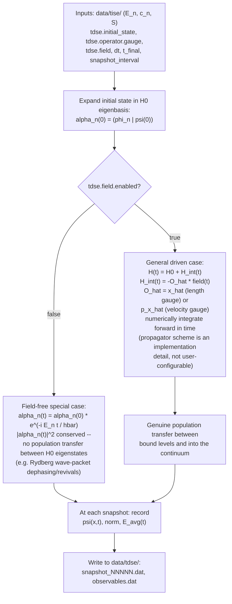

This is the mode that makes bound-state population vs. time (REQ-F-060) a meaningful, non-constant analysis output only when a field is applied — the field-free case conserves populations by construction.

**Figure 9 — TDSE Eigenstate Round-Trip.** *(Source: `docs/planning/bsplines.md`, "The Round-Trip: Enabling TDSE"; reused verbatim.)*

```mermaid
flowchart LR
    d0["Initial state<br/>in B-spline coords-<br/>$$\mathbf{d}_0$$"]
    a0["Eigenstate<br/>coefficients-<br/>$$\boldsymbol{\alpha}(0)$$"]
    at["Time-evolved<br/>eigenstate coeffs-<br/>$$\boldsymbol{\alpha}(t)$$"]
    dt["B-spline coeffs<br/>at time t-<br/>$$\mathbf{d}(t)$$"]
    psi["Real-space<br/>wavefunction-<br/>$$\Psi(r,t)$$"]

    d0 -->|"$$C^{-1}$$"| a0
    a0 -->|"$$e^{-iE_n t}$$<br/>component-wise"| at
    at -->|"$$C$$"| dt
    dt -->|"evaluate<br/>B-splines"| psi
```

This is the concrete algorithm behind Figure 8's field-free special case. It closes only because the eigenstates live in the B-spline subspace by construction, making $C$ a well-defined, invertible change-of-basis matrix ([§6.2](#62-internal-data-structures)).

**Current implementation baseline.** `TISE/time_evolution.hpp`/`.cpp` (namespace `tevol::`) already prototypes exactly this field-free round trip for a Gaussian wavepacket: `computeGaussianOverlaps` → `projectToEigenBasis` (`Phi_G = C_dagger * B_G`) → `timeEvolveState` (`V_t = evolution.cwiseProduct(Phi_G)`) → `transformToSpaceBasis` (`CV_t = C * V_t`) → `writeTimestep`. The driven case ($H_\text{int}(t) \neq 0$, Figure 8's `DRIVEN` branch) is not yet implemented — this is the core of TDSE Solver implementation work in [§10](#10-implementation-roadmap-and-phasing) Phase 8.

#### 5.3.4 Error Handling

Failure modes include missing or malformed `data/tise/` input (contract violation of [§7.2.4](#724-controller-to-tdse-solver)), norm drift beyond tolerance during propagation (a correctness warning, not necessarily a hard failure — see [§8](#8-error-handling-and-logging-strategy)), and the same config-validation failures described in [§6.4](#64-data-validation-rules).

### 5.4 Analysis Module

#### 5.4.1 Responsibilities

Post-processing and visualization (`analysis.py`). Reads from `data/tise/` and/or `data/tdse/` as needed and computes the REQ-F-060 quantities:

1. Bound-state populations vs. time.
2. Spectral distribution across available channels at end of simulation.
3. Expectation values of $\hat{x}$, $\hat{p}$, $\hat{T}$, $\hat{V}$, $\hat{H}$ vs. time.
4. Interval probability vs. time *(optional)*.

#### 5.4.2 Interfaces

Reads `data/tise/` per [§7.2.2](#722-tise-solver-to-analysis) and `data/tdse/` per [§7.2.5](#725-tdse-solver-to-analysis); invoked by the Controller per [§7.2.3](#723-controller-to-analysis); consumes the `analysis` and `visualization` config blocks ([§6.1](#61-configuration-schema)) — note that `visualization`'s plot-parameter fields (ranges, state subsets) are deferred per ADR-0004.

#### 5.4.3 Internal Design

Using the notation from `docs/planning/architecture-07-02.md`:

| Quantity | Notation |
|---|---|
| Bound-state population vs. time | $p_n(t) = \lvert\langle\phi_n\mid\Psi(t)\rangle\rvert^2$ |
| Asymptotic (end-of-run) population | $p_n(\infty) = \lvert\langle\phi_n\mid\Psi(t_\text{final})\rangle\rvert^2$ |
| Asymptotic spectral distribution | $\dfrac{dP_\alpha}{dE} = \lvert\langle\psi^-_{\alpha E}\mid\Psi(t_\text{final})\rangle\rvert^2$ |
| Expectation value of operator $\hat{O}$ vs. time | $\langle\hat{O}\rangle_t = \langle\Psi(t)\mid\hat{O}\mid\Psi(t)\rangle$ |
| Interval probability *(optional)* | $P_{[x_a,x_b]}(t) = \int_{x_a}^{x_b} \lvert\psi(x,t)\rvert^2\,dx$ |

All quantities are computable via B-spline integrals between arbitrary boundaries, reusing the same integration machinery as the TISE/TDSE solvers ([§6.2](#62-internal-data-structures)).

#### 5.4.4 Error Handling

Analysis should degrade gracefully when an optional upstream artifact is missing (e.g., `run_tdse: false` means no `data/tdse/` to read) rather than failing outright — see [§8](#8-error-handling-and-logging-strategy) for how this interacts with the Controller's `run.*` gating.

---

## 6. Data Design

### 6.1 Configuration Schema

`config.yaml` is the single source of truth for a simulation run, read by the Controller and passed to each solver subprocess ([§7.1](#71-external-interfaces)).

**Figure 4 — `config.yaml` Schema Structure.** *(Source: `docs/superpowers/specs/2026-06-28-config-yaml-schema-design.md` + inline comments in `config.yaml`.)*

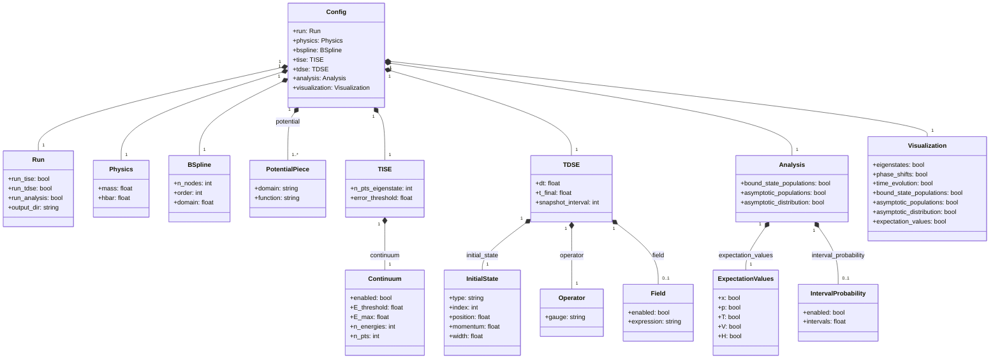

`bspline` is top-level (shared infrastructure for both solvers); `continuum` nests under `tise` because continuum states are computed by the TISE solver. `analysis` and `visualization` are deliberately separate top-level blocks — conflating them would mislabel raw TISE/TDSE output as "analysis."

**`run`**

| Field | Type | Description |
|---|---|---|
| `run_tise` | bool | Whether to invoke the TISE solver |
| `run_tdse` | bool | Whether to invoke the TDSE solver |
| `run_analysis` | bool | Whether to invoke the Analysis script |
| `output_dir` | string | Root directory for all solver output; `tise/` and `tdse/` subdirs created here |

**`physics`**

| Field | Type | Description |
|---|---|---|
| `mass` | float | Particle mass (`1.0` for atomic units) |
| `hbar` | float | Reduced Planck constant (`1.0` for atomic units) |

**`bspline`** (shared by all solvers)

| Field | Type | Description |
|---|---|---|
| `n_nodes` | int | Number of knot points on the spatial grid |
| `order` | int | B-spline order $k$ (degree $k-1$; continuity $C^{k-2}$) |
| `domain` | [float, float] | Spatial domain `[x_min, x_max]` |

**`potential`** — a YAML list of string-encoded `{'domain': ..., 'function': ...}` dicts ([§6.4](#64-data-validation-rules) covers parsing/validation rules); see Figure 5.

**Figure 5 — Potential Definition DSL.** *(Source: the `potential` block comment in `config.yaml` and its schema entry in the config-schema spec.)*

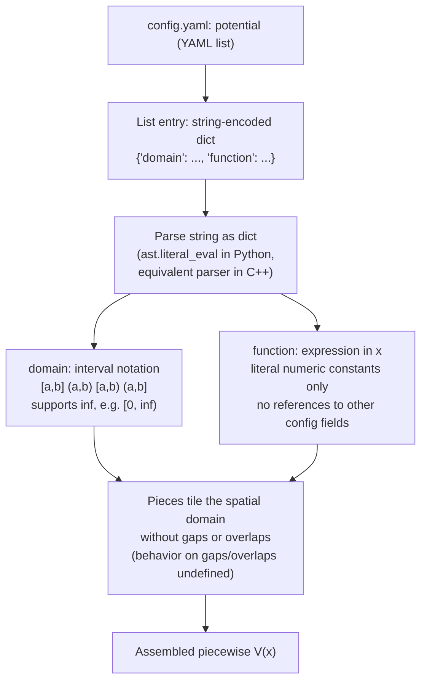

**`tise`** (the solver always computes all bound states below threshold — REQ-F-020)

| Field | Type | Description |
|---|---|---|
| `n_pts_eigenstate` | int | Spatial grid points for eigenstate wavefunction output |
| `error_threshold` | float | Eigenvalue accuracy cutoff for reporting |

**`tise.continuum`** (REQ-F-040)

| Field | Type | Description |
|---|---|---|
| `enabled` | bool | Whether to compute continuum pseudostates and phase shifts |
| `E_threshold` | float | Lower bound of the continuum spectrum range |
| `E_max` | float | Upper bound of the continuum spectrum range |
| `n_energies` | int | Number of energy grid points in `[E_threshold, E_max]` |
| `n_pts` | int | Spatial grid points per continuum state output |

**`tdse`** — propagates $H(t) = H_0 + H_\text{int}(t)$; propagator method (Magnus, Crank-Nicolson, RK4, …) is an implementation detail, not exposed in the schema.

| Field | Type | Description |
|---|---|---|
| `initial_state.type` | string | `eigenstate` or `gaussian` |
| `initial_state.index` | int | *(eigenstate)* 0-indexed bound state |
| `initial_state.position/momentum/width` | float | *(gaussian)* $x_0$, $k_0$, $\sigma$ |
| `operator.gauge` | string | `length` ($\hat{x}$ coupling) or `velocity` ($\hat{p}_x$ coupling); default `length` |
| `field.enabled` | bool | Whether a driving field is applied; default `false` |
| `field.expression` | string | Expression in `t`, literal constants only — same rule as `potential.function` |
| `dt` | float | Numerical integration time step |
| `t_final` | float | Total propagation time |
| `snapshot_interval` | int | `dt` steps between wavefunction snapshot writes |

**`analysis`** (REQ-F-060; all fields require `run_tdse: true`)

| Field | Type | Description |
|---|---|---|
| `bound_state_populations` | bool | $p_n(t)$ |
| `asymptotic_populations` | bool | $p_n(\infty)$ |
| `asymptotic_distribution` | bool | $dP_\alpha/dE$; requires `tise.continuum.enabled: true` |
| `expectation_values.{x,p,T,V,H}` | bool | $\langle\hat{x}\rangle(t)$, $\langle\hat{p}\rangle(t)$, $\langle\hat{T}\rangle(t)$, $\langle\hat{V}\rangle(t)$, $\langle\hat{H}\rangle(t)$ |
| `interval_probability.enabled` | bool | Whether to compute interval probability *(optional)* |
| `interval_probability.intervals` | list of [float, float] | $[x_a, x_b]$ pairs |

**`visualization`** — boolean toggles only; **plot parameters (ranges, state subsets) are deferred, see ADR-0004.**

| Field | Type | Description |
|---|---|---|
| `eigenstates` | bool | TISE: plot $\lvert\phi_n(x)\rvert^2$ |
| `phase_shifts` | bool | TISE: plot $\delta(E)$, $d\delta/dE$; requires continuum enabled |
| `time_evolution` | bool | TDSE: plot/animate $\lvert\Psi(x,t)\rvert^2$ |
| `bound_state_populations`, `asymptotic_populations`, `asymptotic_distribution`, `expectation_values` | bool | Analysis-computed equivalents |

### 6.2 Internal Data Structures

**B-spline representation** (`docs/planning/bsplines.md`): a knot/grid vector with maximum multiplicity ($k$) at the endpoints and unit multiplicity at interior breakpoints; Dirichlet boundary conditions are enforced by dropping the first/last basis function rather than by a projection or penalty term. $\mathbf{H}$ and $\mathbf{S}$ are symmetric banded matrices with half-bandwidth $k-1$, solved via LAPACK `DSBGV` ([§5.2.3](#523-internal-design), Figure 10).

**Current concrete C++ types** (`TISE/BSpline.hpp`, `TISE/tise.hpp`, `TISE/time_evolution.hpp`):

- `bspline::BSpline` — holds the extended grid, normalization factors, and flattened polynomial coefficients; exposes `init`, `free`, `eval` (single B-spline or a linear combination), and `integral` (Gauss-Legendre quadrature of $\int [D^{n_1}B_i]\,f(x)\,[D^{n_2}B_j]\,dx$).
- `tise::EigenResult{values, vectors, dim, ldz}` — ascending eigenvalues and column-major eigenvectors from `solveGeneralizedEigenproblem`.
- `tevol::` functions operate on `Eigen::VectorXd`/`VectorXcd` for the eigenstate-basis round trip ([§5.3.3](#533-internal-design), Figure 9): `Phi_G` (B-spline→eigenbasis projection), `V_t` (time-evolved eigenbasis coefficients), `CV_t` (back-transformed B-spline coefficients).

The current `tise::radialPotential` is hydrogenic-specific; satisfying REQ-F-010's general 1D scope requires it to be replaced by evaluation of the config-driven piecewise potential ([§6.1](#61-configuration-schema), [§6.4](#64-data-validation-rules)) — tracked as TISE Solver implementation work in [§10](#10-implementation-roadmap-and-phasing) Phase 4.

Continuum-state construction ([§5.2.3](#523-internal-design)) additionally requires precomputing and retaining the boundary-coupling matrix elements $\langle\phi_n|H|B_N\rangle$ and $\langle\phi_n|B_N\rangle$ for each confined eigenstate — small, fixed-size vectors derived once from the same $\mathbf{H}$ and basis already assembled for the bound-state diagonalization, not currently part of `tise::EigenResult`.

### 6.3 Persistent Storage Format

| File | Format | Contents |
|---|---|---|
| `data/tise/eigenvalues.dat` | Plain text (2-col) | Index, $E_n$ |
| `data/tise/eigenvectors.dat` | Plain text (matrix) | Columns are $\mathbf{c}_n$ coefficient vectors |
| `data/tise/hamiltonian.dat` | Plain text or binary | $\mathbf{H}$ matrix (banded) |
| `data/tise/overlap.dat` | Plain text or binary | $\mathbf{S}$ matrix (banded) |
| `data/tise/phase_shifts.dat` | Plain text (3-col) | $\varepsilon_i$, $\delta(\varepsilon_i)$, $d\delta/dE$ |
| `data/tise/continuum_state_NNN.dat` | Plain text (2-col) | $x$, $\psi_{\varepsilon_i}(x)$ per energy |
| `data/tise/warnings.json` | JSON array | Array of `{"category": "physics"\|"operational", "message": "..."}` objects; always present after successful run |
| `data/tdse/snapshot_NNNNN.dat` | Plain text (3-col) | $x$, $\text{Re}(\psi)$, $\text{Im}(\psi)$ per time step |
| `data/tdse/observables.dat` | Plain text (4-col) | $t$, norm, $\langle E\rangle$, $P(t)$ |

Plain text is preferred initially for transparency and ease of inspection with standard tools. Migration to HDF5 (via the HDF5 C++ API and `h5py` in Python) can be done later if file sizes or I/O speed become a bottleneck — the interface between programs ([§7.2](#72-inter-component-interfaces)) does not change, only the file format.

*Continuum output uses the spatial grid $x_i = R/(N_x-1)(i-1)$ and the stable phase-shift-derivative formula, both defined in [§5.2.3](#523-internal-design) — not direct differentiation of $\delta(E)$.*

### 6.4 Data Validation Rules

- **Potential piece tiling.** The `potential` list's pieces must together tile the spatial domain without gaps or overlaps; behavior on gaps/overlaps is undefined, so the Controller ([§5.1.1](#511-responsibilities)) should validate this before invoking the TISE solver.
- **Expression constants.** `potential.function` and `tdse.field.expression` must use literal numeric constants only — no references to other config fields.
- **Continuum accuracy check (REQ-F-040).** The program computes $E_\text{acc}$ from node spacing and warns if `tise.continuum.E_max` exceeds it.
- **Well-containment diagnostic ([§5.2.3](#523-internal-design), Figure 6).** Bound states with $\psi'(x_\text{max}) \neq 0$ are flagged as potentially inaccurate rather than silently reported.
- **Boundary-condition asymptote classification (REQ-F-030).** Case 3 (unknown/irregular asymptote) must emit a user-facing warning about the introduced discontinuity and approximate normalization — this is a validation-adjacent, physics-correctness warning, not a hard error ([§8](#8-error-handling-and-logging-strategy)).

---

## 7. Interface Design

### 7.1 External Interfaces

| Binary/Script | Flags |
|---|---|
| `tise_solver` | `--config <path>` `--output-dir <path>` |
| `tdse_solver` | `--config <path>` `--tise-dir <path>` `--output-dir <path>` |
| `analysis.py` | `--config <path>` `--tise-dir <path>` `--tdse-dir <path>` |

`config.yaml` itself ([§6.1](#61-configuration-schema)) is the primary external interface — every binary and script reads it (or CLI-overridden fields of it) as its source of truth for physics and run parameters.

### 7.2 Inter-Component Interfaces

Each subsection below is a complete, standalone contract per [§2.4](#24-assumptions-and-constraints)'s constraint that every component must be independently runnable and testable. These five contracts are implemented in the order given in [§10.2](#102-phased-implementation-sequence).

#### 7.2.1 Controller to TISE Solver

- **Direction:** Controller invokes TISE Solver as a subprocess.
- **Invocation:** `tise_solver --config <config.yaml> --output-dir <data/tise/>`.
- **Inputs:** `bspline`, `potential`, `tise` (incl. `tise.continuum`) blocks of `config.yaml` ([§6.1](#61-configuration-schema)).
- **Outputs:** files under `data/tise/` per [§6.3](#63-persistent-storage-format); process exit code.
- **Success/failure:** exit code `0` and all expected files present = success. Non-zero exit = hard failure ([§8](#8-error-handling-and-logging-strategy)); physics warnings (e.g., Case 3 boundary discontinuity, REQ-F-030) do not by themselves cause non-zero exit.
- **Related:** REQ-F-010, REQ-F-020, REQ-F-030, REQ-F-040, REQ-F-050.

#### 7.2.2 TISE Solver to Analysis

- **Direction:** Analysis reads TISE Solver output directly (no subprocess relationship between these two — both are invoked independently by the Controller).
- **Inputs to Analysis:** `data/tise/eigenvalues.dat`, `eigenvectors.dat`, `hamiltonian.dat`, `overlap.dat`, `phase_shifts.dat`, `continuum_state_NNN.dat` ([§6.3](#63-persistent-storage-format)).
- **Contract:** Analysis must tolerate `tise.continuum.enabled: false` (no continuum files present) per [§5.4.4](#544-error-handling).
- **Related:** REQ-F-060 (asymptotic_distribution requires continuum output).

#### 7.2.3 Controller to Analysis

- **Direction:** Controller invokes Analysis as a subprocess.
- **Invocation:** `analysis.py --config <config.yaml> --tise-dir <data/tise/> --tdse-dir <data/tdse/>`.
- **Inputs:** `analysis`, `visualization` config blocks ([§6.1](#61-configuration-schema)); `--tise-dir`/`--tdse-dir` paths.
- **Outputs:** none in Phase 3 — no plots, no derived-data files, no placeholder artifact of any kind ([ADR-0005](adr/0005-defer-analysis-output-artifact-format.md)); once REQ-F-060 quantities are computable, expected outputs are plots/derived data whose format/location is not yet fixed and matures alongside ADR-0005's revisit trigger (a broader question than ADR-0004's `visualization` plot-*parameter* scope); process exit code.
- **Success/failure:** as [§7.2.1](#721-controller-to-tise-solver). This contract is revisited/extended in [§10](#10-implementation-roadmap-and-phasing) Phase 7 once TDSE output also needs to be consumed.
- **Related:** REQ-F-060.

#### 7.2.4 Controller to TDSE Solver

- **Direction:** Controller invokes TDSE Solver as a subprocess.
- **Invocation:** `tdse_solver --config <config.yaml> --tise-dir <data/tise/> --output-dir <data/tdse/>`.
- **Inputs:** `data/tise/` artifacts ([§6.3](#63-persistent-storage-format)) plus the `tdse` config block ([§6.1](#61-configuration-schema)).
- **Outputs:** files under `data/tdse/` per [§6.3](#63-persistent-storage-format); process exit code.
- **Success/failure:** as [§7.2.1](#721-controller-to-tise-solver).
- **Related:** REQ-F-010 (operator/gauge scope).

#### 7.2.5 TDSE Solver to Analysis

- **Direction:** Analysis reads TDSE Solver output directly, analogous to [§7.2.2](#722-tise-solver-to-analysis).
- **Inputs to Analysis:** `data/tdse/snapshot_NNNNN.dat`, `observables.dat` ([§6.3](#63-persistent-storage-format)).
- **Contract:** Analysis must tolerate `run_tdse: false` (no `data/tdse/` present) per [§5.4.4](#544-error-handling).
- **Related:** REQ-F-060.

### 7.3 API and Function Signatures

This section intentionally starts thin — per [§10](#10-implementation-roadmap-and-phasing), function-level signatures are finalized as each component's internal design is implemented, not fixed speculatively in advance. The existing baseline to build from:

- The C++ config-reading pattern (`yaml-cpp`):

  ```cpp
  #include <yaml-cpp/yaml.h>

  YAML::Node config = YAML::LoadFile(config_path);
  double V0      = config["potential"]["V0"].as<double>();
  int    n_nodes = config["bspline"]["n_nodes"].as<int>();
  ```

- The already-implemented `bspline::BSpline`, `tise::` namespace functions, and `tevol::` namespace functions described in [§6.2](#62-internal-data-structures) — these are the concrete signatures Phase 4/8 implementation work ([§10.2](#102-phased-implementation-sequence)) extends, rather than replaces.

---

## 8. Error Handling and Logging Strategy

This policy is synthesized from responsibilities stated across the source planning docs ([§1.5](#15-references)) rather than copied from a single one, since no prior document centralized it.

**Exit code convention.** All three executables (`tise_solver`, `tdse_solver`) and the `analysis.py` script use `0` for success and non-zero for a hard failure. The Controller (`subprocess.run(..., check=True)`, [§5.1.3](#513-internal-design)) treats any non-zero exit as fatal to the run.

**Failure aggregation.** On a non-zero exit from any stage, the Controller must report *which* stage failed and surface that stage's `stderr`, rather than letting a raw Python traceback from `subprocess.CalledProcessError` be the only signal. This is a Controller responsibility ([§5.1.1](#511-responsibilities)) — a Phase-1 concern per [§10.2](#102-phased-implementation-sequence), since it's part of the Controller↔TISE contract ([§7.2.1](#721-controller-to-tise-solver)).

**Warning taxonomy.** Distinguish two classes of non-fatal signal, both to be well short of a non-zero exit:

- *Physics warnings* — the computation completed but a result may be approximate or should be scrutinized: the Case-3 boundary-discontinuity warning (REQ-F-030), the `E_max > E_acc` continuum-accuracy warning (REQ-F-040), and the per-state well-containment flag ($\psi'(x_\text{max}) \neq 0$, [§5.2.3](#523-internal-design)).
- *Operational warnings* — e.g., an optional upstream artifact was absent and Analysis skipped a quantity that depends on it ([§5.4.4](#544-error-handling), [§7.2.2](#722-tise-solver-to-analysis)/[§7.2.5](#725-tdse-solver-to-analysis)).

**Destination.** Warnings and errors go to `stderr`, consistently across the C++ binaries and Python scripts, keeping `stdout` free for any data a tool might pipe. Physics and operational warnings are also written to a machine-readable sidecar file, `data/tise/warnings.json`, as a JSON array of objects shaped `{"category": "physics"|"operational", "message": "..."}` ([§6.3](#63-persistent-storage-format)). This allows downstream stages (Analysis or the Controller) to programmatically surface warnings rather than requiring a human to parse solver `stderr`. The Controller must read `data/tise/warnings.json` after a successful TISE run and report its contents, degrading gracefully (treating it as zero warnings) if the file is missing or malformed. This sidecar-file convention was established as part of the Phase 1 Controller↔TISE contract ([§7.2.1](#721-controller-to-tise-solver)); the TDSE solver is expected to follow the same pattern (`data/tdse/warnings.json`) once implemented in Phase 5 ([§7.2.4](#724-controller-to-tdse-solver)).

---

## 9. Testing Strategy

### 9.1 Unit Testing and TDD Approach

Per [§1.1](#11-purpose-of-this-document) and REQ-NF-010, tests are written from this document's interface and behavior specifications, not after the fact. The existing pattern to extend: a GoogleTest suite under `TISE/tests/` (`test_bspline.cpp`, `test_utils.cpp`, `test_tise.cpp`, `test_time_evolution.cpp`), built via the `BUILD_TESTING` CMake option ([§11.1](#111-build-system-and-dependencies)) and run with `ctest`. New C++ components should follow this same pattern; Controller and Analysis (Python) should get an equivalent unit-test suite (e.g., `pytest`).

Coverage tooling to satisfy REQ-NF-010 is not yet pinned down: likely `gcov`/`lcov` for the C++ solvers and `coverage.py`/`pytest-cov` for the Python Controller/Analysis, unified into one reported number or tracked per-language — finalize alongside [§10.3](#103-test-coverage-policy).

### 9.2 Integration Testing

Each inter-component interface in [§7.2](#72-inter-component-interfaces) gets a contract test that exercises the real subprocess boundary (real binaries, real files), not just unit-level mocks of the other side — this is what "integration" means for REQ-NF-010. Per [§10.2](#102-phased-implementation-sequence), each interface's integration test is written alongside that interface's implementation phase, before the corresponding component's internals are filled in.

### 9.3 Verification and Validation

Because the goal is a publication-quality solver ([§2.2](#22-goals-and-objectives)), "correct" means agreement with known physics, not merely "tests pass." Validation benchmarks:

- Bound-state eigenvalues against analytic hydrogenic energies $E_n = -1/(2n_\text{eff}^2)$ (already the pattern in `TISE/README.md` and `TISE/tests/`).
- Continuum phase shifts and matching against the Bachau reference (`H_Bachau_2001...pdf`).
- General (non-hydrogenic) potentials validated against other known closed-form solutions where available (e.g., harmonic oscillator, square well), since REQ-F-010 scopes the system to arbitrary 1D potentials, not just Coulomb.

### 9.4 Test Traceability

This table is necessarily forward-looking for components not yet implemented; it is populated as [§10](#10-implementation-roadmap-and-phasing)'s phases complete.

| REQ ID | Test(s) | Status |
|---|---|---|
| REQ-F-050 (basis construction only) | `TISE/tests/test_bspline.cpp` | Existing |
| REQ-F-010, REQ-F-020, REQ-F-030, REQ-F-040 | To be created alongside [§10](#10-implementation-roadmap-and-phasing) Phase 4 (TISE Solver implementation) | Pending |
| REQ-F-060 | To be created alongside [§10](#10-implementation-roadmap-and-phasing) Phase 8 and Analysis implementation | Pending |
| REQ-NF-010 | Coverage tooling + CI gate | Pending, see [§10.3](#103-test-coverage-policy) |

---

## 10. Implementation Roadmap and Phasing

### 10.1 Development Methodology

Development follows the interface-driven, TDD approach motivated in [§1.1](#11-purpose-of-this-document): for each pairwise interface in [§7.2](#72-inter-component-interfaces), the contract is specified and tested *before* the component behind it is fully implemented, so that both sides of a boundary can be built and verified independently. TISE is built out fully (interfaces, then internals) before TDSE, since TDSE depends on TISE output ([§4.3](#43-data-flow)) but not vice versa.

### 10.2 Phased Implementation Sequence

| Phase | Deliverable | Interface / Component |
|---|---|---|
| 1 | Controller ↔ TISE interface | [§7.2.1](#721-controller-to-tise-solver) |
| 2 | TISE ↔ Analysis interface | [§7.2.2](#722-tise-solver-to-analysis) |
| 3 | Controller ↔ Analysis interface | [§7.2.3](#723-controller-to-analysis) |
| 4 | TISE Solver implementation | [§5.2](#52-tise-solver) |
| 5 | Controller ↔ TDSE interface | [§7.2.4](#724-controller-to-tdse-solver) |
| 6 | TDSE ↔ Analysis interface | [§7.2.5](#725-tdse-solver-to-analysis) |
| 7 | Controller ↔ Analysis interface, extended for TDSE outputs | [§7.2.3](#723-controller-to-analysis) (revisited) |
| 8 | TDSE Solver implementation | [§5.3](#53-tdse-solver) |

Phases 1–3 establish every contract the TISE solver must honor (and stub/mock its way through) before Phase 4 fills in the real numerics; Phases 5–7 repeat the same interface-first pattern for TDSE, then Phase 8 implements it. This ordering means a component's internals are only ever built against an already-fixed, already-tested contract ([§9.2](#92-integration-testing)) — never the other way around.

### 10.3 Test Coverage Policy

REQ-NF-010 (≥80% unit + integration coverage) is a **per-phase gate**, not an end-of-project target: coverage must not be allowed to drop below 80% as each phase in [§10.2](#102-phased-implementation-sequence) lands, and CI (once set up) should fail a phase's merge if it does. Coverage tooling (gcov/lcov for C++, coverage.py/pytest-cov for Python, [§9.1](#91-unit-testing-and-tdd-approach)) and how the two languages' numbers are combined into one gate are to be finalized at the start of Phase 1, since that phase is where the first testable interface contract exists.

---

## 11. Build, Configuration Management, and Deployment

### 11.1 Build System and Dependencies

**Current build** (`TISE/CMakeLists.txt`): CMake ≥ 3.10, C++17, requires `BLAS`/`LAPACK`; `GTest` and the `tests/` subdirectory are opt-in via `-DBUILD_TESTING=ON`; `Eigen` is required for `time_evolution_lib`. Libraries are split as `bspline_lib`, `utils_lib`, `tise_lib`, `time_evolution_lib`, linked into the `H-BoundStates` executable.

**Additions required by this design:**

- `yaml-cpp`, to read `config.yaml` ([§6.1](#61-configuration-schema), [§7.3](#73-api-and-function-signatures)):

  ```cmake
  find_package(yaml-cpp REQUIRED)
  target_link_libraries(tise_solver PRIVATE yaml-cpp)
  ```

- An expression parser for `potential.function`/`tdse.field.expression` ([§6.1](#61-configuration-schema), [§6.4](#64-data-validation-rules)) — candidates from `docs/planning/resources.md` are [FunctionParser](http://warp.povusers.org/FunctionParser/) and [NFParam](https://github.com/nativeformat/NFParam); not yet chosen definitively.
- On the Python side: `PyYAML` or `ruamel.yaml` for the Controller; a plotting library (matplotlib, implied by existing `plot.py`/`heatmap.py`) for Analysis.
- Also listed in `resources.md` as available if needed: [Boost.Math interpolation](https://www.boost.org/doc/libs/1_77_0/libs/math/doc/html/interpolation.html), [nlohmann/json](https://github.com/nlohmann/json).

### 11.2 Directory Layout

**Current** (actual, as of this writing):

```
1D-QM-Playground/
├── TISE/                  # BSpline.cpp/.hpp, tise.cpp/.hpp, time_evolution.cpp/.hpp,
│                          #   main.cpp, utils/, tests/, CMakeLists.txt, build/
├── moduleBspline.f90, Template.f90   # Fortran reference
├── plot.py, heatmap.py
├── config.yaml
├── output/
└── docs/
```

**Target** (per `docs/planning/architecture-06-26.md` §7):

```
project/
├── config.yaml
├── controller.py
├── analysis.py
├── src/
│   ├── tise/  (main.cpp, solver.cpp/.h, CMakeLists.txt)
│   └── tdse/  (main.cpp, propagator.cpp/.h, CMakeLists.txt)
├── build/
├── data/      (tise/, tdse/)
└── CMakeLists.txt
```

**Delta.** The current `TISE/` is a flat, single-executable layout built around a hydrogenic-only potential. Reaching the target layout means: splitting into `src/tise/` (a library + thin `main.cpp`, generalized to the config-driven potential per REQ-F-010) and `src/tdse/` (currently only prototyped inside `TISE/time_evolution.*`/`main.cpp`, [§5.3.3](#533-internal-design)), and adding `controller.py`/`analysis.py` at the top level. This migration is expected to happen incrementally across the [§10](#10-implementation-roadmap-and-phasing) phases rather than as a single upfront reorganization.

### 11.3 Version Control Conventions

Proposed fresh — no existing convention to migrate:

- One branch/PR per [§10.2](#102-phased-implementation-sequence) roadmap phase.
- Commit messages follow [Conventional Commits](https://www.conventionalcommits.org/) format — `<type>(scope): <description>` — using the relevant section as the scope, e.g. `feat(§7.2.1): implement Controller→TISE subprocess contract (REQ-F-020)`. Expected types: `feat`, `fix`, `test`, `docs`, `refactor`, `chore`.
- Changes to requirements ([§3](#3-requirements)), ADRs (`docs/adr/`), or this document generally are reviewed like code changes, not treated as documentation-only edits.

---

## 12. Appendices

### A. Glossary

| Term | Definition |
|---|---|
| SDD | Software Design Document — this document |
| REQ-F / REQ-NF | Functional / Non-Functional Requirement identifier ([§3](#3-requirements)) |
| ADR | Architecture Decision Record; a recorded decision to defer a design alternative (`docs/adr/`) |
| Atomic units | Unit system with $\hbar = m = 1$; used throughout (`physics.hbar`, `physics.mass`) |
| B-spline | A piecewise polynomial basis function of order $k$, nonzero over exactly $k$ consecutive knot intervals |
| Knot / breakpoint | A point in the spatial grid where B-spline pieces join; multiplicity controls continuity across it |
| de Boor recursion | The recursive construction of order-$k$ B-splines from order-$(k-1)$ B-splines (Figure 10) |
| Order $k$ / degree | A B-spline of order $k$ is a degree-$(k-1)$ piecewise polynomial, $C^{k-2}$ continuous at interior knots |
| Dirichlet boundary condition | $\psi = 0$ at a boundary; enforced by dropping the one B-spline nonzero there |
| Bound state | An eigenstate with energy below the ionization threshold; spatially localized |
| Continuum / scattering state | An eigenstate with energy above the ionization threshold |
| Pseudostate | A discrete, box-confined approximation to a true continuum state |
| Phase shift $\delta(E)$ | The phase by which a scattering solution is shifted relative to a free particle |
| Ionization threshold | The energy above which states are unbound (continuum) |
| Generalized eigenvalue problem | $\mathbf{Hc} = E\mathbf{Sc}$; arises because B-splines are not orthonormal |
| Banded matrix | A matrix whose nonzero entries are confined to a diagonal band |
| LAPACK `DSBGV` | The routine used to solve the symmetric banded generalized eigenvalue problem |
| FEDVR | Finite-Element Discrete Variable Representation; a B-spline-related basis with diagonal $V$ and identity $S$ (ADR-0001) |
| DVR | Discrete Variable Representation; the transform diagonalizing $\hat{x}$ within a FEDVR element |
| CAP | Complex Absorbing Potential; an imaginary potential absorbing outgoing flux near a boundary ([§12.B](#b-open-design-questions)) |
| ECS | Exterior Complex Scaling; a technique for rigorous outgoing-wave boundary conditions ([§12.B](#b-open-design-questions)) |
| Siegert / outgoing-wave BC | A boundary condition requiring purely outgoing flux, yielding complex (resonance) eigenvalues ([§12.B](#b-open-design-questions)) |
| WKB | Wentzel–Kramers–Brillouin; here, node placement proportional to local classical momentum (ADR-0002) |
| Gauge (length / velocity) | Two equivalent choices for how dipole field-matter coupling enters the Hamiltonian |
| Dipole approximation | Treating the driving field as spatially uniform, so coupling is $-\hat{O}\mathcal{E}(t)$ |
| Rydberg state | A highly excited bound state with large principal quantum number |

### B. Open Design Questions

This appendix is a permanent, append-only log of every design question raised during this project. Entries are never removed as they're resolved — the original reasoning and stakeholder decisions stay reproduced verbatim from their source documents; each entry is instead annotated with its current status and, where applicable, the requirement or ADR that resolved it.

**Operators: what and whether to expose them.**

**Initial analysis.**

In 1D quantum mechanics the Hamiltonian is always

$$\hat{H} = \frac{\hat{p}^2}{2m} + V(\hat{r})$$

with $V$ supplied by the user. So the TISE Hamiltonian is fully determined by the potential input — there is nothing left for the user to specify there.

For the TDSE the story is different. The field–matter coupling introduces an interaction Hamiltonian $\hat{H}_\text{int}(t)$. In the dipole approximation this involves the **dipole operator** $\hat{d}$, but there are two common gauge choices:

- **Length gauge:** $\hat{H}_\text{int} = -e\,\hat{r}\,\mathcal{E}(t)$ — straightforward to implement and interpret; the coupling is proportional to the electron's displacement.
- **Velocity gauge:** $\hat{H}_\text{int} = -\frac{e}{m}\hat{p}\,A(t)$ — advantageous numerically for highly oscillatory fields because the matrix elements decay faster at large momenta; related to the length gauge by a unitary transformation.

Beyond the field coupling, other operators appear naturally as **observables** during and after propagation:

- Position $\langle \hat{r}(t) \rangle$ and its second derivative $\langle \ddot{\hat{r}} \rangle$ (the dipole acceleration, whose Fourier transform gives the high-harmonic generation spectrum)
- Momentum $\langle \hat{p}(t) \rangle$ (relevant for ATI spectra and momentum distributions)
- Angular momentum $\hat{L}^2$ (if extended beyond 1D or to non-zero $l$ channels)
- Transition dipole matrix elements $\langle \psi_m | \hat{d} | \psi_n \rangle$ between eigenstates (needed to construct selection rules and compute photoionization cross-sections)
- The norm and energy, $\langle \hat{H} \rangle(t)$, as diagnostic quantities during propagation

**Recommendation:** The dipole operator gauge (length vs. velocity) is a sensible user input for the TDSE since it affects both accuracy and performance in ways that depend on the field parameters. Arbitrary operator input is probably out of scope at this stage. A reasonable approach is to hard-code the standard set of observables listed above and let the user select which to compute via the Analysis input (see below).

**Stakeholder feedback (2026-07-03).**

*Updated 2026-07-03 — stakeholder feedback incorporated.*

There are two distinct sets of operators to consider: those **governing the dynamics** and those **associated with measurement** (observables).

**Dynamics operators.**

For the dynamics, the central design decision is dimensionality. Going to 2D or 3D (e.g., the hydrogen atom) would require a substantially more complex code and demanding simulations. **Stakeholder recommendation: stay with 1D.** This keeps the program simple: there is only one discrete symmetry (parity), at most two escape channels (left/right, or even/odd for symmetric potentials), and the dynamics operator is just the Hamiltonian

$$\hat{H} = \frac{\hat{p}^2}{2m} + V(\hat{x})$$

fully determined by the user's choice of $V(x)$ — there is nothing else to expose. In 1D without driving fields, a user can compute bound and scattering states of any central potential but not driven time evolution. The most interesting time-domain problem accessible in this regime is preparing Rydberg wave packets and observing their radial periodicity.

The relevant operator set is therefore restricted to: $\hat{H}$, $\hat{x}$, and $\hat{p}_x$.

**Observables (post-processing).**

To be handled by the Analysis layer after simulation:

1. **Asymptotic observables** — projection of the final state onto scattering states
2. **Bound-state populations and amplitudes** — projection onto bound eigenstates
3. **Expectation values** of $\hat{x}$, $\hat{p}$, $\hat{T}$ (kinetic energy), $\hat{V}$ (potential energy), and $\hat{H}$ as functions of time
4. **Interval probability** — probability of finding the particle within a user-specified spatial interval, computable via B-spline integrals between arbitrary boundaries

**Future directions (deferred).**

Potential expansions for pedagogical purposes include two interacting particles (which opens entanglement, correlation, exchange symmetry, and decoherence) before adding 3D complexity. These are explicitly deferred.

**Decision: keep it simple.** Work toward a clean, self-contained publication first. Expansions can follow depending on where the project stands at completion.

**Status: resolved.** Core scope ($\hat{H}$, $\hat{x}$, $\hat{p}_x$; 1D only) formalized as REQ-F-010. The multi-particle/3D extension noted above under "Future directions" is formally deferred — see ADR-0003.

Related: REQ-F-010, ADR-0003.

---

**Number of bound states: input or computed?**

**Initial analysis.**

The number of bound states is not a free parameter — it is determined by the potential and the box size. A finite confining box always produces a finite number of pseudobound states below the ionization threshold, and a Coulomb potential in a box of size $r_\text{max}$ has roughly $n_\text{max} \sim \sqrt{r_\text{max}/2}$ bound states (from the hydrogen energy levels $E_n = -1/2n^2$ au).

The architecture diagram labels this as a STRUCTURAL input, which most likely means something narrower: **how many bound states to retain for downstream use**, not how many exist. Plausible use cases:

- **TDSE truncation.** Time propagation can be performed in a truncated eigenbasis containing only the lowest $N_b$ bound states and a selected window of continuum pseudostates. Restricting $N_b$ reduces the matrix dimension and propagation cost, at the expense of accuracy for dynamics that populate high Rydberg states.
- **Convergence testing.** Running the same physical scenario with $N_b = 5, 10, 20, \ldots$ and checking that results stabilize is standard practice; making $N_b$ a runtime input makes this easy.
- **Analysis filtering.** Even if the full diagonalization is performed, the user may only want to plot or store the lowest $N_b$ wavefunctions rather than all $n = l + k - 1$ eigenstates.

**Recommendation:** Compute all eigenstates automatically from the diagonalization; expose $N_b$ as an optional truncation parameter for TDSE and analysis. The program should label eigenstates by energy and let the user specify either a count or an energy cutoff (e.g., "all states below $2E_\text{ion}$").

**Stakeholder feedback (2026-07-03).**

*Updated 2026-07-03 — stakeholder feedback incorporated.*

**Is it a valid input?**

The number of bound states is **not known a priori** — a user asking for 10 may find there are only 3, or none. Conversely, the diagonalization will produce all sub-threshold states regardless, so arbitrarily withholding them serves no purpose. Taking this as a mandatory input is therefore not appropriate.

The count depends on the asymptotics of the potential:

- Potentials decaying as $1/r$ (Coulomb) or $1/r^2$ have **infinitely many** bound states, with energies converging to the threshold as $1/n^2$ and $e^{-n}$ respectively.
- Attractive potentials that taper off faster than $1/r^2$ have a **finite** number of bound states.

**Accuracy within the box.**

Not all sub-threshold states the diagonalization produces are reliable. States well-contained within the quantization box are accurate. States that "collide" with the boundary are not — if analytically continued past the box, they would carry a diverging irregular component. One could in principle extend the box boundary condition to match the logarithmic derivative of the known asymptotic regular solution (turning the box boundary into a transcendental equation), but this adds significant implementation complexity for unclear gain.

A practical quality metric: **check the derivative of the eigenstate at the box boundary.** If $\psi'(x_\text{max}) \neq 0$, that is a red flag indicating the state is not well-contained and its energy and wavefunction may be inaccurate. This diagnostic should be computed and reported alongside each state.

**Decision: bound state count is output, not input.**

List all states with energy below the ionization threshold as output, with the caveat that some energies and wavefunctions may be inaccurate if the state is not well-contained in the box. The user selects whichever states they want from that list.

**Visualization and analysis.**

Tabulate whichever states are the box a user asks for, and optionally allow the user to restrict the number of states visualized to a subset. The analysis program should additionally allow the user to request any specific state by index or energy, regardless of the default display limit.

**Status: resolved.** Formalized as REQ-F-020.

Related: REQ-F-020.

---

**Extra boundary conditions.**

**Initial analysis.**

The standard boundary conditions are Dirichlet at both endpoints: $\psi(x_\text{min}) = 0$ and $\psi(x_\text{max}) = 0$. "Extra boundary conditions" in the notes likely refers to physical constraints beyond this baseline. The relevant options depend significantly on whether the solver is being used for a hydrogenic (radial) system or a general 1D problem.

**Domain geometry.** The first question is what the spatial domain looks like:

- **Half-line** $[0, \infty)$ — the radial Schrödinger equation for a spherically symmetric 3D system. The coordinate $r \geq 0$ and the physical boundary condition at the origin is set by the angular momentum quantum number $l$ (see below).
- **Full line** $(-\infty, \infty)$ — a genuinely 1D problem (e.g., a particle in a symmetric well). No special origin condition exists; the domain is truncated symmetrically to $[-x_\text{max}, x_\text{max}]$ with Dirichlet walls.
- **Finite box** $[a, b]$ — arbitrary 1D confinement problem. Both ends are user-specified walls.

The domain geometry should be a user input, since it determines which boundary conditions are physically meaningful.

**Hydrogenic / radial-equation BCs at the origin.** For a radial equation with angular momentum quantum number $l$, the physical solution behaves as $\psi \sim r^{l+1}$ near $r = 0$. The Dirichlet condition $\psi(0) = 0$ enforces this for all $l \geq 0$ — it is automatically satisfied by the working basis (dropping $B_1$) regardless of $l$. However, $l$ still enters the Hamiltonian through the centrifugal barrier $l(l+1)/2mr^2$, so it must be a user input for the radial case. For a general 1D problem there is no centrifugal term and no $l$ dependence.

**Outgoing-wave (Siegert) BCs.** For resonance calculations, the Dirichlet condition at the outer wall is replaced by the requirement that the wavefunction is a purely outgoing wave at large $r$: $\psi(r_\text{max}) \sim e^{ikr}$. This yields complex eigenvalues $E = E_r - i\Gamma/2$ where $\Gamma$ is the resonance width (inverse lifetime). Implementing this rigorously requires exterior complex scaling (ECS) of the outer region and is a significant extension.

**Complex absorbing potential (CAP).** A practical alternative to outgoing-wave BCs: add an imaginary absorbing potential $-iW(r)$ near the outer wall that damps outgoing flux before it reaches the boundary, preventing artificial reflections. The Dirichlet wall is then physically harmless, and no complex scaling is needed. CAPs introduce free parameters (onset position and strength) that must be tuned, but they are compatible with the existing real-valued B-spline infrastructure and are the more tractable near-term option for ionization studies.

**Recommendation:** Expose the domain geometry (half-line, full line, finite box) as a user input, since it determines which BCs are physical. For the initial implementation, Dirichlet walls at both ends are recommended for all domain types. For the radial (half-line) case, $l$ should be a user input since it enters the Hamiltonian. CAP support at the outer boundary is the recommended next addition for continuum and ionization calculations, since it does not require changes to the real-valued eigensolver. Outgoing-wave BCs and ECS are deferred to a later stage.

**Stakeholder feedback (2026-07-03).**

*Updated 2026-07-03 — stakeholder feedback incorporated.*

**Domain specification.**

The user specifies which sides of the domain are bounded. Three configurations are supported:

| Configuration | Left boundary | Right boundary | Example use case |
|---|---|---|---|
| Finite box $[a, b]$ | bounded (Dirichlet) | bounded (Dirichlet) | Particle in a box with non-uniform potential |
| Half-line $[0, \infty)$ | bounded (Dirichlet at origin) | unbounded | Radial equation, scattering potential |
| Full line $(-\infty, \infty)$ | unbounded | unbounded | Symmetric well, free-particle problems |

At every **bounded** side, the program applies a Dirichlet condition ($\psi = 0$) at the wall. This is the only user-facing boundary condition choice for bounded sides.

**Handling unbounded sides: automatic asymptote analysis.**

For any **unbounded** side, the program is responsible for determining the behavior of the potential at that boundary. The potential is specified as a sum of terms, each defined over a user-supplied support interval (allowing piecewise or compact-support potentials). The program evaluates the asymptote of the assembled potential at the unbounded edge and selects the appropriate treatment from three cases:

**Case 1 — No finite asymptote** (potential diverges or grows without bound, e.g., $x^2$, $x$):

The potential is not bounded at the edge, so no scattering states exist in that channel. The program places a hard wall (Dirichlet condition) at the quantization box boundary $R$. All states produced are discrete pseudostates confined to $[0, R]$.

**Case 2 — Known asymptote with analytic solutions** (flat potential or Coulomb $\sim 1/r$):

The program can treat bound and continuum states separately:
- **Bound states**: diagonalize the Hamiltonian with Dirichlet BC at $R$ as usual.
- **Continuum states**: normalize by matching the B-spline solution inside $[0, R]$ to the analytically known asymptotic solutions at the boundary (Coulomb functions for a $1/r$ tail; a shifted sine $\sin(kx + \delta)$ for a flat asymptote). This matching extracts the normalization constant $A_E$ and phase shift $\delta(E)$.

**Case 3 — Unknown or irregular asymptote** (e.g., $1/r^{3/2}$, or any potential not covered by Case 2):

The program approximates the potential as flat beyond $R$:

$$V'(x) = \begin{cases} V(x) & x < R \\ V(\infty) & x \geq R \end{cases}$$

and matches continuum solutions to a shifted sine, as in the flat-asymptote branch of Case 2. **The user is warned** that this introduces a discontinuity in the potential at $x = R$, and that continuum normalizations are approximate.

**Use cases.**

- **Bounded domain** $[a, b]$: any particle-in-a-box problem with a non-uniform internal potential. All states are discrete; no asymptote analysis is needed.
- **Unbounded right, potential grows** (e.g., harmonic oscillator $V \sim x^2$, linear $V \sim x$): Case 1 applies — Dirichlet at $R$, all states are box-confined pseudostates.
- **Unbounded right, Coulomb tail** ($V \sim 1/x$): Case 2 applies — bound states from diagonalization, continuum states normalized against Coulomb functions.
- **Unbounded right, fast decay** (e.g., $V \sim e^{-x^2}$): Case 3 applies — asymptote treated as flat, continuum matched to a shifted sine, user cautioned about the approximation.

**Status: resolved (domain geometry + Dirichlet + Case 1–3 asymptote logic).** Formalized as REQ-F-030. The Complex Absorbing Potential (CAP), outgoing-wave (Siegert) boundary condition, and exterior complex scaling (ECS) options discussed above under "Initial analysis" were not revisited in the 2026-07-03 stakeholder feedback and remain genuinely unresolved — no decision has been made to adopt this capability, and unlike FEDVR, WKB collocation, the multi-particle extension, or the visualization schema (ADR-0001 through ADR-0004), no decision has been made to defer it either. The next time this is discussed with the stakeholder, it should be promoted to either a new REQ (if adopted) or a new ADR (if a conscious decision to defer is made).

Related: REQ-F-030 (resolved); CAP / outgoing-wave BCs / ECS (still open — no REQ or ADR yet).

---

**Continuum range.**

**Initial analysis.**

This is a genuine physical input. The energy range of continuum pseudostates the solver produces is set by the box size $r_\text{max}$ and the B-spline grid density: a box of size $r_\text{max}$ produces pseudostates with density

$$\rho(E) = \frac{r_\text{max}}{\pi\sqrt{2E}}$$

and the highest continuum state reached is approximately $E_\text{max} \sim \frac{1}{2}\left(\frac{N_\text{cont}\pi}{r_\text{max}}\right)^2$ where $N_\text{cont}$ is the number of continuum pseudostates.

For TDSE calculations the required continuum range is set by the laser field. For a monochromatic field of peak intensity $I$ and frequency $\omega$, the ponderomotive energy is $U_p = I/4\omega^2$ (atomic units), and the relevant energy ranges are:

- **Above-threshold ionization (ATI) cutoff:** $\approx 2U_p + I_p$ (direct electrons), $10U_p + I_p$ (rescattered)
- **High-harmonic generation (HHG) cutoff:** $\approx 3.17U_p + I_p$

where $I_p$ is the ionization potential. Including enough continuum states to cover these cutoffs determines the minimum box size and grid resolution.

**Recommendation:** Expose $r_\text{max}$ and the desired maximum continuum energy $E_\text{max}$ as user inputs. The program can then compute the required pseudostate density and warn if the current grid is insufficient.

**Stakeholder feedback (2026-07-03).**

There are two distinct ranges to separate:

**1. Range of the state functions** — determined when specifying the physical problem. This is $R$, the size of the quantization box. It controls the density of continuum pseudostates and is set as part of the problem's spatial domain, not as a spectral parameter.

**2. Range of the computed spectrum** — how much of the continuum the user actually wants to compute scattering states for. This is a user-specified energy interval $[E_\text{threshold}, E_\text{max}]$, and is always a subset of what $R$ can support. The user may, for example, only need scattering states up to a few eV above threshold even if the basis can produce pseudostates at much higher energies.

**Basis accuracy limit.**

The B-spline basis imposes a natural upper bound on accurately representable energies, independent of $R$. States whose half de Broglie wavelength is commensurate with or smaller than the separation between B-spline nodes cannot be accurately represented:

$$\frac{\lambda}{2} = \frac{\pi}{k} \lesssim \Delta x_\text{node} \implies k \gtrsim \frac{\pi}{\Delta x_\text{node}} \implies E \gtrsim \frac{\pi^2}{2m\,\Delta x_\text{node}^2}$$

This sets a hard accuracy ceiling $E_\text{acc}$ for the spectrum. If the user requests scattering states at energies above $E_\text{acc}$, the program should issue a warning that results are unreliable.

**Decision.**

- $R$ (box size) is part of the spatial domain specification, determined when setting up the problem.
- $[E_\text{threshold},\, E_\text{max}]$ is a separate user input for the continuum spectrum, allowing the user to compute only the scattering states they need.
- The program computes $E_\text{acc}$ from the node spacing and warns if $E_\text{max} > E_\text{acc}$.

**Status: resolved.** Formalized as REQ-F-040.

Related: REQ-F-040.

---

**Collocation scheme.**

**Initial analysis.**

How to distribute B-spline knot points along the coordinate. Uniform spacing is the simplest choice but is rarely optimal: regions where the wavefunction oscillates rapidly or the potential varies strongly need denser knot placement, while smooth asymptotic regions need far fewer points. Four strategies are on the table:

- **Uniform** — equal spacing in $x$. Simplest to implement and potential-agnostic, but wastes points in smooth regions and underresolves wherever the wavefunction varies rapidly.

- **WKB / phase-angle uniform** — place nodes so that equal amounts of classical phase accumulate between successive knots:

  $$\theta(x) = \int_{x_\text{min}}^x k(x')\, dx', \qquad k(x) = \sqrt{2m\bigl(E - V(x)\bigr)}$$

  Spacing uniformly in $\theta$ concentrates nodes wherever the local kinetic energy is large (rapid oscillation) and spreads them out in classically slow regions. This adapts automatically to any potential without any Coulomb-specific assumptions, making it the most general physics-driven scheme. The main drawback is that it requires a reference energy $E$ to define $k(x)$; natural choices are the ionization threshold or a representative continuum energy.

- **Derivative-adaptive** — place nodes where $|d\psi/dx|$ is large, refining iteratively based on the solution. Fully agnostic about the potential, but creates a chicken-and-egg problem: you need an approximate solution to build the grid. Better suited to a two-pass scheme (coarse solve → refine → final solve). Discussed in the 06-26 notes as an alternative that avoids choosing a reference energy, at the cost of implementation complexity.

- **Mixed exponential + linear (Bachau Appendix A.1)** — exponential spacing near the origin joined to linear spacing in the outer region. Designed specifically for the Coulomb potential, whose $-Z/r$ singularity demands extreme density near $r = 0$. This is the scheme in the current implementation. *For potentials without a Coulomb singularity at the origin, this scheme is not appropriate as a default: its exponential clustering would concentrate knots in a region that requires no special treatment.*

**Recommendation:** The mixed exponential+linear scheme is the right default for hydrogenic (Coulomb-singular) systems, but it should not be the default for a general 1D solver. For the general case, WKB is the recommended default — it adapts to any potential and is the most principled choice without the chicken-and-egg problem of derivative-adaptive schemes. A user-facing interface should offer a named selection (e.g., `grid: uniform | wkb | exponential-linear`), with WKB as the general default and exponential-linear available explicitly for Coulomb-type systems. For WKB, the reference energy should also be user-configurable.

**Stakeholder feedback (2026-07-03).**

The program should select a node distribution heuristically based on the potential, but leave open the option for the user to supply an arbitrary sequence of points via a formula $x(n)$.

Node placement breaks naturally into two independent concerns: **strategic placement** driven by potential structure, and **density distribution** driven by accuracy requirements.

**Strategic node placement.**

The potential type dictates where knot degeneracy is required or where B-splines must be removed entirely:

| Potential type | Required treatment |
|---|---|
| **Delta potential** $\delta(x - x_0)$ | Pile up degenerate knots at $x_0$ to capture the discontinuity in the first derivative of $\psi$ |
| **Potential step** | Pile up degenerate knots at the step location to capture the discontinuity in $\psi''$ |
| **Stitched potentials with continuous derivative** | Include knot degeneracy at the join point to guarantee the discontinuity in $\psi'''$ is represented |
| **Singular potentials** (e.g., $1/r$) | Remove B-splines at the singular point to enforce regularity of $\psi$ at the divergence |

These strategic knots are determined automatically by the program from the user's potential specification; they are not something the user needs to set manually.

**Node density distribution.**

On top of strategic placement, the overall density of nodes across the domain can follow different schemes. Two natural options:

- **Uniform**: equal spacing everywhere. Simplest to implement; a reasonable default for smooth potentials.

- **WKB-proportional**: node density proportional to the local classical momentum at a reference energy $E$,

$$n(x) = \alpha\,\sqrt{2m\bigl(E - V(x)\bigr)}, \qquad N(x) = \alpha\int_a^x \sqrt{2m\bigl(E - V(x')\bigr)}\,dx'$$

  Nodes $x_i$ are then placed so that $N(x_i)$ is an integer, concentrating resolution where the wavefunction oscillates fastest. This is the most principled general scheme but requires choosing a reference energy.

**Decision for initial implementation:** Use a uniform B-spline basis as the default, augmented only by the strategic nodes dictated by the potential structure (degeneracies and removals listed above). WKB-proportional spacing is noted as a natural upgrade path but is considered overkill for the initial version.

**Status: resolved.** Default scheme (uniform + strategic nodes) formalized as REQ-F-050. WKB-proportional density is formally deferred — see ADR-0002.

Related: REQ-F-050, ADR-0002.

---

**Analysis: what to compute.**

**Initial analysis.**

The "Analysis" block in the diagram is the most open-ended input. Its role is to specify which post-processing quantities to extract from the TISE and TDSE outputs without rerunning the solvers. Organizing by source:

**From TISE output:**
- Bound-state energies (and, for systems with known analytic solutions, optional comparison to reference values)
- Probability densities $|\psi_n(x)|^2$ for selected eigenstates
- Transition dipole matrix elements $\langle \psi_m | \hat{d} | \psi_n \rangle$
- Oscillator strengths and photoionization cross-sections
- Phase shifts $\delta(E)$ for continuum pseudostates (applicable when the asymptotic potential is known)
- Density of states $\rho(E)$ as a function of energy

**From TDSE output:**
- Time-dependent norm $\langle \psi(t) | \psi(t) \rangle$ (diagnostic: should stay near 1)
- Time-dependent energy $\langle \hat{H} \rangle(t)$
- Ionization probability: population transferred to continuum states above threshold
- Dipole moment $\langle \hat{r} \rangle(t)$ and dipole acceleration $\langle \ddot{\hat{r}} \rangle(t)$
- HHG spectrum: $|{\rm FT}[\langle \ddot{\hat{r}} \rangle(t)]|^2$ as a function of harmonic order
- ATI spectrum: momentum-space probability distribution at the end of the pulse
- Population in individual bound states $|\langle \psi_n | \psi(t) \rangle|^2$
- Heatmaps of $|\psi(r,t)|^2$ over the full space-time grid

**Recommendation:** Define the Analysis input as a configuration block (e.g., a section of a YAML, TOML or JSON input file) that lists which quantities to compute, with parameters for each. All Python post-processing scripts read the same output file format regardless of which quantities were requested; uncomputed quantities simply have no entry. This keeps the C++ solvers agnostic about plotting and lets the Python layer evolve independently.

**Stakeholder feedback (2026-07-03).**

The following is the agreed set of computable quantities, ordered from core to optional:

1. **Bound-state populations as a function of time** — $|\langle \psi_n | \psi(t) \rangle|^2$ for each bound eigenstate $n$, tracking how population flows between bound levels during the simulation.

2. **Spectral distribution across available channels at end of simulation** — projection of the final state $\psi(t_f)$ onto all available scattering channels (bound and continuum), giving the energy-resolved probability distribution at the conclusion of the run.

3. **Expectation values of key observables as a function of time** — $\langle \hat{x} \rangle(t)$, $\langle \hat{p} \rangle(t)$, $\langle \hat{T} \rangle(t)$ (kinetic energy), $\langle \hat{V} \rangle(t)$ (potential energy), and $\langle \hat{H} \rangle(t)$ (total energy).

4. **Interval probability as a function of time** *(optional)* — probability of finding the particle within a user-specified spatial interval $[x_a, x_b]$:

$$P_{[x_a,\,x_b]}(t) = \int_{x_a}^{x_b} |\psi(x,t)|^2\, dx$$

computable via B-spline integrals between arbitrary boundaries.

**Status: resolved.** Formalized as REQ-F-060.

Related: REQ-F-060.


### C. Revision History

| Date | Milestone |
|---|---|
| 2026-06-20 | Initial 4-layer architecture sketch transcribed from handwritten notes (input → TISE → TDSE → Python analysis). |
| 2026-06-26 | Architecture Design Document formalized; Controller introduced as orchestrator; subprocess+YAML interface chosen; local storage schema (`data/tise/`, `data/tdse/`) defined; TDSE originally specified as a Chebyshev/van Dijk propagator. |
| 2026-06-28 | `config.yaml` schema locked; `tise.n_states` and `tdse.chebyshev_order` removed as user-facing fields; `analysis` split from `visualization`. |
| 2026-07-02 | TISE/TDSE/Analysis input-output math notation reference written (`architecture-07-02.md`). |
| 2026-07-03 | Stakeholder decisions incorporated: dynamics restricted to 1D ($\hat{H}, \hat{x}, \hat{p}_x$); boundary conditions formalized (3 domain configs, Case 1–3 asymptote logic); bound-state count confirmed as output; node placement decided (uniform + strategic default, WKB deferred); FEDVR explored and deferred; `SDD.md` opened as a skeleton. |
| *(post-06-28)* | `architecture-06-26.md` revised in place to the general driven-Hamiltonian TDSE design (gauge choice, optional field), superseding its original Chebyshev description (preserved under `docs/TDSE-original-design/`). |
| 2026-07-09 | SDD populated: REQ-F-010…060 and REQ-NF-010 formalized from resolved decisions ([§3](#3-requirements)); `docs/adr/` created with ADR-0001–0004 for deferred items (FEDVR, WKB collocation, multi-particle/3D extension, visualization plot parameters); [§12.B](#b-open-design-questions) opened for the still-unresolved CAP/outgoing-wave-BC/ECS question; Implementation Roadmap ([§10](#10-implementation-roadmap-and-phasing)) added, encoding the interface-first phased build order and the ≥80% test-coverage policy (REQ-NF-010). |
