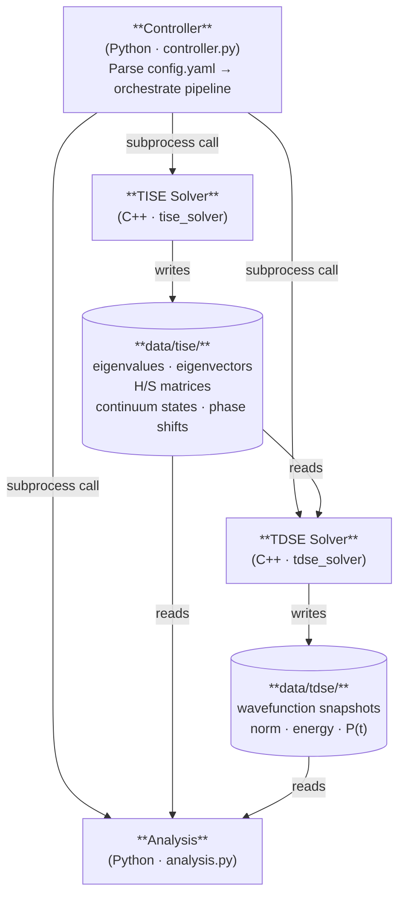

# Architecture Design Document — 2026-06-26
## 1D Quantum Mechanics B-Spline Playground

---

## 1. System Overview

The system is composed of four loosely-coupled components, orchestrated by a central **Controller** written in Python. The C++ solvers (TISE, TDSE) are independent executables; the Analysis program is a Python script. All persistent data is exchanged through a structured local storage directory.



---

## 2. Component Descriptions

### 2.1 Controller (`controller.py`)

The controller is the single entry point for a simulation run. Its responsibilities are:

- Parse the run configuration from `config.yaml` (and optionally from CLI overrides)
- Validate parameters before any solver is invoked
- Invoke the TISE solver via subprocess and wait for completion
- Conditionally invoke the TDSE solver if time evolution is requested
- Invoke the Analysis program with references to the relevant output directories
- Handle errors and non-zero exit codes from the C++ programs

The controller does **not** implement any physics — it is purely an orchestration layer.

### 2.2 TISE Solver (`tise_solver` binary, C++)

Solves the Time-Independent Schrödinger Equation on a finite interval $[0, R]$ using a B-spline basis. Specifically:

- Assembles the Hamiltonian matrix **H** and overlap matrix **S** in the B-spline basis
- Solves the generalized eigenvalue problem $\mathbf{H}\mathbf{c} = \mathbf{S}\mathbf{c}E$ for bound states
- For continuum states (the ContinuumEigenstates problem): loops over an energy grid $\varepsilon_i = \frac{E_\text{max}}{N_E} i$, computes $|\bar{\psi}_E\rangle$, extracts the normalization constant $A_E$ and phase shift $\delta(E)$, and computes $d\delta/dE$
- Writes all results to `data/tise/`

**Inputs** (from `config.yaml`):
- Potential parameters ($V_0$, $\sigma$, $x_0$)
- B-spline parameters (order $k$, number of nodes $N$, domain $[0, R]$)
- Energy grid parameters ($E_\text{max}$, $N_E$)

**Outputs** (to `data/tise/`):
- Bound-state eigenvalues and eigenvectors
- Hamiltonian and overlap matrices (needed by TDSE)
- Continuum state wavefunctions $\psi_{\varepsilon_i}(x)$ on a spatial grid
- Phase shift table: $\varepsilon_i$, $\delta(\varepsilon_i)$, $d\delta/dE|_{\varepsilon_i}$

### 2.3 TDSE Solver (`tdse_solver` binary, C++)

Propagates a wavefunction forward in time using **eigenstate expansion** in the B-spline basis. The initial state is expanded in the eigenstates computed by the TISE solver; each component acquires a time-dependent phase:

$$\psi(x, t) = \sum_n \alpha_n(0)\, e^{-i E_n t / \hbar}\, \phi_n(x), \qquad \alpha_n(0) = \langle \phi_n \mid \psi(0) \rangle$$

The inner products are evaluated in B-spline coefficient space using the overlap matrix $\mathbf{S}$ from the TISE. This approach is exact within the basis and requires neither finite-difference spatial discretization nor iterative time-stepping.

**Inputs**:
- `data/tise/` output (eigenvalues $E_n$, eigenvectors $\mathbf{c}_n$, overlap matrix $\mathbf{S}$)
- Time evolution parameters ($\Delta t$, $t_\text{final}$, `snapshot_interval`) from `config.yaml`
- Initial state specification (e.g., a bound eigenstate index, or a Gaussian wave packet)

**Outputs** (to `data/tdse/`):
- Wavefunction snapshots $\psi(x, t_n)$ at user-specified intervals
- Norm and energy expectation value at each snapshot (for stability monitoring)

### 2.4 Analysis (`analysis.py`, Python)

Post-processing and visualization. Reads from `data/tise/` and/or `data/tdse/` as needed.

Responsibilities:
- Plot phase shift $\delta(E)$ and its derivative $d\delta/dE$ vs. energy
- Identify resonance energies (peaks in $d\delta/dE$)
- Plot continuum eigenfunctions $\psi_E(x)$ at energies of interest
- For TDSE runs: animate or plot $|\psi(x,t)|^2$, compute escape probability $P(t)$ and survival probability $S_n(t)$

---

## 3. Data Flow Summary

| Producer | Consumer(s) | Data |
|---|---|---|
| TISE | TDSE, Analysis | Eigenvalues, eigenvectors |
| TISE | TDSE, Analysis | **H** and **S** matrices |
| TISE | Analysis | Continuum states, phase shifts |
| TDSE | Analysis | Wavefunction time series |

---

## 4. Configuration Schema (`config.yaml`)

A single YAML file drives the entire run. Example:

```yaml
# ─── Run control ──────────────────────────────────────────────────────────────
run:
  run_tise:     true
  run_tdse:     false
  run_analysis: false
  output_dir:   "./data"

# ─── Physical constants ───────────────────────────────────────────────────────
physics:
  mass: 1.0    # particle mass
  hbar: 1.0    # reduced Planck constant

# ─── B-spline basis ───────────────────────────────────────────────────────────
bspline:
  n_nodes: 51
  order:   12
  domain:  [0.0, 100.0]

# ─── Potential (piecewise, expressions in x) ──────────────────────────────────
# Each entry encodes a dict with two keys:
#   domain   — interval notation: [ ] closed, ( ) open. Supports inf.
#   function — a math expression in x with literal numeric constants only.
potential:
  - "{'domain': '(0, 100]', 'function': '-1/x + 1/x^2'}"

# ─── TISE solver ──────────────────────────────────────────────────────────────
tise:
  n_pts_eigenstate: 301       # spatial grid points for eigenstate output
  error_threshold:  1.0e-10   # eigenvalue accuracy cutoff for reporting

  continuum:
    enabled:     false
    E_threshold: 0.0          # lower bound of continuum spectrum range
    E_max:       10.0         # upper bound of continuum spectrum range
    n_energies:  100          # number of energy points in [E_threshold, E_max]
    n_pts:       500

# ─── TDSE solver ──────────────────────────────────────────────────────────────
tdse:
  initial_state:
    type:  eigenstate   # eigenstate | gaussian
    index: 0            # (eigenstate only) 0-indexed bound state
    # position: 10.0   # (gaussian only)
    # momentum:  0.0   # (gaussian only)
    # width:     1.0   # (gaussian only)
  dt:                0.3
  t_final:         300.0
  snapshot_interval: 10

# ─── Analysis (computed from TISE + TDSE output) ──────────────────────────────
# Requires run_tdse: true. See architecture-07-02.md for the underlying math.
analysis:
  bound_state_populations: true   # p_n(t)   = |<phi_n|Psi(t)>|^2
  asymptotic_populations:  true   # p_n(inf) = |<phi_n|Psi(t_final)>|^2
  asymptotic_distribution: true   # dP_a/dE  (requires tise.continuum.enabled)
  expectation_values:
    x: true
    p: true
    T: true
    V: true
    H: true
  interval_probability:
    enabled: false
    intervals:
      - [0.0, 5.0]

# ─── Visualization (what to plot; boolean toggles only) ───────────────────────
visualization:
  eigenstates:              true   # TISE
  phase_shifts:              true   # TISE (requires tise.continuum.enabled)
  time_evolution:            true   # TDSE (requires run_tdse)
  bound_state_populations:   true   # Analysis
  asymptotic_populations:    true   # Analysis
  asymptotic_distribution:   true   # Analysis (requires tise.continuum.enabled)
  expectation_values:        true   # Analysis
```

For full field descriptions, types, constraints, and potential parsing rules see
`docs/superpowers/specs/2026-06-28-config-yaml-schema-design.md`.

---

## 5. Python–C++ Interface

### 5.1 Options Considered

**A. `subprocess` + YAML config (recommended)**

Python launches the compiled C++ binary as a child process, passing the path to the shared YAML config file (with optional CLI overrides for one-off parameter changes):

```python
import subprocess

result = subprocess.run(
    ["./build/tise_solver",
     "--config", "config.yaml",
     "--output-dir", "data/tise/"],
    check=True,
    capture_output=True,
    text=True
)
```

The C++ side reads the YAML using **yaml-cpp** (header-only, CMake-friendly). The Python controller uses **PyYAML** or **ruamel.yaml**.

**B. pybind11 (in-process Python extension)**

Compile the solver logic as a Python `.so` module, callable directly from Python without spawning a process:

```python
import tise_solver  # compiled .so
tise_solver.run(config_dict)
```

This eliminates file-based data transfer for intermediate results and allows passing numpy arrays directly across the boundary. It requires writing pybind11 binding code and building with a Python-aware CMake target, but is otherwise not deeply invasive if the C++ code is organized into library functions with a thin `main()` wrapper.

**C. ctypes / cffi**

Wrap the C++ API in `extern "C"` functions, compile as a shared library, and call from Python via `ctypes`. Lower-level than pybind11 with more manual memory management — not recommended here.

**D. Shared memory / ZeroMQ / gRPC**

Appropriate for distributed or streaming workloads. Overkill for a local single-machine orchestrator.

### 5.2 Recommendation: `subprocess` + YAML

For this project, **Option A is the right choice**, for the following reasons:

1. **The programs are already long-running.** Process startup overhead (~milliseconds) is negligible compared to a physics solve that takes seconds to minutes. The subprocess penalty is irrelevant.

2. **The data flow is file-based by design.** Wavefunction grids and matrix data live on disk between runs. There is no benefit to passing them in-process.

3. **Independent testability.** Each C++ binary can be run, debugged, and profiled standalone without the Python layer in the loop. This is valuable during development.

4. **No changes to C++ code required.** The programs only need to accept a `--config` flag, which they should have anyway.

5. **Clean separation of concerns.** The controller stays thin. Physics logic stays in C++. Analysis stays in Python.

**When to reconsider pybind11:** If you later want to call the solver in a tight loop (e.g., a parameter sweep over hundreds of potential configurations where spawning a new process each time adds up), pybind11 becomes attractive. The path is: restructure the C++ into a library with a `solve(Params p) -> Results r` API, add bindings, and wrap `main()` as a thin CLI shim that calls the same library.

### 5.3 C++ YAML Support

Add **yaml-cpp** as a dependency. With CMake:

```cmake
find_package(yaml-cpp REQUIRED)
target_link_libraries(tise_solver PRIVATE yaml-cpp)
```

The C++ programs parse their config at startup:

```cpp
#include <yaml-cpp/yaml.h>

YAML::Node config = YAML::LoadFile(config_path);
double V0    = config["potential"]["V0"].as<double>();
int    n_nodes = config["bspline"]["n_nodes"].as<int>();
```

---

## 6. Local Storage Format

| File | Format | Contents |
|---|---|---|
| `data/tise/eigenvalues.dat` | Plain text (2-col) | Index, $E_n$ |
| `data/tise/eigenvectors.dat` | Plain text (matrix) | Columns are $\mathbf{c}_n$ coefficient vectors |
| `data/tise/hamiltonian.dat` | Plain text or binary | **H** matrix (banded) |
| `data/tise/overlap.dat` | Plain text or binary | **S** matrix (banded) |
| `data/tise/phase_shifts.dat` | Plain text (3-col) | $\varepsilon_i$, $\delta(\varepsilon_i)$, $d\delta/dE$ |
| `data/tise/continuum_state_NNN.dat` | Plain text (2-col) | $x$, $\psi_{\varepsilon_i}(x)$ per energy |
| `data/tdse/snapshot_NNNNN.dat` | Plain text (3-col) | $x$, Re$(\psi)$, Im$(\psi)$ per time step |
| `data/tdse/observables.dat` | Plain text (4-col) | $t$, norm, $\langle E \rangle$, $P(t)$ |

Plain text is preferred initially for transparency and ease of inspection with standard tools. Migration to HDF5 (via the HDF5 C++ API and `h5py` in Python) can be done later if file sizes or I/O speed become a bottleneck — the interface between programs does not change, only the file format.

---

## 7. Directory Layout

```
project/
├── config.yaml                 # Run configuration (single source of truth)
├── controller.py               # Python orchestrator
├── analysis.py                 # Python analysis/visualization
├── src/
│   ├── tise/
│   │   ├── main.cpp
│   │   ├── solver.cpp / .h
│   │   └── CMakeLists.txt
│   └── tdse/
│       ├── main.cpp
│       ├── propagator.cpp / .h
│       └── CMakeLists.txt
├── build/                      # CMake build output
│   ├── tise_solver
│   └── tdse_solver
├── data/                       # Runtime output (gitignored)
│   ├── tise/
│   └── tdse/
└── CMakeLists.txt              # Top-level build
```

---

## 8. Controller Pseudocode

```python
import subprocess
import sys
import yaml
from pathlib import Path

def run(config_path: str):
    with open(config_path) as f:
        cfg = yaml.safe_load(f)

    out = Path(cfg["run"]["output_dir"])
    (out / "tise").mkdir(parents=True, exist_ok=True)

    # --- Step 1: TISE ---
    if cfg["run"]["run_tise"]:
        subprocess.run(
            ["./build/tise_solver", "--config", config_path,
             "--output-dir", str(out / "tise")],
            check=True
        )

    # --- Step 2: TDSE (optional) ---
    if cfg["run"]["run_tdse"]:
        (out / "tdse").mkdir(exist_ok=True)
        subprocess.run(
            ["./build/tdse_solver", "--config", config_path,
             "--tise-dir", str(out / "tise"),
             "--output-dir", str(out / "tdse")],
            check=True
        )

    # --- Step 3: Analysis ---
    if cfg["run"]["run_analysis"]:
        subprocess.run(
            [sys.executable, "analysis.py",
             "--config", config_path,
             "--tise-dir", str(out / "tise"),
             "--tdse-dir", str(out / "tdse")],
            check=True
        )

if __name__ == "__main__":
    import argparse
    parser = argparse.ArgumentParser()
    parser.add_argument("--config", default="config.yaml")
    args = parser.parse_args()
    run(args.config)
```
