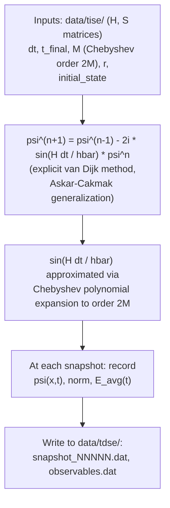

# TDSE Solver Internal Flow — Chebyshev / van Dijk Propagator (superseded)

*Diagram companion to `architecture-06-26.md` §2.3 in this folder. This describes the
original TDSE propagation design: an explicit Chebyshev/van-Dijk propagator with a
user-facing `tdse.chebyshev_order` config field. It has been superseded by the
eigenstate-expansion design now documented in the live `docs/planning/architecture-06-26.md`
and locked into the current `config.yaml` schema (which removed `tdse.chebyshev_order`
entirely — see `docs/superpowers/specs/2026-06-28-config-yaml-schema-design.md`'s Design
Decisions table).*

*Moved out of the main `docs/diagrams.md` reference on 2026-07-09 so that doc stays scoped
to the current, non-superseded design. Kept here, alongside the other original-design
documents it illustrates, for archival/traceability purposes.*

## TDSE Solver Internal Flow — Chebyshev / van Dijk Propagator (`flowchart`)

*Source: `architecture-06-26.md` §2.3 in this folder (= the top-level duplicate at
`Quantum Mechanics BSplines C++ Project/architecture-06-26.md`).*

`tdse.chebyshev_order` (`M`) was removed from the schema on 2026-06-28 in favor of
eigenstate expansion. This diagram is retained here purely as a historical record of
the design this folder's other documents describe — it does not reflect the current
TDSE solver design.
