# Diagram Reference — 1D-QM-Playground

*Generated from documentation only, not from the C++/Python source, since the
implementation is expected to change substantially while the documented
design is comparatively stable. Every diagram below cites the doc(s) it was
drawn from. Diagrams marked "reused verbatim" are copied unmodified from an
existing doc; everything else is newly authored here to visualize prose,
tables, or pseudocode that had no diagram of its own.*

*The docs disagree on the TDSE propagation method (see Section D). Only the
current design is diagrammed here; the superseded Chebyshev/van Dijk propagator
diagram lives at `docs/TDSE-original-design/tdse-propagator-diagram.md`, alongside
the archived docs describing it.*

## Contents

- **A. System Architecture & Data Flow** — 1–3
- **B. Configuration** — 4–5
- **C. TISE Solver** — 6–7
- **D. TDSE Solver** — 8–9
- **E. B-Spline Numerics** — 10–11
- **F. Process & History** — 12–14

---

## Section A — System Architecture & Data Flow

## 1. System Component Architecture (`flowchart`)

*Source: `docs/planning/architecture-06-26.md`, §1 (current). Reused verbatim.*

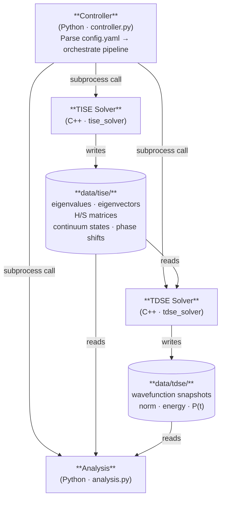

The system is four loosely-coupled components orchestrated by a central Python **Controller**. The C++ solvers are independent executables; **Analysis** is a Python script; all persistent data moves through the `data/` directory.

---

## 2. Orchestration Sequence (`sequenceDiagram`)

*Source: controller pseudocode in `docs/planning/architecture-06-26.md` §8, and the `run.*` flags in `config.yaml`.*

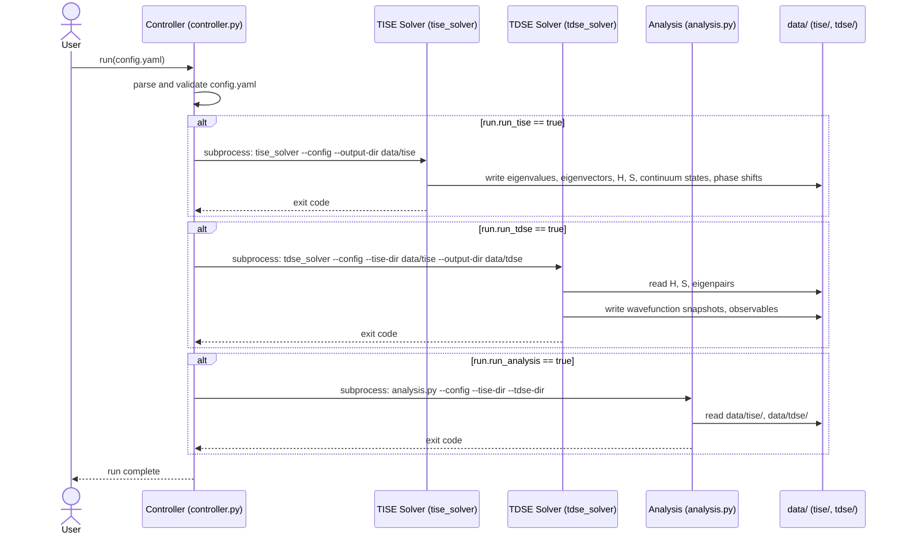

Each stage is gated by a boolean in `config.yaml`'s `run` block; the Controller "does not implement any physics — it is purely an orchestration layer."

---

## 3. Data Artifact Map (`flowchart`)

*Source: Data Flow Summary (§3) and Local Storage Format (§6) tables in `docs/planning/architecture-06-26.md`.*

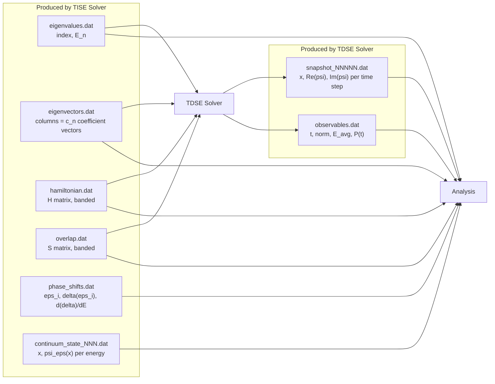

The layout now follows the actual pipeline order left to right (TISE files → TDSE Solver → TDSE files → Analysis), with the TDSE Solver node explicitly writing `F7`/`F8` so that column has something to anchor to; wider rank/node spacing gives the long TISE-to-Analysis edges (for `eigenvalues`, `eigenvectors`, `H`, `S`, which per the Data Flow Summary table feed both TDSE and Analysis) room to route around the middle columns instead of crossing through them. Plain text is preferred initially "for transparency and ease of inspection with standard tools"; migration to HDF5 is a possible later change that would not alter this producer/consumer map.

---

## Section B — Configuration

## 4. config.yaml Schema Structure (`classDiagram`)

*Source: `docs/superpowers/specs/2026-06-28-config-yaml-schema-design.md` + inline comments in `config.yaml`.*

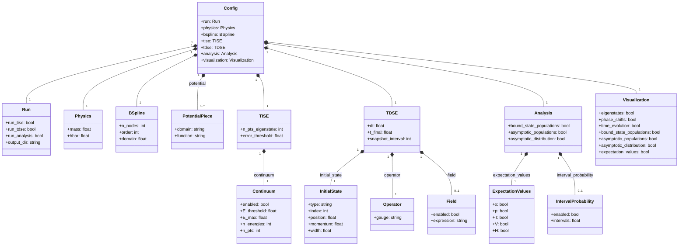

`bspline` is top-level (shared infrastructure for both solvers); `continuum` nests under `tise` because "continuum states are computed by the TISE solver — nesting expresses that dependency." `analysis` and `visualization` are deliberately separate top-level blocks: "conflating them mislabeled TISE/TDSE raw outputs as 'analysis'."

---

## 5. Potential Definition DSL (`flowchart`)

*Source: the `potential` block comment in `config.yaml` and its schema entry in the config-schema spec.*

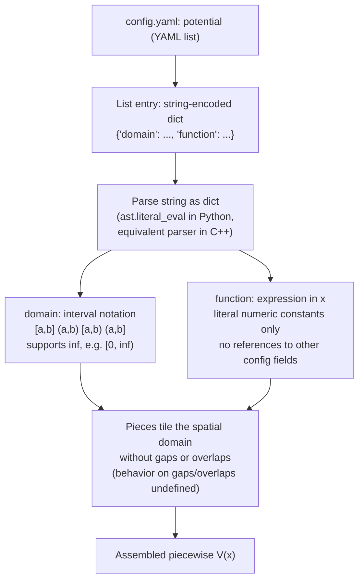

All constants, "including centrifugal terms, must be baked in" — there is no cross-referencing between config fields inside a potential expression.

---

## Section C — TISE Solver

## 6. TISE Solver Internal Flow (`flowchart`)

*Source: `docs/planning/architecture-06-26.md` §2.2, and Layer 2 + the bound-state stakeholder decision in `docs/planning/architecture-06-20.md`.*

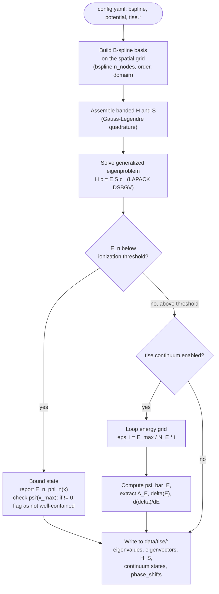

Bound-state count is an **output**, not an input: "the solver always computes all sub-threshold states." The well-containment check (`psi'(x_max) != 0`) is the documented diagnostic for flagging states whose energy/wavefunction may be inaccurate.

---

## 7. Boundary Condition Decision Tree (`flowchart`)

*Source: "Extra boundary conditions" stakeholder-feedback subsection (2026-07-03) in `docs/planning/architecture-06-20.md`.*

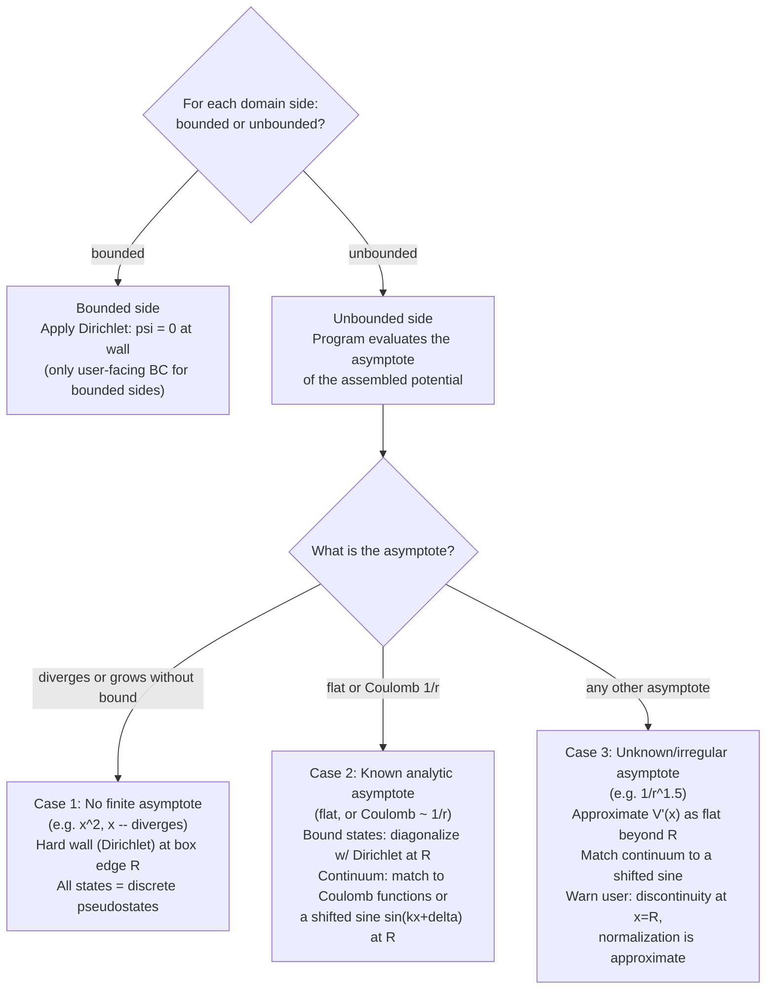

Three domain configurations are supported end-to-end: finite box (both sides bounded), half-line (left bounded, right unbounded — the radial equation), and full line (both sides unbounded).

---

## Section D — TDSE Solver

The docs disagree on the TDSE propagation method. `docs/planning/architecture-06-26.md` (current, matches the live `config.yaml` schema) describes a general driven-Hamiltonian design using eigenstate expansion; an older copy of the same-named document (archived under `docs/TDSE-original-design/` and duplicated at the top-level `Quantum Mechanics BSplines C++ Project/architecture-06-26.md`) describes an explicit Chebyshev/van Dijk propagator that the config-schema spec's Design Decisions table explicitly says was removed (`tdse.chebyshev_order` — "propagator method is an implementation detail, not a user-facing config field"). This doc only diagrams the current design below; the superseded Chebyshev/van Dijk propagator diagram has been moved to `docs/TDSE-original-design/tdse-propagator-diagram.md`, alongside the archived docs it illustrates, until the team formally retires it for good.

## 8. TDSE Solver Internal Flow — Eigenstate Expansion `[CURRENT]` (`flowchart`)

*Source: `docs/planning/architecture-06-26.md` §2.3 (current) + `docs/superpowers/specs/2026-06-28-config-yaml-schema-design.md` §`tdse`.*

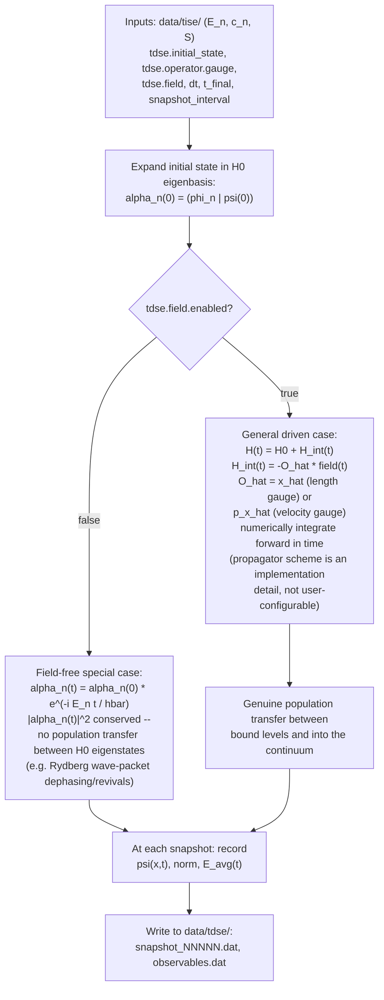

This is the mode that makes bound-state population vs. time a *meaningful, non-constant* analysis output only when a field is applied — the field-free case conserves populations by construction.

---

## 9. TDSE Eigenstate Round-Trip — math notation (`flowchart`)

*Source: `docs/planning/bsplines.md`, "The Round-Trip: Enabling TDSE". Reused verbatim.*

```mermaid
flowchart LR
    d0["Initial state\nin B-spline coords\n$$\mathbf{d}_0$$"]
    a0["Eigenstate\ncoefficients\n$$\boldsymbol{\alpha}(0)$$"]
    at["Time-evolved\neigenstate coeffs\n$$\boldsymbol{\alpha}(t)$$"]
    dt["B-spline coeffs\nat time t\n$$\mathbf{d}(t)$$"]
    psi["Real-space\nwavefunction\n$$\Psi(r,t)$$"]

    d0 -->|"$$C^{-1}$$"| a0
    a0 -->|"$$e^{-iE_n t}$$\ncomponent-wise"| at
    at -->|"$$C$$"| dt
    dt -->|"evaluate\nB-splines"| psi
```

This is the concrete algorithm behind Diagram 8's field-free special case, as implemented (prototype) in `TISE/main.cpp`: `Phi_G = C_dagger * B_G` → `V_t = evolution.cwiseProduct(Phi_G)` → `CV_t = C * V_t` → `bspline.eval`. It closes only because the eigenstates live in the B-spline subspace by construction, making `C` a well-defined, invertible change-of-basis matrix.

---

## Section E — B-Spline Numerics

## 10. B-Spline Construction via de Boor Recursion (`flowchart`)

*Source: `docs/planning/bsplines.md`, "Recursion Tree for $B_i^3$". Reused verbatim.*

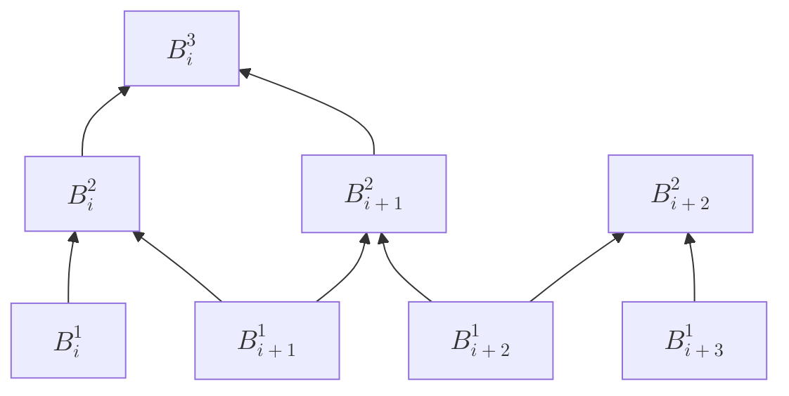

Each node is a weighted blend of the two nodes below it. At any evaluation point `x`, only `k` B-splines are nonzero simultaneously, so exactly `k` leaves of this tree contribute. The project currently uses `k = 12`.

---

## 11. FEDVR vs. B-Spline Operator Structure `[future / deferred]` (`flowchart`)

*Source: comparison table (§4.4) in `docs/planning/fedvr-exploration.md`. Status: "deferred. To be revisited once the B-spline code is working."*

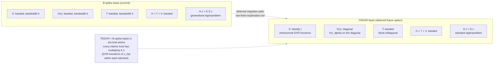

Not part of the current architecture — included here as a documented future option, not a present component.

---

## Section F — Process & History

## 12. Simulation Run State Diagram (`stateDiagram-v2`)

*Source: `run.run_tise` / `run.run_tdse` / `run.run_analysis` flags in `config.yaml`, and the controller pseudocode in `docs/planning/architecture-06-26.md` §8.*

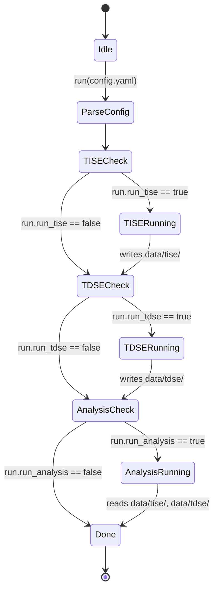

---

## 13. Original 4-Layer Architecture Sketch `[historical, 2026-06-20]` (`flowchart`)

*Source: `docs/planning/architecture-06-20.md`, "Architecture Diagram" (transcribed from handwritten notes `06-20-Notes-Part-1.jpg`). Reused verbatim.*

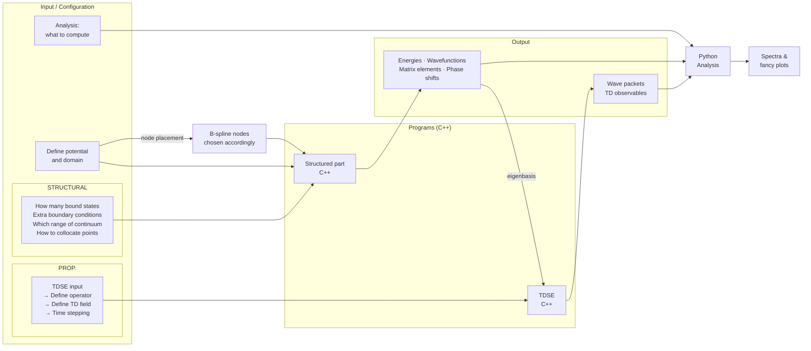

This is the earliest architecture sketch (predates the Controller and the local-storage schema, both introduced in the 06-26 doc). Kept here as the historical starting point of the design.

---

## 14. Design Evolution Timeline (`timeline`)

*Source: dates and content of all planning docs cross-referenced above.*

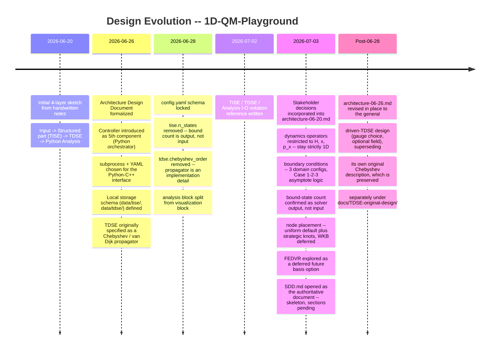

Two documents share the name `architecture-06-26.md` with different content: the one under `docs/planning/` was updated in place to match the current, driven-Hamiltonian TDSE design; the one under `docs/TDSE-original-design/` (and its duplicate at the top-level `Quantum Mechanics BSplines C++ Project/architecture-06-26.md`) preserves the original Chebyshev/van Dijk design as an archival snapshot.
