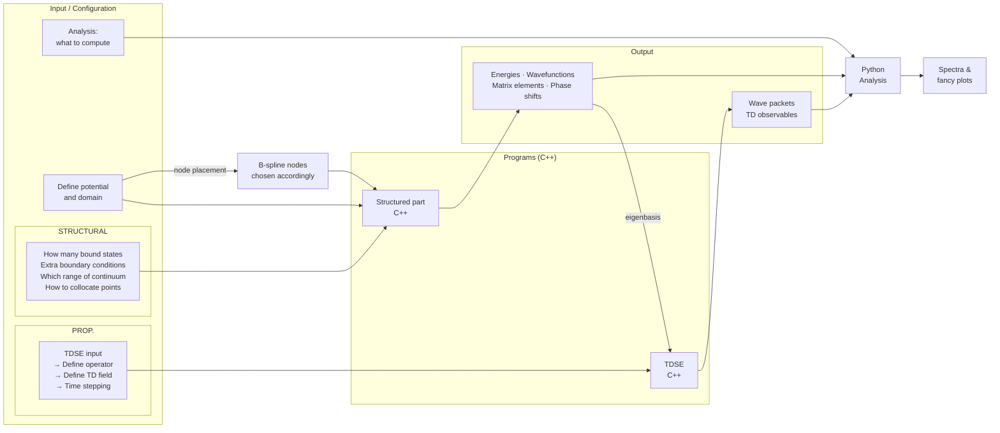

# Proposed Architecture: 1D QM Solver
*Transcription and conceptual breakdown of handwritten notes — 06-20-Notes-Part-1.jpg*

---

## Raw Transcription

**Goal:** publ. in AJP.

**1D solver for:**
- TISE (both bound & cont. states)
- TDSE under ext. pulses.

---

### User-Facing Input Groups

The left side of the diagram identifies three categories of user-configurable input, each labeled with a bracket:

**INPUT**
- Def. potential and domain
  - *(annotation with arrow)* B-splines nodes → must be chosen accordingly.

**STRUCTURAL**
- How many bound states,
- Extra bound cond.
- Which range of continuum energies
- How to collocate points

**PROP.**
- TDSE input.
  - → Define operator.
  - → Define TD field.
  - → Time stepping.

**Analysis**
- what to compute.

---

### Center Annotation — B-Spline Definition

Written between the input column and the program boxes, referencing the B-spline example figures on the right of the page:

> $B^k$ → extend on $K$ contiguous intervals. Polynomial of degree $K-1$, and the $(K-2)$-th derivative is continuous.

*(The B-spline example plots — $B^1$, $B^2$, $B^3$, $B^5$ — appearing on the right of the page are covered in a separate document.)*

---

### Programs (C++)

Two distinct C++ programs are sketched, each labeled **PROG.**:

| Label | Language | Role |
|---|---|---|
| Structured part | C++ | TISE solver — eigenvalues, eigenfunctions, matrix elements |
| TDSE. | C++ | Time-domain propagator — wave packets, observables |

---

### Outputs

**OUTPUT** (from Structured part):
- Energies, wvt. fxns. [wavefunctions], scattering states, matrix elements, phase shifts

**OUTPUT** (from TDSE):
- Wave packets, TD observable

---

### Downstream Analysis

Both output streams feed into a single block:

**Python. Analysis.** → Spectra and fancy plots.

---

## Conceptual Breakdown

The diagram proposes a modular, layered architecture. The following is a description of each layer and its role.

### Layer 1 — Physical Setup (Input)

Before any computation, the user defines the physical problem. This divides naturally into two sub-groups:

**Static (STRUCTURAL) inputs** configure the TISE run:
- The potential $V(x)$ and the spatial domain $[x_\text{min}, x_\text{max}]$.
- The B-spline basis: the node count and distribution must be chosen relative to the potential's structure and the desired continuum range. Poor node placement leads to inaccurate phase shifts or missing continuum states.
- Boundary conditions (e.g., Dirichlet at $r = 0$ and at the box boundary).
- Collocation scheme: how Gauss quadrature points are placed within each B-spline interval.

**Dynamic (PROP.) inputs** configure the TDSE run, which builds on the TISE output:
- The operator form (e.g., dipole coupling to a laser field).
- The time-dependent field $\mathcal{E}(t)$: envelope, frequency, duration, polarization.
- The time-stepping scheme: step size $\Delta t$ and propagator method.

**Analysis** specifies which post-processing quantities to extract (e.g., spectra, ionization probability, ATI peaks).

### Layer 2 — Structured Part (C++, TISE)

The core eigenvalue/eigenfunction engine. Given the physical setup, it:

1. Constructs the B-spline basis $\{B_i^k\}$ on the radial grid.
2. Assembles the Hamiltonian $H$ and overlap $S$ matrices in banded storage.
3. Solves the generalized eigenvalue problem $H \mathbf{c} = E\, S \mathbf{c}$ (LAPACK `DSBGV`).
4. Identifies and normalizes both bound-state and continuum eigenstates.
5. Computes matrix elements (e.g., dipole, kinetic) and phase shifts for scattering states.
6. Writes eigenvalues, eigenfunctions, and matrix elements to disk.

The annotation in the notes ("B-spline nodes must be chosen accordingly") reflects that basis quality is tightly coupled to the potential: for a Coulomb potential the grid should be denser near $r = 0$; for a continuum problem the box size and node density determine the energy resolution of pseudostates.

### Layer 3 — TDSE (C++)

The time-domain propagator, consuming the structured output:

1. Reads the eigenbasis (eigenvalues and eigenvectors) from the TISE output.
2. Expands the initial state in the eigenbasis.
3. Applies the time-evolution operator $e^{-i\hat{H}_\text{tot} \Delta t}$ step-by-step, where $\hat{H}_\text{tot} = \hat{H}_0 + \hat{V}_\text{field}(t)$.
4. At each step, records observables: norm, energy, dipole moment, ionization probability.
5. Writes time-step snapshots of the wave packet $\Psi(x,t)$ and integrated observables to disk.

### Layer 4 — Python Analysis

A post-processing layer, entirely decoupled from the C++ solvers:

- Reads eigenstate files and time-step snapshots.
- Computes Fourier transforms for harmonic spectra.
- Produces publication-quality figures: radial probability densities, energy spectra, ATI maps, heatmaps of $|\Psi(x,t)|^2$.

Keeping analysis in Python allows rapid iteration on figures without recompilation.

---

## Architecture Diagram

---

## Open Questions (from diagram context)

The notes identify several choices left to be specified:

- **Collocation scheme** — How to distribute B-spline knot points along the radial coordinate. Uniform spacing is the simplest choice but is rarely optimal: bound states need density near $r = 0$ where the wavefunction oscillates and decays rapidly, while continuum states at higher energies need adequate resolution across the entire box. Three main strategies are on the table:

  - **Uniform in $r$** — simplest to implement; adequate for low-lying bound states in a small box but wastes points in the asymptotic region and underresolves near the origin for a Coulomb potential.

  - **WKB / phase-angle uniform distribution** — place nodes so that equal amounts of classical phase accumulate between successive knots:

    $$\theta(r) = \int_0^r k(r')\, dr', \qquad k(r) = \sqrt{2m\bigl(E - V(r)\bigr)}$$

    Spacing uniformly in $\theta$ rather than in $r$ automatically concentrates nodes where $k(r)$ is large (high kinetic energy, rapid oscillation — near the nucleus for a Coulomb potential) and spreads them out in the classically slow region. This is physics-driven and handles both bound and continuum states well since the grid adapts to the local wavelength. The main drawback is that it requires choosing a reference energy $E$ to define $k(r)$; a natural choice is the ionization threshold or a representative continuum energy.

  - **Derivative-adaptive** — place nodes where $|d\psi/dr|$ is large, refining the grid iteratively based on the solution itself. More agnostic about the physics and applicable to arbitrary potentials, but creates a chicken-and-egg problem: you need an approximate solution to build a good grid. Better suited to a two-pass scheme (coarse solve → refine grid → final solve) than to a one-shot calculation.

  For the hydrogen atom with a Coulomb potential and a mixed bound + continuum spectrum, the WKB approach is the most natural starting point. The derivative-adaptive approach was also considered (discussed in 06-26 notes) as an alternative that avoids choosing a reference energy, at the cost of additional implementation complexity; however, as we intend to build on the current implementation to solve 1D problems generally, it may not suffice to choose a solution based on what works best specifically in the case of a hydrogen atom with a Coulomb potential.
- **Continuum range** — which energy range of scattering states to include; this sets the box size and the pseudostate density.
- **Operator form for TDSE** — length vs. velocity gauge for the dipole interaction.
- **Time-stepping method** — Crank–Nicolson, Arnoldi-Lanczos, split-operator, or Runge–Kutta.
- **What to compute** (Analysis) — the specific observables and figure types are left open-ended in the notes.
