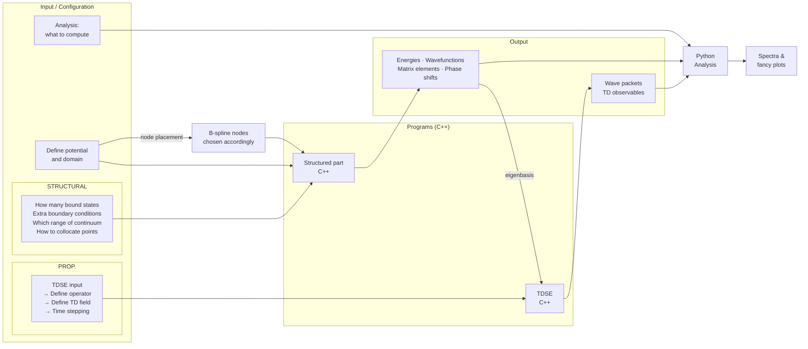

# Proposed Architecture: 1D QM Solver
*Transcription and conceptual breakdown of handwritten notes — 06-20-Notes-Part-1.jpg*

---

## Raw Transcription

**Goal:** publ. in AJP.

**1D solver for:**
- TISE (both bound & cont. states)
- TDSE under ext. pulses.

---

### User-Facing Input Groups

The left side of the diagram identifies three categories of user-configurable input, each labeled with a bracket:

**INPUT**
- Def. potential and domain
  - *(annotation with arrow)* B-splines nodes → must be chosen accordingly.

**STRUCTURAL**
- How many bound states,
- Extra bound cond.
- Which range of continuum energies
- How to collocate points

**PROP.**
- TDSE input.
  - → Define operator.
  - → Define TD field.
  - → Time stepping.

**Analysis**
- what to compute.

---

### Center Annotation — B-Spline Definition

Written between the input column and the program boxes, referencing the B-spline example figures on the right of the page:

> $B^k$ → extend on $K$ contiguous intervals. Polynomial of degree $K-1$, and the $(K-2)$-th derivative is continuous.

*(The B-spline example plots — $B^1$, $B^2$, $B^3$, $B^5$ — appearing on the right of the page are covered in a separate document.)*

---

### Programs (C++)

Two distinct C++ programs are sketched, each labeled **PROG.**:

| Label | Language | Role |
|---|---|---|
| Structured part | C++ | TISE solver — eigenvalues, eigenfunctions, matrix elements |
| TDSE. | C++ | Time-domain propagator — wave packets, observables |

---

### Outputs

**OUTPUT** (from Structured part):
- Energies, wvt. fxns. [wavefunctions], scattering states, matrix elements, phase shifts

**OUTPUT** (from TDSE):
- Wave packets, TD observable

---

### Downstream Analysis

Both output streams feed into a single block:

**Python. Analysis.** → Spectra and fancy plots.

---

## Conceptual Breakdown

The diagram proposes a modular, layered architecture. The following is a description of each layer and its role.

### Layer 1 — Physical Setup (Input)

Before any computation, the user defines the physical problem. This divides naturally into two sub-groups:

**Static (STRUCTURAL) inputs** configure the TISE run:
- The potential $V(x)$ and the spatial domain $[x_\text{min}, x_\text{max}]$.
- The B-spline basis: the node count and distribution must be chosen relative to the potential's structure and the desired continuum range. Poor node placement leads to inaccurate phase shifts or missing continuum states.
- Boundary conditions (e.g., Dirichlet at $r = 0$ and at the box boundary).
- Collocation scheme: how Gauss quadrature points are placed within each B-spline interval.

**Dynamic (PROP.) inputs** configure the TDSE run, which builds on the TISE output:
- The operator form (e.g., dipole coupling to a laser field).
- The time-dependent field $\mathcal{E}(t)$: envelope, frequency, duration, polarization.
- The time-stepping scheme: step size $\Delta t$ and propagator method.

**Analysis** specifies which post-processing quantities to extract (e.g., spectra, ionization probability, ATI peaks).

### Layer 2 — Structured Part (C++, TISE)

The core eigenvalue/eigenfunction engine. Given the physical setup, it:

1. Constructs the B-spline basis $\{B_i^k\}$ on the radial grid.
2. Assembles the Hamiltonian $H$ and overlap $S$ matrices in banded storage.
3. Solves the generalized eigenvalue problem $H \mathbf{c} = E\, S \mathbf{c}$ (LAPACK `DSBGV`).
4. Identifies and normalizes both bound-state and continuum eigenstates.
5. Computes matrix elements (e.g., dipole, kinetic) and phase shifts for scattering states.
6. Writes eigenvalues, eigenfunctions, and matrix elements to disk.

The annotation in the notes ("B-spline nodes must be chosen accordingly") reflects that basis quality is tightly coupled to the potential: for a Coulomb potential the grid should be denser near $r = 0$; for a continuum problem the box size and node density determine the energy resolution of pseudostates.

### Layer 3 — TDSE (C++)

The time-domain propagator, consuming the structured output:

1. Reads the eigenbasis (eigenvalues and eigenvectors) from the TISE output.
2. Expands the initial state in the eigenbasis.
3. Applies the time-evolution operator $e^{-i\hat{H}_\text{tot} \Delta t}$ step-by-step, where $\hat{H}_\text{tot} = \hat{H}_0 + \hat{V}_\text{field}(t)$.
4. At each step, records observables: norm, energy, dipole moment, ionization probability.
5. Writes time-step snapshots of the wave packet $\Psi(x,t)$ and integrated observables to disk.

### Layer 4 — Python Analysis

A post-processing layer, entirely decoupled from the C++ solvers:

- Reads eigenstate files and time-step snapshots.
- Computes Fourier transforms for harmonic spectra.
- Produces publication-quality figures: radial probability densities, energy spectra, ATI maps, heatmaps of $|\Psi(x,t)|^2$.

Keeping analysis in Python allows rapid iteration on figures without recompilation.

---

## Architecture Diagram

---

## Open Questions (from diagram context)

The notes identify several design choices that remain to be resolved. Each is examined below along with the considerations that bear on the decision.

---

### Operators: what and whether to expose them

#### Initial analysis

In 1D quantum mechanics the Hamiltonian is always

$$\hat{H} = \frac{\hat{p}^2}{2m} + V(\hat{r})$$

with $V$ supplied by the user. So the TISE Hamiltonian is fully determined by the potential input — there is nothing left for the user to specify there.

For the TDSE the story is different. The field–matter coupling introduces an interaction Hamiltonian $\hat{H}_\text{int}(t)$. In the dipole approximation this involves the **dipole operator** $\hat{d}$, but there are two common gauge choices:

- **Length gauge:** $\hat{H}_\text{int} = -e\,\hat{r}\,\mathcal{E}(t)$ — straightforward to implement and interpret; the coupling is proportional to the electron's displacement.
- **Velocity gauge:** $\hat{H}_\text{int} = -\frac{e}{m}\hat{p}\,A(t)$ — advantageous numerically for highly oscillatory fields because the matrix elements decay faster at large momenta; related to the length gauge by a unitary transformation.

Beyond the field coupling, other operators appear naturally as **observables** during and after propagation:

- Position $\langle \hat{r}(t) \rangle$ and its second derivative $\langle \ddot{\hat{r}} \rangle$ (the dipole acceleration, whose Fourier transform gives the high-harmonic generation spectrum)
- Momentum $\langle \hat{p}(t) \rangle$ (relevant for ATI spectra and momentum distributions)
- Angular momentum $\hat{L}^2$ (if extended beyond 1D or to non-zero $l$ channels)
- Transition dipole matrix elements $\langle \psi_m | \hat{d} | \psi_n \rangle$ between eigenstates (needed to construct selection rules and compute photoionization cross-sections)
- The norm and energy, $\langle \hat{H} \rangle(t)$, as diagnostic quantities during propagation

**Recommendation:** The dipole operator gauge (length vs. velocity) is a sensible user input for the TDSE since it affects both accuracy and performance in ways that depend on the field parameters. Arbitrary operator input is probably out of scope at this stage. A reasonable approach is to hard-code the standard set of observables listed above and let the user select which to compute via the Analysis input (see below).

#### Stakeholder feedback (2026-07-03)

*Updated 2026-07-03 — stakeholder feedback incorporated.*

There are two distinct sets of operators to consider: those **governing the dynamics** and those **associated with measurement** (observables).

#### Dynamics operators

For the dynamics, the central design decision is dimensionality. Going to 2D or 3D (e.g., the hydrogen atom) would require a substantially more complex code and demanding simulations. **Stakeholder recommendation: stay with 1D.** This keeps the program simple: there is only one discrete symmetry (parity), at most two escape channels (left/right, or even/odd for symmetric potentials), and the dynamics operator is just the Hamiltonian

$$\hat{H} = \frac{\hat{p}^2}{2m} + V(\hat{x})$$

fully determined by the user's choice of $V(x)$ — there is nothing else to expose. In 1D without driving fields, a user can compute bound and scattering states of any central potential but not driven time evolution. The most interesting time-domain problem accessible in this regime is preparing Rydberg wave packets and observing their radial periodicity.

The relevant operator set is therefore restricted to: $\hat{H}$, $\hat{x}$, and $\hat{p}_x$.

#### Observables (post-processing)

To be handled by the Analysis layer after simulation:

1. **Asymptotic observables** — projection of the final state onto scattering states
2. **Bound-state populations and amplitudes** — projection onto bound eigenstates
3. **Expectation values** of $\hat{x}$, $\hat{p}$, $\hat{T}$ (kinetic energy), $\hat{V}$ (potential energy), and $\hat{H}$ as functions of time
4. **Interval probability** — probability of finding the particle within a user-specified spatial interval, computable via B-spline integrals between arbitrary boundaries

#### Future directions (deferred)

Potential expansions for pedagogical purposes include two interacting particles (which opens entanglement, correlation, exchange symmetry, and decoherence) before adding 3D complexity. These are explicitly deferred.

**Decision: keep it simple.** Work toward a clean, self-contained publication first. Expansions can follow depending on where the project stands at completion.

---

### Number of bound states: input or computed?

#### Initial analysis

The number of bound states is not a free parameter — it is determined by the potential and the box size. A finite confining box always produces a finite number of pseudobound states below the ionization threshold, and a Coulomb potential in a box of size $r_\text{max}$ has roughly $n_\text{max} \sim \sqrt{r_\text{max}/2}$ bound states (from the hydrogen energy levels $E_n = -1/2n^2$ au).

The architecture diagram labels this as a STRUCTURAL input, which most likely means something narrower: **how many bound states to retain for downstream use**, not how many exist. Plausible use cases:

- **TDSE truncation.** Time propagation can be performed in a truncated eigenbasis containing only the lowest $N_b$ bound states and a selected window of continuum pseudostates. Restricting $N_b$ reduces the matrix dimension and propagation cost, at the expense of accuracy for dynamics that populate high Rydberg states.
- **Convergence testing.** Running the same physical scenario with $N_b = 5, 10, 20, \ldots$ and checking that results stabilize is standard practice; making $N_b$ a runtime input makes this easy.
- **Analysis filtering.** Even if the full diagonalization is performed, the user may only want to plot or store the lowest $N_b$ wavefunctions rather than all $n = l + k - 1$ eigenstates.

**Recommendation:** Compute all eigenstates automatically from the diagonalization; expose $N_b$ as an optional truncation parameter for TDSE and analysis. The program should label eigenstates by energy and let the user specify either a count or an energy cutoff (e.g., "all states below $2E_\text{ion}$").

#### Stakeholder feedback (2026-07-03)

*Updated 2026-07-03 — stakeholder feedback incorporated.*

#### Is it a valid input?

The number of bound states is **not known a priori** — a user asking for 10 may find there are only 3, or none. Conversely, the diagonalization will produce all sub-threshold states regardless, so arbitrarily withholding them serves no purpose. Taking this as a mandatory input is therefore not appropriate.

The count depends on the asymptotics of the potential:

- Potentials decaying as $1/r$ (Coulomb) or $1/r^2$ have **infinitely many** bound states, with energies converging to the threshold as $1/n^2$ and $e^{-n}$ respectively.
- Attractive potentials that taper off faster than $1/r^2$ have a **finite** number of bound states.

#### Accuracy within the box

Not all sub-threshold states the diagonalization produces are reliable. States well-contained within the quantization box are accurate. States that "collide" with the boundary are not — if analytically continued past the box, they would carry a diverging irregular component. One could in principle extend the box boundary condition to match the logarithmic derivative of the known asymptotic regular solution (turning the box boundary into a transcendental equation), but this adds significant implementation complexity for unclear gain.

A practical quality metric: **check the derivative of the eigenstate at the box boundary.** If $\psi'(x_\text{max}) \neq 0$, that is a red flag indicating the state is not well-contained and its energy and wavefunction may be inaccurate. This diagnostic should be computed and reported alongside each state.

#### Decision: bound state count is output, not input

List all states with energy below the ionization threshold as output, with the caveat that some energies and wavefunctions may be inaccurate if the state is not well-contained in the box. The user selects whichever states they want from that list.

#### Visualization and analysis

Tabulate whichever states are the box a user asks for, and optionally allow the user to restrict the number of states visualized to a subset. The analysis program should additionally allow the user to request any specific state by index or energy, regardless of the default display limit.

---

### Extra boundary conditions

#### Initial analysis

The standard boundary conditions are Dirichlet at both endpoints: $\psi(x_\text{min}) = 0$ and $\psi(x_\text{max}) = 0$. "Extra boundary conditions" in the notes likely refers to physical constraints beyond this baseline. The relevant options depend significantly on whether the solver is being used for a hydrogenic (radial) system or a general 1D problem.

**Domain geometry.** The first question is what the spatial domain looks like:

- **Half-line** $[0, \infty)$ — the radial Schrödinger equation for a spherically symmetric 3D system. The coordinate $r \geq 0$ and the physical boundary condition at the origin is set by the angular momentum quantum number $l$ (see below).
- **Full line** $(-\infty, \infty)$ — a genuinely 1D problem (e.g., a particle in a symmetric well). No special origin condition exists; the domain is truncated symmetrically to $[-x_\text{max}, x_\text{max}]$ with Dirichlet walls.
- **Finite box** $[a, b]$ — arbitrary 1D confinement problem. Both ends are user-specified walls.

The domain geometry should be a user input, since it determines which boundary conditions are physically meaningful.

**Hydrogenic / radial-equation BCs at the origin.** For a radial equation with angular momentum quantum number $l$, the physical solution behaves as $\psi \sim r^{l+1}$ near $r = 0$. The Dirichlet condition $\psi(0) = 0$ enforces this for all $l \geq 0$ — it is automatically satisfied by the working basis (dropping $B_1$) regardless of $l$. However, $l$ still enters the Hamiltonian through the centrifugal barrier $l(l+1)/2mr^2$, so it must be a user input for the radial case. For a general 1D problem there is no centrifugal term and no $l$ dependence.

**Outgoing-wave (Siegert) BCs.** For resonance calculations, the Dirichlet condition at the outer wall is replaced by the requirement that the wavefunction is a purely outgoing wave at large $r$: $\psi(r_\text{max}) \sim e^{ikr}$. This yields complex eigenvalues $E = E_r - i\Gamma/2$ where $\Gamma$ is the resonance width (inverse lifetime). Implementing this rigorously requires exterior complex scaling (ECS) of the outer region and is a significant extension.

**Complex absorbing potential (CAP).** A practical alternative to outgoing-wave BCs: add an imaginary absorbing potential $-iW(r)$ near the outer wall that damps outgoing flux before it reaches the boundary, preventing artificial reflections. The Dirichlet wall is then physically harmless, and no complex scaling is needed. CAPs introduce free parameters (onset position and strength) that must be tuned, but they are compatible with the existing real-valued B-spline infrastructure and are the more tractable near-term option for ionization studies.

**Recommendation:** Expose the domain geometry (half-line, full line, finite box) as a user input, since it determines which BCs are physical. For the initial implementation, Dirichlet walls at both ends are recommended for all domain types. For the radial (half-line) case, $l$ should be a user input since it enters the Hamiltonian. CAP support at the outer boundary is the recommended next addition for continuum and ionization calculations, since it does not require changes to the real-valued eigensolver. Outgoing-wave BCs and ECS are deferred to a later stage.

#### Stakeholder feedback (2026-07-03)

*Updated 2026-07-03 — stakeholder feedback incorporated.*

#### Domain specification

The user specifies which sides of the domain are bounded. Three configurations are supported:

| Configuration | Left boundary | Right boundary | Example use case |
|---|---|---|---|
| Finite box $[a, b]$ | bounded (Dirichlet) | bounded (Dirichlet) | Particle in a box with non-uniform potential |
| Half-line $[0, \infty)$ | bounded (Dirichlet at origin) | unbounded | Radial equation, scattering potential |
| Full line $(-\infty, \infty)$ | unbounded | unbounded | Symmetric well, free-particle problems |

At every **bounded** side, the program applies a Dirichlet condition ($\psi = 0$) at the wall. This is the only user-facing boundary condition choice for bounded sides.

#### Handling unbounded sides: automatic asymptote analysis

For any **unbounded** side, the program is responsible for determining the behavior of the potential at that boundary. The potential is specified as a sum of terms, each defined over a user-supplied support interval (allowing piecewise or compact-support potentials). The program evaluates the asymptote of the assembled potential at the unbounded edge and selects the appropriate treatment from three cases:

**Case 1 — No finite asymptote** (potential diverges or grows without bound, e.g., $x^2$, $x$):

The potential is not bounded at the edge, so no scattering states exist in that channel. The program places a hard wall (Dirichlet condition) at the quantization box boundary $R$. All states produced are discrete pseudostates confined to $[0, R]$.

**Case 2 — Known asymptote with analytic solutions** (flat potential or Coulomb $\sim 1/r$):

The program can treat bound and continuum states separately:
- **Bound states**: diagonalize the Hamiltonian with Dirichlet BC at $R$ as usual.
- **Continuum states**: normalize by matching the B-spline solution inside $[0, R]$ to the analytically known asymptotic solutions at the boundary (Coulomb functions for a $1/r$ tail; a shifted sine $\sin(kx + \delta)$ for a flat asymptote). This matching extracts the normalization constant $A_E$ and phase shift $\delta(E)$.

**Case 3 — Unknown or irregular asymptote** (e.g., $1/r^{3/2}$, or any potential not covered by Case 2):

The program approximates the potential as flat beyond $R$:

$$V'(x) = \begin{cases} V(x) & x < R \\ V(\infty) & x \geq R \end{cases}$$

and matches continuum solutions to a shifted sine, as in the flat-asymptote branch of Case 2. **The user is warned** that this introduces a discontinuity in the potential at $x = R$, and that continuum normalizations are approximate.

#### Use cases

- **Bounded domain** $[a, b]$: any particle-in-a-box problem with a non-uniform internal potential. All states are discrete; no asymptote analysis is needed.
- **Unbounded right, potential grows** (e.g., harmonic oscillator $V \sim x^2$, linear $V \sim x$): Case 1 applies — Dirichlet at $R$, all states are box-confined pseudostates.
- **Unbounded right, Coulomb tail** ($V \sim 1/x$): Case 2 applies — bound states from diagonalization, continuum states normalized against Coulomb functions.
- **Unbounded right, fast decay** (e.g., $V \sim e^{-x^2}$): Case 3 applies — asymptote treated as flat, continuum matched to a shifted sine, user cautioned about the approximation.

---

### Continuum range

#### Initial analysis

This is a genuine physical input. The energy range of continuum pseudostates the solver produces is set by the box size $r_\text{max}$ and the B-spline grid density: a box of size $r_\text{max}$ produces pseudostates with density

$$\rho(E) = \frac{r_\text{max}}{\pi\sqrt{2E}}$$

and the highest continuum state reached is approximately $E_\text{max} \sim \frac{1}{2}\left(\frac{N_\text{cont}\pi}{r_\text{max}}\right)^2$ where $N_\text{cont}$ is the number of continuum pseudostates.

For TDSE calculations the required continuum range is set by the laser field. For a monochromatic field of peak intensity $I$ and frequency $\omega$, the ponderomotive energy is $U_p = I/4\omega^2$ (atomic units), and the relevant energy ranges are:

- **Above-threshold ionization (ATI) cutoff:** $\approx 2U_p + I_p$ (direct electrons), $10U_p + I_p$ (rescattered)
- **High-harmonic generation (HHG) cutoff:** $\approx 3.17U_p + I_p$

where $I_p$ is the ionization potential. Including enough continuum states to cover these cutoffs determines the minimum box size and grid resolution.

**Recommendation:** Expose $r_\text{max}$ and the desired maximum continuum energy $E_\text{max}$ as user inputs. The program can then compute the required pseudostate density and warn if the current grid is insufficient.

#### Stakeholder feedback (2026-07-03)

There are two distinct ranges to separate:

**1. Range of the state functions** — determined when specifying the physical problem. This is $R$, the size of the quantization box. It controls the density of continuum pseudostates and is set as part of the problem's spatial domain, not as a spectral parameter.

**2. Range of the computed spectrum** — how much of the continuum the user actually wants to compute scattering states for. This is a user-specified energy interval $[E_\text{threshold}, E_\text{max}]$, and is always a subset of what $R$ can support. The user may, for example, only need scattering states up to a few eV above threshold even if the basis can produce pseudostates at much higher energies.

#### Basis accuracy limit

The B-spline basis imposes a natural upper bound on accurately representable energies, independent of $R$. States whose half de Broglie wavelength is commensurate with or smaller than the separation between B-spline nodes cannot be accurately represented:

$$\frac{\lambda}{2} = \frac{\pi}{k} \lesssim \Delta x_\text{node} \implies k \gtrsim \frac{\pi}{\Delta x_\text{node}} \implies E \gtrsim \frac{\pi^2}{2m\,\Delta x_\text{node}^2}$$

This sets a hard accuracy ceiling $E_\text{acc}$ for the spectrum. If the user requests scattering states at energies above $E_\text{acc}$, the program should issue a warning that results are unreliable.

#### Decision

- $R$ (box size) is part of the spatial domain specification, determined when setting up the problem.
- $[E_\text{threshold},\, E_\text{max}]$ is a separate user input for the continuum spectrum, allowing the user to compute only the scattering states they need.
- The program computes $E_\text{acc}$ from the node spacing and warns if $E_\text{max} > E_\text{acc}$.

---

### Collocation scheme

#### Initial analysis

How to distribute B-spline knot points along the coordinate. Uniform spacing is the simplest choice but is rarely optimal: regions where the wavefunction oscillates rapidly or the potential varies strongly need denser knot placement, while smooth asymptotic regions need far fewer points. Four strategies are on the table:

- **Uniform** — equal spacing in $x$. Simplest to implement and potential-agnostic, but wastes points in smooth regions and underresolves wherever the wavefunction varies rapidly.

- **WKB / phase-angle uniform** — place nodes so that equal amounts of classical phase accumulate between successive knots:

  $$\theta(x) = \int_{x_\text{min}}^x k(x')\, dx', \qquad k(x) = \sqrt{2m\bigl(E - V(x)\bigr)}$$

  Spacing uniformly in $\theta$ concentrates nodes wherever the local kinetic energy is large (rapid oscillation) and spreads them out in classically slow regions. This adapts automatically to any potential without any Coulomb-specific assumptions, making it the most general physics-driven scheme. The main drawback is that it requires a reference energy $E$ to define $k(x)$; natural choices are the ionization threshold or a representative continuum energy.

- **Derivative-adaptive** — place nodes where $|d\psi/dx|$ is large, refining iteratively based on the solution. Fully agnostic about the potential, but creates a chicken-and-egg problem: you need an approximate solution to build the grid. Better suited to a two-pass scheme (coarse solve → refine → final solve). Discussed in the 06-26 notes as an alternative that avoids choosing a reference energy, at the cost of implementation complexity.

- **Mixed exponential + linear (Bachau Appendix A.1)** — exponential spacing near the origin joined to linear spacing in the outer region. Designed specifically for the Coulomb potential, whose $-Z/r$ singularity demands extreme density near $r = 0$. This is the scheme in the current implementation. *For potentials without a Coulomb singularity at the origin, this scheme is not appropriate as a default: its exponential clustering would concentrate knots in a region that requires no special treatment.*

**Recommendation:** The mixed exponential+linear scheme is the right default for hydrogenic (Coulomb-singular) systems, but it should not be the default for a general 1D solver. For the general case, WKB is the recommended default — it adapts to any potential and is the most principled choice without the chicken-and-egg problem of derivative-adaptive schemes. A user-facing interface should offer a named selection (e.g., `grid: uniform | wkb | exponential-linear`), with WKB as the general default and exponential-linear available explicitly for Coulomb-type systems. For WKB, the reference energy should also be user-configurable.

#### Stakeholder feedback (2026-07-03)

The program should select a node distribution heuristically based on the potential, but leave open the option for the user to supply an arbitrary sequence of points via a formula $x(n)$.

Node placement breaks naturally into two independent concerns: **strategic placement** driven by potential structure, and **density distribution** driven by accuracy requirements.

##### Strategic node placement

The potential type dictates where knot degeneracy is required or where B-splines must be removed entirely:

| Potential type | Required treatment |
|---|---|
| **Delta potential** $\delta(x - x_0)$ | Pile up degenerate knots at $x_0$ to capture the discontinuity in the first derivative of $\psi$ |
| **Potential step** | Pile up degenerate knots at the step location to capture the discontinuity in $\psi''$ |
| **Stitched potentials with continuous derivative** | Include knot degeneracy at the join point to guarantee the discontinuity in $\psi'''$ is represented |
| **Singular potentials** (e.g., $1/r$) | Remove B-splines at the singular point to enforce regularity of $\psi$ at the divergence |

These strategic knots are determined automatically by the program from the user's potential specification; they are not something the user needs to set manually.

##### Node density distribution

On top of strategic placement, the overall density of nodes across the domain can follow different schemes. Two natural options:

- **Uniform**: equal spacing everywhere. Simplest to implement; a reasonable default for smooth potentials.

- **WKB-proportional**: node density proportional to the local classical momentum at a reference energy $E$,

$$n(x) = \alpha\,\sqrt{2m\bigl(E - V(x)\bigr)}, \qquad N(x) = \alpha\int_a^x \sqrt{2m\bigl(E - V(x')\bigr)}\,dx'$$

  Nodes $x_i$ are then placed so that $N(x_i)$ is an integer, concentrating resolution where the wavefunction oscillates fastest. This is the most principled general scheme but requires choosing a reference energy.

**Decision for initial implementation:** Use a uniform B-spline basis as the default, augmented only by the strategic nodes dictated by the potential structure (degeneracies and removals listed above). WKB-proportional spacing is noted as a natural upgrade path but is considered overkill for the initial version.

---

### Analysis: what to compute

#### Initial analysis

The "Analysis" block in the diagram is the most open-ended input. Its role is to specify which post-processing quantities to extract from the TISE and TDSE outputs without rerunning the solvers. Organizing by source:

**From TISE output:**
- Bound-state energies (and, for systems with known analytic solutions, optional comparison to reference values)
- Probability densities $|\psi_n(x)|^2$ for selected eigenstates
- Transition dipole matrix elements $\langle \psi_m | \hat{d} | \psi_n \rangle$
- Oscillator strengths and photoionization cross-sections
- Phase shifts $\delta(E)$ for continuum pseudostates (applicable when the asymptotic potential is known)
- Density of states $\rho(E)$ as a function of energy

**From TDSE output:**
- Time-dependent norm $\langle \psi(t) | \psi(t) \rangle$ (diagnostic: should stay near 1)
- Time-dependent energy $\langle \hat{H} \rangle(t)$
- Ionization probability: population transferred to continuum states above threshold
- Dipole moment $\langle \hat{r} \rangle(t)$ and dipole acceleration $\langle \ddot{\hat{r}} \rangle(t)$
- HHG spectrum: $|{\rm FT}[\langle \ddot{\hat{r}} \rangle(t)]|^2$ as a function of harmonic order
- ATI spectrum: momentum-space probability distribution at the end of the pulse
- Population in individual bound states $|\langle \psi_n | \psi(t) \rangle|^2$
- Heatmaps of $|\psi(r,t)|^2$ over the full space-time grid

**Recommendation:** Define the Analysis input as a configuration block (e.g., a section of a YAML, TOML or JSON input file) that lists which quantities to compute, with parameters for each. All Python post-processing scripts read the same output file format regardless of which quantities were requested; uncomputed quantities simply have no entry. This keeps the C++ solvers agnostic about plotting and lets the Python layer evolve independently.

#### Stakeholder feedback (2026-07-03)

The following is the agreed set of computable quantities, ordered from core to optional:

1. **Bound-state populations as a function of time** — $|\langle \psi_n | \psi(t) \rangle|^2$ for each bound eigenstate $n$, tracking how population flows between bound levels during the simulation.

2. **Spectral distribution across available channels at end of simulation** — projection of the final state $\psi(t_f)$ onto all available scattering channels (bound and continuum), giving the energy-resolved probability distribution at the conclusion of the run.

3. **Expectation values of key observables as a function of time** — $\langle \hat{x} \rangle(t)$, $\langle \hat{p} \rangle(t)$, $\langle \hat{T} \rangle(t)$ (kinetic energy), $\langle \hat{V} \rangle(t)$ (potential energy), and $\langle \hat{H} \rangle(t)$ (total energy).

4. **Interval probability as a function of time** *(optional)* — probability of finding the particle within a user-specified spatial interval $[x_a, x_b]$:

$$P_{[x_a,\,x_b]}(t) = \int_{x_a}^{x_b} |\psi(x,t)|^2\, dx$$

computable via B-spline integrals between arbitrary boundaries.
