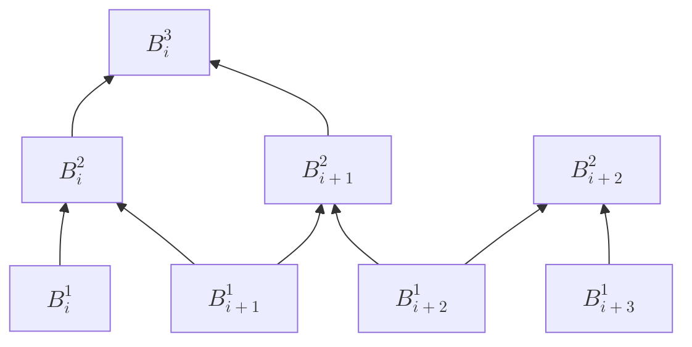

# B-Splines: Definition, Properties, and Use in 1D QM

*Sources: H. Bachau et al., Rep. Prog. Phys. 64 (2001) §§2–3 and Appendix A; PHY5606 Fall 2023 course notes; handwritten notes 06-20-Notes-Part-1.jpg.*

---

## What Are B-Splines?

B-splines (basis splines) are piecewise polynomial functions defined on a finite interval. The "B" stands for *basis* — they form a basis for the space of all piecewise polynomials of a given degree and smoothness. Schoenberg introduced them in 1946; their systematic application to physics problems took off in the 1990s with de Boor's FORTRAN routines and the work of Shore and collaborators.

The key idea is locality. A Taylor polynomial is globally defined and can oscillate wildly far from its expansion point. A B-spline is **nonzero only over a small number of consecutive subintervals**. It represents the function accurately in its local region without affecting anything elsewhere. This makes B-splines ideal for atomic wavefunctions, which vary rapidly near the nucleus and smoothly (or oscillatorily) further out.

### Knots and Breakpoints

Start with a domain $[a, b]$ divided into $l$ subintervals by a sequence of **breakpoints**:

$$a = \xi_1 < \xi_2 < \cdots < \xi_l < \xi_{l+1} = b$$

From the breakpoints, construct a (generally larger) **knot sequence** $\{t_i\}$ by assigning a multiplicity $\mu_j$ to each breakpoint $\xi_j$ — meaning $\xi_j$ appears $\mu_j$ times in the knot list. The standard choice used throughout this project is:

- **Maximum multiplicity** $\mu_1 = \mu_{l+1} = k$ at the endpoints (the first and last $k$ knots coincide).
- **Unit multiplicity** $\mu_j = 1$ at all interior breakpoints.

This gives a total of $n = l + k - 1$ B-splines, for two reasons that are worth spelling out.

#### Why $n = l + k - 1$

The total number of knots is:

$$m = \underbrace{k}_{\text{left endpoint}} + \underbrace{(l-1)}_{\text{interior breakpoints}} + \underbrace{k}_{\text{right endpoint}} = 2k + l - 1$$

The number of B-splines of order $k$ for a knot sequence of length $m$ is always $n = m - k$, because each step up in the recursion consumes one extra B-spline: at order 1 there are $m - 1$ step functions, and each of the $k - 1$ subsequent recursion steps reduces the count by one, giving $n = (m-1) - (k-1) = m - k$. Substituting:

$$n = (2k + l - 1) - k = l + k - 1$$

#### Why the endpoint B-spline reaches $B = 1$ there — and only there

With $t_1 = t_2 = \cdots = t_k = a$, the order-1 base functions $B_1^1$ through $B_{k-1}^1$ all have zero-length support (since $t_i = t_{i+1}$ for each of them), so they are identically zero everywhere. Only $B_k^1$ — whose support runs from $a$ to the first distinct knot — is nonzero.

Tracing the recursion upward with a concrete example ($k = 3$, knots $\{0, 0, 0, 1, 2, \ldots\}$):

- **Order 1:** $B_1^1 = B_2^1 = 0$ (zero-length support). $B_3^1(x) = 1$ for $x \in [0, 1)$.
- **Order 2:** The recursion blending $B_2^1$ and $B_3^1$ into $B_2^2$ gives, at $x = 0$:

$$B_2^2(0) = \underbrace{\frac{0 - t_2}{t_3 - t_2}}_{= 0/0\, \to\, 0} B_2^1(0) + \underbrace{\frac{t_4 - 0}{t_4 - t_3}}_{= 1/1} B_3^1(0) = 1$$

  The $0/0$ term is taken as zero by convention (a zero-length interval contributes nothing). Every other order-2 B-spline evaluates to 0 at $x = 0$.

- **Order 3:** Blending $B_1^2$ (identically zero) and $B_2^2$ into $B_1^3$ gives, at $x = 0$:

$$B_1^3(0) = \underbrace{\frac{0 - t_1}{t_3 - t_1}}_{= 0/0\, \to\, 0} B_1^2(0) + \underbrace{\frac{t_4 - 0}{t_4 - t_2}}_{= 1/1} B_2^2(0) = 1$$

  All other order-3 B-splines evaluate to 0 at $x = 0$.

At each level the nonzero B-spline at $x = a$ shifts one index to the left. After $k - 1$ recursion steps from the base, the result is always $B_1^k(a) = 1$, with all other $B_i^k(a) = 0$. The partition-of-unity property ($\sum_i B_i^k = 1$ everywhere) confirms this must be so: since only $B_1^k$ can be nonzero at the left endpoint, it must equal exactly 1 there.

The same argument applies symmetrically at the right endpoint, giving $B_N^k(b) = 1$.

#### The consequence for boundary conditions

Because $B_1^k$ is the *unique* basis function nonzero at $a$, and $B_N^k$ is the unique one nonzero at $b$, boundary conditions reduce to simple index arithmetic. The Dirichlet condition $f(a) = 0$ is satisfied by removing $B_1$ from the working basis; $f(b) = 0$ by removing $B_N$. No projection or penalty term is needed — the condition is exact and automatic. This is the mechanism used throughout this project: the working basis runs over indices $2$ through $N-1$, and both endpoint conditions are satisfied by construction.

#### Why construct $B_1$ and $B_N$ at all?

A natural question: if we immediately discard $B_1$ and $B_N$, why build them in the first place? The answer is that the interior B-splines $B_2^k$ through $B_{N-1}^k$ depend on the boundary knots — and therefore on $B_1$ and $B_N$ — for their shapes.

**The knot sequence is shared.** The de Boor recursion for $B_2^k$ uses knots $t_2$ through $t_{k+2}$. With maximum endpoint multiplicity, $t_2 = t_3 = \cdots = t_k = a$, and those values appear literally in the blending weights:

$$B_2^k(x) = \frac{x - t_2}{t_{k+1} - t_2}\, B_2^{k-1}(x) + \frac{t_{k+2} - x}{t_{k+2} - t_3}\, B_3^{k-1}(x)$$

When $t_2 = a$, the leading weight becomes $\frac{x - a}{t_{k+1} - a}$, which is zero at $x = a$ and rises smoothly inward. This is what forces $B_2^k(a) = 0$ and gives it its correct "ramp from zero" shape at the boundary. Change the repeated knots and every one of $B_2^k$ through $B_{N-1}^k$ changes shape along with them.

**The partition of unity requires the full set.** The identity $\sum_i B_i^k(x) = 1$ holds for the complete set of $N$ B-splines. Near $x = a$, the only nonzero B-splines are $B_1^k$ and the first few interior ones. Removing $B_1^k$ from the sum would cause the remaining functions to sum to less than 1 near the boundary — they do not span the full function space there on their own.

**The roles are separated in time.** $B_1$ and $B_N$ do their work *during construction* — establishing the knot structure and shaping the boundary-adjacent interior B-splines via the recursion. They are removed *at the solution level*: the working $(N-2) \times (N-2)$ generalized eigenvalue system simply has no rows or columns for $c_1$ or $c_N$, which is equivalent to pinning those coefficients to zero.

The maximum multiplicity choice is precisely what makes this clean: it concentrates the entire boundary-reaching behavior into exactly one B-spline per endpoint, so one deletion per side gives exact Dirichlet enforcement with no residual.

### The de Boor Recursion

The $i$-th B-spline of order $k$, written $B_i^k(x)$, has support $[t_i, t_{i+k}]$ and is built recursively. The base case (order 1) is a unit step function:

$$B_i^1(x) = \begin{cases} 1 & t_i \leq x < t_{i+1} \\ 0 & \text{otherwise} \end{cases}$$

Each higher order is constructed by blending two adjacent lower-order B-splines with linearly varying weights (de Boor recursion):

$$B_i^k(x) = \frac{x - t_i}{t_{i+k-1} - t_i}\, B_i^{k-1}(x) + \frac{t_{i+k} - x}{t_{i+k} - t_{i+1}}\, B_{i+1}^{k-1}(x)$$

The first weight grows from 0 to 1 as $x$ crosses $B_i^{k-1}$'s support; the second shrinks from 1 to 0 over $B_{i+1}^{k-1}$'s support. Together they always sum to 1, which is why the partition-of-unity property is preserved at every order.

#### Recursion Tree for $B_i^3$



Each node is a weighted blend of the two nodes below it. At any evaluation point $x$, only $k$ B-splines are nonzero simultaneously, so exactly $k$ leaves of this tree contribute.

*(Bachau Figure 2 — see source PDF §2.1 — shows this evaluation graphically for $k=3$, illustrating how each set is obtained from the previous by the recursion.)*

---

## Shape by Order: Sketches from the 06-20 Notes

The right margin of `06-20-Notes-Part-1.jpg` shows schematic sketches of a single B-spline $B_i^k$ for increasing orders. Each sketch represents the shape of one basis function.

**Order vs. degree.** A B-spline of order $k$ consists of degree-$(k-1)$ polynomial pieces, so:

$$\text{degree } p = k - 1$$

The order also determines the smoothness: with unit multiplicity at interior knots, $B_i^k$ is $C^{k-2}$ continuous (i.e., $k-2$ continuous derivatives). As a table:

| Order $k$ | Degree $p = k-1$ | Each piece is… | Continuity |
|:---------:|:----------------:|----------------|:----------:|
| 1 | 0 | constant | $C^{-1}$ (discontinuous) |
| 2 | 1 | linear | $C^0$ |
| 3 | 2 | quadratic | $C^1$ |
| 5 | 4 | quartic | $C^3$ |
| **12** | **11** | **degree-11 polynomial** | $C^{10}$ |

```
k = 1  (order 1, degree 0)
Piecewise constant. Rectangular pulse over one interval.
Continuity: C⁻¹ (discontinuous).

  ┌───┐
  │   │
──┘   └──

k = 2  (order 2, degree 1)
Piecewise linear. Triangular tent spanning two intervals.
Continuity: C⁰ (continuous, non-differentiable at knots).

    /\
   /  \
──/    \──

k = 3  (order 3, degree 2)
Piecewise quadratic. Smooth bump spanning three intervals.
Continuity: C¹ (one continuous derivative).

    ╭──╮
   ╱    ╲
──╱      ╲──

k = 5  (order 5, degree 4)
Piecewise quartic. Wider, bell-shaped, indistinguishable
from a Gaussian by eye. Continuity: C³.

  ╭────────╮
 ╱          ╲
╱            ╲──
```

This project uses $k = 12$: degree-11 piecewise polynomials with $C^{10}$ continuity — extremely smooth.

*(Source: 06-20-Notes-Part-1.jpg, right margin; also PHY5606_F25_Bsplines_v2.pdf page 1 figure for $k = 1$ through $5$.)*

---

## Key Mathematical Properties

*(Bachau §2.1; PHY5606 notes §1)*

**Compact support.** $B_i^k(x) = 0$ outside $]t_i, t_{i+k}[$. Each B-spline spans exactly $k$ consecutive intervals — the *minimum* possible support for a piecewise polynomial of that order and smoothness.

**Positivity.** $B_i^k(x) > 0$ for $x \in ]t_i, t_{i+k}[$. Expansion coefficients of any function stay close to the function values at the knots, with minimal cancellation between terms. This is in sharp contrast to Slater-type orbitals (STOs), where components can be large and opposite in sign — causing numerical instability for high excited states. Bachau Figures 3 and 4 make this comparison explicit for the hydrogen 4s wavefunction: the STO expansion shows large cancellations among four terms, while the B-spline expansion shows almost none.

**Partition of unity.** $\sum_i B_i^k(x) = 1$ everywhere on $[t_k, t_{n+1}]$. This is automatic from the recursion and holds regardless of knot placement.

**Locality.** At any point $x \in [t_i, t_{i+1}]$, exactly $k$ B-splines are nonzero. Evaluating the expansion $f(x) = \sum_j c_j B_j(x)$ always involves only $k$ terms, regardless of the total number of basis functions $n$.

**Banded matrices.** Since $B_i^k \cdot B_j^k = 0$ for $|i - j| \geq k$, every matrix element $\langle B_i | \hat{O} | B_j \rangle$ vanishes when $|i - j| \geq k$. Both the Hamiltonian $H$ and overlap $S$ matrices are symmetric banded with half-bandwidth $k - 1$, containing only $Nk$ nonzero entries rather than $N^2$.

**Derivative.** The derivative of a B-spline of order $k$ is itself a linear combination of order-$(k-1)$ B-splines:

$$DB_i^k(x) = \frac{k-1}{t_{i+k-1} - t_i}\, B_i^{k-1}(x) - \frac{k-1}{t_{i+k} - t_{i+1}}\, B_{i+1}^{k-1}(x)$$

This makes exact differentiation within the basis straightforward.

**Error bound.** The error when approximating a smooth function $f$ in a B-spline basis with characteristic interval width $h$ is:

$$\varepsilon \sim \frac{h^k}{k!}\,\bigl|D^k f(\eta)\bigr|$$

for some $\eta$ in the interval. Higher order $k$ reduces the error exponentially for fixed $h$, motivating high-order splines. In practice $k \in [7, 11]$ is the range where accuracy and computational cost balance well. Bachau Table 2 illustrates this: for hydrogen ground state error $\Delta E < 10^{-6}$ au, the lowest-CPU-time solution is $k = 6$, $N = 370$, rather than the naïve choice of small $k$ with many points.

---

## Applying B-Splines to the Radial Schrödinger Equation

### The Physical Problem

For a hydrogen-like atom, separating variables gives a radial wavefunction $\mathcal{U}_{nl}(r)$ (where $\psi_{nlm} = \mathcal{U}_{nl}(r)/r \cdot Y_l^m(\theta,\phi)$) satisfying the **reduced radial equation** [Bachau eq. (4)]:

$$\left[ -\frac{1}{2}\frac{d^2}{dr^2} + \frac{l(l+1)}{2r^2} + V(r) \right] \mathcal{U}_{nl}(r) = E_{nl}\, \mathcal{U}_{nl}(r), \qquad \mathcal{U}_{nl}(0) = 0$$

The centrifugal term $l(l+1)/(2r^2)$ and the Coulomb potential $V(r) = -1/r$ both diverge at $r=0$, which is what makes this problem hard for finite-difference methods with uniform grids. B-splines handle this by concentrating breakpoints near the origin.

### Expanding in the Basis

Confine the problem to a box $[0, r_\text{max}]$ and expand the radial wavefunction [Bachau eq. (5)]:

$$\mathcal{U}_{nl}(r) = \sum_{i=1}^{N} c_i^{nl}\, B_i(r)$$

Substitute into the Schrödinger equation and project onto each $B_j(r)$. The result is a **generalized eigenvalue problem** [Bachau eq. (6); PHY5606 notes]:

$$\mathbf{H}\,\mathbf{c} = E\,\mathbf{S}\,\mathbf{c}$$

with matrix elements [Bachau eq. (7)]:

$$H_{ij} = -\frac{1}{2}\int_0^{r_\text{max}} B_i\,\frac{d^2 B_j}{dr^2}\,dr + \frac{l(l+1)}{2}\int_0^{r_\text{max}} \frac{B_i B_j}{r^2}\,dr + \int_0^{r_\text{max}} B_i\,V(r)\,B_j\,dr$$

$$S_{ij} = \int_0^{r_\text{max}} B_i(r)\,B_j(r)\,dr$$

The overlap matrix $S$ appears because the B-splines are not orthonormal. The generalized problem is equivalent to a standard one — the PHY5606 notes show how to transform it by diagonalizing $S = O\Lambda O^T$ — but LAPACK's `DSBGV` routine solves the banded generalized form directly without the transformation.

The general matrix element integral implemented in the B-spline module is [PHY5606 notes]:

$$\int dx\,\bigl[D^n B_i(x)\bigr]\,f(x;\mathbf{Y})\,\bigl[D^m B_j(x)\bigr]$$

where $n$, $m$ specify derivative orders (0 or 1 in current use) and $f(x;\mathbf{Y})$ is a user-supplied function with an optional parameter array.

### Boundary Conditions

The Dirichlet condition $\mathcal{U}(0) = \mathcal{U}(r_\text{max}) = 0$ is imposed by **removing the first and last B-splines** from the working basis. With maximum-multiplicity endpoint knots, $B_1$ is the only function nonzero at $r = 0$, and $B_N$ is the only one nonzero at $r = r_\text{max}$. Dropping both automatically satisfies both boundary conditions. The working basis then runs over indices $2$ through $N-1$, giving a system of size $N - 2$.

### Computing Matrix Elements

All integrals are computed using **Gauss–Legendre (GL) quadrature** on each B-spline interval [Bachau §2]. A GL rule of order $n$ integrates polynomials of degree $2n - 1$ exactly. Since $B_i^k B_j^k$ is a polynomial of degree $2(k-1)$ on each segment, $k$ GL points suffice to integrate the overlap exactly. For the kinetic energy (involving $D^2 B_j$, which is order $k-3$) the integrand is of degree $2k - 4$, still handled by $k$ points. For terms involving $V(r) = -1/r$ or $l(l+1)/r^2$, the integrand is not polynomial, but adding a small number of extra GL points achieves machine-precision accuracy very rapidly.

### Solving the Eigenproblem

Because $H$ and $S$ are symmetric banded with half-bandwidth $k-1$, LAPACK's `DSBGV` solves the problem in $O(Nk^2)$ operations. For $N = 59$ and $k = 12$, the matrices have only $N \times k = 708$ stored entries each, versus $N^2 = 3481$ for dense storage. For larger bases needed to resolve high continuum energies, this scaling advantage becomes essential.

---

## Bound States vs. Continuum States

### Bound States

Eigenenergies below the ionization threshold ($E < 0$) correspond to bound states. The wavefunction decays exponentially in the asymptotic region, with most of its weight concentrated near the nucleus. Accuracy is therefore sensitive to breakpoint distribution **near $r = 0$**.

An exponential breakpoint sequence $\xi_j = (e^{\gamma(j-1)/l} - 1)/(e^\gamma - 1) \cdot r_\text{max}$ concentrates points near the origin, matching the rapid variation of the Coulomb wavefunction. Bachau Table 1 shows the result for hydrogen $\ell = 0$ with $k=9$, $N=100$, exponential sequence ($\gamma = 5$): the first four bound-state energies agree with $E_n^{\text{exact}} = -1/(2n^2)$ to machine precision ($\Delta E \sim 10^{-13}$ au). The same calculation with a linear (uniform) sequence gives $\Delta E = 2.4 \times 10^{-4}$ au for the ground state — five orders of magnitude worse.

The box size $r_\text{max}$ must be chosen large enough to contain the highest bound state of interest. For hydrogen, $\langle r \rangle_{nl} = \tfrac{1}{2}[3n^2 - l(l+1)]$ au, so high-$n$ states require large boxes.

*(Source: Bachau §3.2, Table 1)*

### Discretized Continuum States

Above the ionization threshold ($E > 0$), the true continuum is replaced by a **discrete set of pseudostates** — the box quantizes the continuum by imposing $\mathcal{U}(r_\text{max}) = 0$. These pseudostates are not exact scattering states but are an excellent approximation, particularly for matrix elements involving them.

Unlike bound states, continuum wavefunctions oscillate throughout $[0, r_\text{max}]$ with approximate wavelength $\lambda = 2\pi/\sqrt{2E}$. A **linear (uniform) breakpoint sequence** is therefore more appropriate: the function varies equally everywhere and needs equal resolution everywhere.

The required breakpoint spacing to resolve the oscillation to phase accuracy $\lesssim 0.1$ rad is [Bachau §3.3]:

$$\Delta r \lesssim \frac{\lambda}{k} = \frac{2\pi}{k\sqrt{2E}}$$

The **density of discretized continuum states** is set by $r_\text{max}$ [Bachau eq. (12)]:

$$\rho(E) = \frac{1}{\pi} \frac{r_\text{max}}{\sqrt{2E}}$$

Increasing $r_\text{max}$ (with fixed breakpoint spacing) increases the number of pseudostates per unit energy — effectively improving the resolution of the continuum. Bachau Figure 5 shows how individual discretized continuum energies shift linearly with $r_\text{max}$, enabling continuum states at any specific target energy to be obtained by tuning the box size.

Bachau Figure 6 compares a discretized continuum wavefunction ($E_k = 54$ eV, $r_\text{max} = 60$ au) with the exact Coulomb result — the two are indistinguishable inside the box.

*(Source: Bachau §3.3, eqs. (9)–(12), Figures 5, 6)*

### Mixed Sequences

Many problems require accuracy in both regimes simultaneously — e.g., computing ionization cross-sections requires a good ground state and accurate continuum matrix elements. The solution is a **mixed breakpoint sequence**: exponential (or power) concentration near the nucleus, transitioning to linear spacing at some intermediate radius. Bachau Appendix A.1 formalizes this and lists four standard sequences:

| Name | Structure | Best for |
|---|---|---|
| Linear | Uniform spacing | Continuum states |
| Exponential | $r_j \propto e^{\gamma j}$ — dense near origin | Bound states, Coulomb |
| Sinelike | Dense at both endpoints | Endpoint-sensitive problems |
| Linear–parabolic | Linear inner + parabolic outer | Mixed bound + continuum |

*(Source: Bachau Appendix A.1)*

---

## Why B-Splines for This Project?

### Versus Other Basis Sets

| Basis | Support | Matrices | Needs optimization? | Bound | Continuum |
|---|---|---|---|---|---|
| Slater-type orbitals (STO) | Global | Dense, ill-conditioned | Yes (exponents) | Good | Poor |
| Gaussian-type (GTO) | Global | Dense | Yes | Good | Poor |
| Finite differences | Local | Banded | No | Good | Good |
| **B-splines** | **Local (compact)** | **Sparse banded** | **No** | **Excellent** | **Excellent** |

B-splines combine the variational rigor of a basis-set approach with the local accuracy and banded structure of finite differences. No nonlinear parameter optimization is needed — only the order $k$, the number of breakpoints $N$, and their distribution. Convergence is systematic: increase either $k$ or $N$ to improve accuracy.

### In Summary

1. **Compact support** → banded matrices → LAPACK `DSBGV` in $O(Nk^2)$ instead of $O(N^3)$.
2. **Positivity** → coefficients track function values, negligible cancellation errors.
3. **High order** ($k = 12$) → exponentially fast convergence; machine-precision bound states with $N \sim 60$.
4. **No optimization** → just set the grid and go.
5. **Flexible breakpoint placement** → same code handles bound and continuum by changing the grid alone.
6. **Gauss–Legendre integration** → all matrix elements exact (or converged) to machine precision.

---

## Eigenstates as Linear Transformations of B-Splines

When `DSBGV` solves the generalized eigenproblem it returns $N-2$ eigenvectors, one per eigenstate. Each eigenvector is a column of coefficients $c_i^{(n)}$, and the corresponding eigenstate is the linear combination:

$$\mathcal{U}_n(r) = \sum_i c_i^{(n)}\, B_i(r)$$

Stacking all eigenvectors into a matrix $C$ — columns indexed by eigenstate, rows by B-spline — gives the full set of eigenstates at any position $r$ as:

$$\boldsymbol{\Psi}(r) = \mathbf{B}(r)\cdot C$$

$C$ is a square, invertible matrix that transforms coordinates from the B-spline basis into the eigenstate basis. Both bases span the same $(N-2)$-dimensional subspace of functions; $C$ and $C^{-1}$ move between them freely.

### Two Bases, Two Jobs

The two representations are good for completely different things, and the ability to switch between them is what makes the program powerful.

The **B-spline basis** is the computational workhorse. B-spline integrals $\langle B_i | \hat{O} | B_j \rangle$ are computed cheaply and exactly by Gauss–Legendre quadrature, and every operator — the Hamiltonian, the dipole, the kinetic energy — is naturally and efficiently assembled here as a banded matrix.

The **eigenstate basis** is where the physics is easy. The Hamiltonian is diagonal in this basis:

$$\langle \psi_m | \hat{H} | \psi_n \rangle = E_n\, \delta_{mn}$$

This means time evolution — the hardest step in a TDSE calculation — reduces to multiplying each coefficient by a phase:

$$\alpha_n(t) = \alpha_n(0)\, e^{-iE_n t}$$

There is no matrix exponentiation, no linear system to solve at each step. The diagonal structure is only available in the eigenstate basis.

### The Round-Trip: Enabling TDSE

The entire time-domain computation in the code is built on this round-trip between the two bases:

```mermaid
flowchart LR
    d0["Initial state\nin B-spline coords\n$$\\mathbf{d}_0$$"]
    a0["Eigenstate\ncoefficients\n$$\\boldsymbol{\\alpha}(0)$$"]
    at["Time-evolved\neigenstate coeffs\n$$\\boldsymbol{\\alpha}(t)$$"]
    dt["B-spline coeffs\nat time t\n$$\\mathbf{d}(t)$$"]
    psi["Real-space\nwavefunction\n$$\\Psi(r,t)$$"]

    d0 -->|"$$C^{-1}$$"| a0
    a0 -->|"$$e^{-iE_n t}$$\ncomponent-wise"| at
    at -->|"$$C$$"| dt
    dt -->|"evaluate\nB-splines"| psi
```



Each arrow corresponds to a step in `main.cpp`:

**Step 1 — Project initial state onto eigenstates** (`Phi_G = C_dagger * B_G`).
The Gaussian initial state is first expressed as B-spline overlap integrals `B_G[i]` $= \langle B_i | G \rangle$, computed by `computeGaussianSumCoeffs`. A single matrix multiply with $C^{-1}$ (`C_dagger` in the code) converts these into eigenstate-basis components $\alpha_n(0) = \langle \psi_n | G \rangle$.

**Step 2 — Time-evolve in the eigenstate basis** (`V_t = evolution.cwiseProduct(Phi_G)`).
Each component is multiplied by $e^{-iE_n t}$ independently. This is a component-wise product — no matrix multiply required. The diagonality of $\hat{H}$ in the eigenstate basis makes this $O(N)$ per time step rather than $O(N^2)$.

**Step 3 — Transform back to B-spline coefficients** (`CV_t = C * V_t`).
A single matrix multiply with $C$ returns to the B-spline basis, giving real-space coefficients at time $t$.

**Step 4 — Evaluate the wavefunction** (`bspline.eval`).
The B-spline coefficients are fed into the evaluation routine to sample $\Psi(r, t)$ on a spatial grid for output.

### What This Requires

The round-trip only closes because the eigenstates live in the B-spline subspace by construction — they are defined as linear combinations of $\{B_i\}$, so $C$ is a well-defined $(N-2) \times (N-2)$ invertible matrix. If the eigenstates were expressed in any other form (e.g., as solutions of an ODE computed on a separate grid), this change-of-basis trick would not be available.

It also means that any operator already computed in the B-spline basis can be immediately transformed into the eigenstate basis without any new integrals:

$$\langle \psi_m | \hat{O} | \psi_n \rangle = \sum_{ij} C_{im}^*\, \langle B_i | \hat{O} | B_j \rangle\, C_{jn} = \bigl(C^\dagger\, O_\text{BS}\, C\bigr)_{mn}$$

This is the mechanism by which dipole matrix elements, transition rates, and coupling terms for the TDSE under an external field will all be assembled in future extensions of the code: compute the operator once in the B-spline basis (cheap, banded), then rotate into the eigenstate basis with two matrix multiplies.

---

## Our Implementation Parameters

The B-spline basis lives in `TISE/BSpline.cpp` / `BSpline.hpp`, a C++ port of Argenti's Fortran module `moduleBspline.f90` (also in `1D-QM-Playground/`). Current default parameters in `TISE/main.cpp`:

| Parameter | Value | Notes |
|---|---|---|
| `BS_ORDER` ($k$) | 12 | Degree-11 polynomials, $C^{10}$ at interior knots |
| `BS_NNODS` | 51 | Number of distinct breakpoints |
| Total B-splines $N$ | $51 + 12 - 2 = 61$ | Formula: $N = \text{nnods} + k - 2$ |
| Working basis | 59 | Drop $B_1$ and $B_{61}$ for Dirichlet BC |
| `BS_GRMIN` | 0.0 au | Left boundary |
| `BS_GRMAX` | 100.0 au | Box size $r_\text{max}$ |
| Grid type | Uniform | Linear breakpoint sequence |
| Eigensolver | LAPACK `DSBGV` | Symmetric banded generalized eigenproblem |

The uniform grid is a starting point. For production calculations involving both bound and continuum states, a mixed exponential–linear sequence is the natural next step (see the open questions in `architecture-06-20.md`).

---

## References

- H. Bachau, E. Cormier, P. Decleva, J. E. Hansen, F. Martín, "Applications of B-splines in atomic and molecular physics," *Rep. Prog. Phys.* **64**, 1815–1942 (2001). §§2–3 and Appendix A.
- L. Argenti (UCF), "Spectral resolution of 1D QM systems with B-splines," PHY5606 course notes (Fall 2023).
- C. de Boor, *A Practical Guide to Splines*, Springer (1978).
